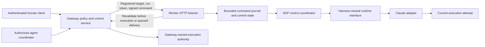
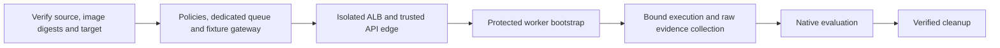

# Agent remote control

ADP remote control lets an authorized human or agent pause, resume, steer, or gracefully abort a hosted agent execution. It reuses the existing gateway, worker identity, and execution lifecycle. It does not introduce another orchestration engine.

This is the current design and integration entry point for [epic #3959](https://github.com/aws-e/adp/issues/3959), including work that is not yet delivered. **Read the implementation status before depending on a capability.** A merged implementation, a deployed revision, and a passed live evaluation are three different milestones.

**Reviewed:** September 24, 2026. Merged source baseline: [`4db839337`](https://github.com/aws-e/adp/tree/4db839337). The abort recovery described below is part of the S4 integration branch until its owning PR merges. The status below is a dated snapshot; linked issues and deployed evidence determine subsequent readiness.

## 1. Scope and current readiness

The target is hosted webhook/SQS/KEDA workers. Claude Agent SDK is the first production runtime adapter. A second deterministic test adapter demonstrates that the shared interface is independent of Claude; it is not a second supported production harness.

| Area | Current state | What a dependent story may assume |
|---|---|---|
| Foundation: gateway, listener, state, registration, isolation | S1 #3960 merged; Wave 1 #3967 accepted September 12 | Reuse the existing components. Recheck deployment compatibility after later identity changes. |
| Neutral runtime and Claude adapter | S3 #3962 merged | Reuse the provider-free interface and attempt lifecycle. |
| Pause/resume | S2 #3961 merged; Wave 2 #3968 still unaccepted | Source exists. End-to-end operational readiness is not established. |
| Human command authority | #5222 source exists; additional refusal tests merged in #5828; issue remains open | Use the signed human-session path, not direct worker calls. Live acceptance is outstanding. |
| Aborted vocabulary and counters | S5 #3964 merged | The status exists; that alone does not implement graceful abort. |
| Graceful abort | S4 #3963 under development/review | Do not depend on an enabled abort capability on main. Failure recovery and terminal reconciliation remain under review. |
| Steering | S6 #3965 pending abort dependency | Contract is defined; full worker integration is not delivered. |
| Dashboard controls | S7 #3966 pending runtime acceptance | API/state contract is reusable; the completed dashboard flow is not delivered. |
| Dashboard explanations | S8 #4989; evaluation #5827 assigned | Planned follow-up after dashboard acceptance. |
| Timeout evidence producer | #5841 merged as `f304ac1f14939dc884b07180bd56d1ddce39bbe2` | Test tooling is delivered; W2-05 live acceptance is still outstanding. |
| Protected evaluation fixture and edge | #5836 edge merged in PR #5838; #3968 fixture integration still under development/review | The staged deployment below is the intended integration; its scripts are not yet accepted as an executable end-to-end path. |
| General protected-worker rollout | #5195 open | Ordinary workload enablement remains gated. |

At the source baseline, both gateway and worker implemented-verb sets contain **pause and resume only**. Every request is still subject to authorization, independent feature flags, adapter support, and current availability. Ordinary control flags remain off in the active epic rollout. There is no claim that all four controls are operational.

Out of scope: chat/ARC integration, a new orchestration engine, durable cross-pod command recovery, cross-cluster control transport, and additional production adapters. Pause is not a rollback, process suspension, or token-saving guarantee.

## 2. Architecture and ownership



| Component | Responsibility | Source |
|---|---|---|
| Gateway control service | Authorize target, resolve registration, validate destination, sign/forward commands, project safe state | [control_service.py](../../modules/gateway/src/activity/control_service.py) |
| Public schema | Run state, capabilities, command requests and acknowledgements | [control_schemas.py](../../modules/gateway/src/activity/control_schemas.py) |
| Human authority | Validate human JWT session and ownership from gateway-owned execution authority | [human_control.py](../../modules/gateway/src/agentauth/human_control.py) |
| Execution authority | Protected bootstrap/binding, delegation, signed envelopes and revalidation | [agentauth](../../modules/gateway/src/agentauth/) |
| Worker listener | Authenticate transport, validate command/envelope, admit and serialize commands | [control-listener.ts](../../modules/agent-factory/agent/src/control-listener.ts) |
| State and journal | Phase, bounded pending commands, idempotency and acknowledgements | [control-state.ts](../../modules/agent-factory/agent/src/control-state.ts) |
| Runtime interface | Adapter contract, current-attempt registry, capability intersection and typed cancellation | [control-runtime.ts](../../modules/agent-factory/agent/src/control-runtime.ts) |
| Pause barrier | Tool admission, observed work, quiescence and bounded release | [pause-gate.ts](../../modules/agent-factory/agent/src/pause-gate.ts) |
| Claude adapter | SDK input conversion, hooks and attempt lifecycle | [claude-control.ts](../../modules/agent-factory/agent/src/harnesses/claude-control.ts) |
| Worker lifecycle | Compose runtime; preserve existing status, heartbeat and queue acknowledgement ownership | [agent-worker.ts](../../modules/agent-factory/agent/src/agent-worker.ts), [entrypoint.py](../../modules/agent-factory/agent-worker-image/entrypoint.py) |

Shared coordinator, listener, state and contract code must not expose SDK `Query`, `SDKUserMessage`, native session handles, or provider-name branches. The composition root selects an allowlisted adapter from trusted configuration. A command cannot choose its own adapter, execution generation, transport address, or authority.

## 3. Identity and authorization

Keep these identifiers separate:

- **Invocation/run ID:** the ADP execution being controlled. For these control routes, an orchestration run adapter resolves to the invocation; a node ID or pod name is not interchangeable.
- **Generation:** identifies the registered worker generation. A stale client response or envelope cannot authorize another generation.
- **Attempt ID:** opaque, process-local runtime attempt identity. In-process retries replace it. It is not a provider session ID.
- **Command ID:** client-generated UUID identifying one intent and its retries.
- **Pod/Job UID:** Kubernetes object-instance identity used by protected bootstrap and fixture ownership, not a browser control identifier.

A human request requires an authenticated, unexpired human JWT session, tenant membership and authorized ownership. The signing path checks ownership against gateway-owned authority; a worker-writable activity row is not sufficient evidence to mint authority. Agent callers use the existing delegated-authority path and its target policy; they do not impersonate human sessions.

The gateway binds a signed envelope to the exact command bytes, action, command ID, target invocation, generation and caller authority. Human envelope lifetime is constrained by the authenticated session. The worker verifies the envelope and revalidates authority before execution, including immediately before queued physical input handoff. An independently buffered adapter callback must not execute later outside that authorization boundary.

The per-run listener token protects transport; it is not a substitute for command authority. Registration includes address, port, token, expiry and generation in an internal record. Credentials and private addresses stay out of public state, browser responses and logs. Tokens expire no later than the worker's remaining lifetime. Teardown clears registration; terminal state independently prevents continued control if cleanup fails.

The gateway uses the registered target, configured pod CIDRs and control port, rejecting loopback, metadata/link-local and public destinations. It disables redirects and environment proxy inheritance and uses finite timeouts. Clients never supply a pod URL. NetworkPolicy and scoped worker credentials reinforce the application checks.

## 4. Public API and client behavior

Browser paths below include `/api`; the edge strips that prefix before gateway routing. Activity and orchestration adapters share one control service and policy contract.

| Method/path | Meaning |
|---|---|
| `GET /api/activity/invocations/{id}/agent/ping` | Authenticated reachability probe; no model turn |
| `GET /api/activity/invocations/{id}/agent/state` | Current generation, phase, capabilities and bounded acknowledgements |
| `POST /api/activity/invocations/{id}/agent/{pause,resume,steer,abort}` | Submit one command |
| `/api/orchestration/runs/{run_id}/...` | Existing orchestration adapter; resolve the bound invocation server-side |

Example pause request and an illustrative pending response:

```json
{"command_id":"6cd04fe9-1c67-45fd-a139-55c0f955f31e"}
```

```json
{"run_id":"invocation-id","action":"pause","state":"pause_requested","command_id":"6cd04fe9-1c67-45fd-a139-55c0f955f31e","command_status":"pending"}
```

Steering adds `instruction` (1–4,000 characters); abort can include a bounded `reason` (up to 1,000 characters). Requests are capped at 16 KiB. UUIDs, action-specific fields and unknown fields are validated. Actor, target credentials and transport addresses are not client payload fields.

| Result | Client interpretation |
|---|---|
| `202` | Accepted/pending, not proof of pause or delivery |
| `200` | Applied synchronously or recorded result of an earlier command; inspect status |
| `401` / `404` | Unauthenticated / unavailable to this caller; cross-tenant and non-owner targets do not disclose existence |
| `400` / `413` | Invalid request / oversized body |
| `409` | Conflicting command payload or temporarily unavailable control; inspect reason |
| `410` | Target is terminal; command was not applied |
| `429` | Pending capacity exhausted |
| `501` / `503` | Verb unimplemented / feature or required authorization service disabled or unavailable |
| `502` | Transport or response failure; command outcome may be unknown |

The exact status is selected after the relevant authentication and authorization checks; this table is not permission to reveal target existence through error ordering. Owner state reads can report a terminal run without contacting a dead worker.

Retry a single intent with the **same command ID and payload**. Same ID/different payload conflicts. Do not mint a fresh ID automatically after a transport timeout: the earlier command may have executed. Poll state and correlate generation and command ID. A missing, expired or ambiguous acknowledgement is `unknown`, not permission to replay.

## 5. State, queue and lifecycle semantics

Run control phase and task outcome are separate. Public phases are `running`, `pause_requested`, `paused`, `abort_requested`, `terminal`, and `unavailable`. The task's terminal outcome separately distinguishes complete, failed, aborted, budget-stopped and other existing outcomes. `unavailable` does not mean the task stopped.

Command statuses are `pending`, `delivered`, `applied`, `cancelled`, `rejected`, and `unknown`. Receipt, physical harness handoff, applied control and model comprehension are different facts. In particular, `delivered` does not mean the model followed the instruction.

The journal defaults to ten pending commands, with a separate reserved resume slot so a full queue cannot prevent release. Completed journal history is bounded by count (100 default) and retention (30 minutes default). These are local bounds, not a durable exactly-once-delivery service. The abort story is also correcting settlement handling for `unknown`; consumers must tolerate that outcome today.

### Pause and resume

1. Accept pause and immediately close admission of new tool actions.
2. Continue to observe already admitted work. Report `pause_requested` while it settles.
3. Report `paused` only after the barrier is effective and tracked work is quiescent. Unknown work count is `null`, never a fabricated zero. Background work or lost observability prevents confirmation.
4. Resume cancels a pending pause or releases a confirmed pause idempotently, preserving the same live execution and context.

Claude uses pre-tool admission plus output gating and preserves existing spill-hook transformations. Output silence by itself does not prove that side effects stopped. The design retains the no-`Query.interrupt()` constraint; restart/replay with the same history is not an implementation of this pause guarantee.

The default pause budget is 30 minutes, clamped to the pod deadline minus finalization margin (60 seconds by default). No positive safe budget means refusal. Held-hook timeout must cover the actual permitted pause. Timeout releases the barrier and submits a neutral annotation without forcing another assistant turn. Heartbeats, command handling and visibility renewal continue during pause; idle retry and completion watchdogs must not mistake it for a stall.

### Steering — required behavior, integration pending

Use one run-level bounded FIFO. Mid-tool or paused submissions remain pending until an authorized supported handoff boundary. Wrap steering text as untrusted input. The adapter owns one attempt's input transport; it must not add another unbounded queue. Preserve initial prompt, continuation behavior and session handling.

Reconnect only pending commands after an in-process retry. Never replay confirmed or ambiguously delivered input. Abort cancels queued input; normal completion drains or cancels deterministically. Update acknowledgements at actual handoff, not enqueue time.

### Graceful abort — required behavior, implementation under review

Set `abort_requested`, stop new admission, cancel a held pause without releasing held work, and wait for admitted work to settle. Typed intentional cancellation must prevent another attempt from starting; it must not enter generic retry handling.

The existing finalizer owns terminal reporting and SQS acknowledgement. The intended successful outcome includes an aborted terminal row, completed time, cancelled check conclusion, one final comment, revoked run control and confirmed queue acknowledgement. Bound retries by the remaining execution/visibility budget. Never claim successful acknowledgement when deletion was not confirmed.

The current S4 branch adds durable accepted-abort intent and a signed receipt bound to the run and command. Intent is evidence that abort was accepted, **not that the original worker is quiescent**. Protected bootstrap already refuses a replacement pod for an active bound execution; redundant abort-specific admission checks are not required to establish that refusal. Original-pod credential renewal must remain possible while it finalizes.

The S4 integration retains the authenticated target pod with the `adp.aws/abort-terminal-report` finalizer **before** recording intent or issuing the receipt. The gateway checks pod UID, service account and resource version; it preserves other controllers' metadata. Retention failure returns a retryable error without an abort receipt. Intent writes and receipt retries require an active execution, preventing a delayed request from recording an abort after retirement.

The gateway's existing maintenance loop discovers retained pods in bounded pages, independently of SQL work claims. Pod annotations are discovery hints: recovery checks the protected execution's tenant, invocation, pod name and UID, then requires an observed terminated worker container. A deletion timestamp, missing pod, expired lease or elapsed timeout is not exit evidence. The finalizer preserves the pod status through ordinary job cleanup and reporting outages.

After confirmed exit, recovery repairs the event row without overwriting an existing terminal outcome, clears control transport fields, retires active authority with conditional writes, releases the dispatch reservation idempotently, and removes its finalizer last. Recovery records the report-transition time and its provenance; it does not invent the exact container-exit time. A crash or failed write leaves the pod discoverable for another pass.

If acceptance stopped between retention and the intent write, recovery must not invent an accepted abort. It atomically preserves an existing terminal outcome or records `failed` with `worker_exited_without_terminal_report`, and retires authority only while the abort marker remains absent. A concurrent abort marker or normal terminal report makes that transaction retry from fresh state.

The gateway requires `get`, `list` and `patch` on pods in the configured worker namespace. Workers gain no Kubernetes permissions. The same Role requirements apply to the isolated evaluation fixture. Runtime implementation is in [exit_retention.py](../../modules/gateway/src/agentauth/exit_retention.py) and [retained_abort_recovery.py](../../modules/gateway/src/agentauth/retained_abort_recovery.py).

**Rollback and cleanup:** stop admitting new control commands, but keep gateway authority, recovery code, event/authority table access and pod permissions available until retained pods have terminal evidence and their finalizers have been released. Disabling authority stops this recovery loop. Do not strip finalizers merely to make deletion finish; unresolved reporting must remain explicit. Fixture teardown must drain recovery before removing its gateway or Role.

Local tests cover startup refusal, retention, reporting outages, recovery restart and concurrent terminal writes. The combined worker failure test covers both direct and protected gateway reporting. Broader integration checks and live acceptance remain outstanding; dependent stories must not treat local evidence as a deployed guarantee.

### Retry and teardown

`CurrentAttemptRegistry` permits one current attempt. Replace and invalidate the old endpoint before disposal; discard stale callbacks and events. Input resolves the current attempt at handoff time. Dispose once, preserve existing credential-retry/budget behavior, and do not turn intentional cancellation into a fresh query. Cross-pod recovery of commands is outside this contract.

## 6. Reusing the runtime from another story

The merged protocol is version 1. [ControlRuntimeAdapter](../../modules/agent-factory/agent/src/control-runtime.ts) exposes `describe`, `capabilities`, `currentAttempt`, `submitInput`, `requestPause`, `resumeFromPause`, `cancel`, `subscribe` and `dispose`. `AttemptEndpoint` owns physical delivery, optional pause/release/work observation, and disposal for one opaque attempt.

For a **new UI or controller**, use the gateway control routes and shared response schemas. Read effective capabilities and current generation; show pending and unknown states. Do not infer availability from a nonterminal task status. Keep orchestration approval/loop-resume semantics separate from worker resume.

For a **new harness**, implement the neutral interface and pass the shared contract tests with independently shaped input/events. Keep native SDK types and cancellation details inside the adapter. Advertise pause only when its mechanism proves the same execution and side-effect guarantees. A native interrupt-and-restart feature would require a different explicit contract.

For a **new workflow feature**, reuse command IDs, authority checks and the journal. If it needs durable delivery across pod loss, bulk controls, a different ownership model, new transport, or new command semantics, document that as an extension; those guarantees do not follow from this API. Capability reporting cannot grant permissions or approve a human gate.

Effective availability is the intersection of ADP-implemented verbs, adapter support, current runtime availability, gateway support, feature configuration and caller authorization. No one layer can enable a verb by itself.

## 7. Dashboard and explanations

S7 will poll the shared state contract, refresh invocation detail, and correlate commands by ID and generation. It must distinguish pause requested from paused, delivery from comprehension, and unknown work from idle. It reuses the activity deep link and requires explicit user confirmation for abort. These UI deliverables remain pending runtime acceptance.

S8 separately adds authenticated streaming implementation explanations and transcript continuity after S7 acceptance. That stream is not the command transport, authority source, or proof a command executed. It adds eight AC-LS acceptance criteria, including actual human comprehension review. See the [S8 design amendment](https://github.com/aws-e/adp/blob/agent/issue-3885/aidlc/spaces/issue-3885/inception/live-progress-extension.md).

## 8. Deployment, evaluation and release gates

Live evaluation currently targets account `879318057152`, environment `dev`, region `us-east-1`. These are evaluation coordinates, not constants another integration should hard-code. Follow the [canonical deployment guide](../../docs/adp-platform-deployment/deploy-with-agent.md) and [worker rollout procedure](../../docs/security/terraform-worker-rollout.md). The owner has authorized all remaining epic waves; the old Wave-2-only stop is superseded by the [September 23 authorization](https://github.com/aws-e/adp/issues/3959#issuecomment-5804953011).

Ordinary enablement remains gated on compatible runtime, abort mechanism, status writers/readers and required acceptance. Early testing enables only an isolated disposable fixture. Broad infrastructure apply is not the current rollout method: unrelated destructive drift was found. Provider/state compatibility and capacity fixes were separately reviewed, merged, applied and verified.

The fixture being completed has this dependency order:



The edge depends on the gateway Service; the worker depends on the edge. A shared ownership ledger binds account, region, run, nonce and Kubernetes UIDs across stages. Before continuing, verify original resource instances, both gateway and worker policies, edge identity and network reachability. Receipts must match the producer's real output schema and exact API host/region/stage/path. Operator credentials must not enter the worker. Transfer expected identity to the bound worker, execute there, and return artifacts tied to that execution. A local path or an idle Job is not evidence of that handoff.

This lifecycle is still under review in #3968/#5836. Open findings include worker-policy observation, endpoint binding, protected composition and executable handoff/cleanup. The sequence above is the required integration, not an assertion that the current scripts can already complete it.

Wave 2 requires all W2-01 through W2-10 checks and verified cleanup. W2-03/04/05 require real Claude tool-side-effect evidence. The merged timeout producer uses the same production heartbeat emitter and actual pause gate; launcher-scraped heartbeats cannot backfill missing experiment observations. Its bounded watchdog experiment records the injected completion-clock offset, proves suppression during pause and firing after release. Pod/container survival and exit observations still require authoritative launcher evidence.

Preserve image/source/CI provenance and raw observations. Mock tests, green CI and a merged PR do not establish live behavior. CI retains named agent, worker and evaluation suites plus coverage gates. Wave 3 #3969 adds abort/steer/retry proof; Wave 4 #3970 adds dashboard and original 37-criterion acceptance; S8 #5827 adds its eight criteria. Cleanup is part of acceptance, not a later housekeeping task.

## 9. Design history and maintenance

This document consolidates the September 15 architecture with current merged code and explicitly identified unfinished work. It does not weaken the original acceptance criteria or silently approve a new runtime mechanism.

- [Original requirements](https://github.com/aws-e/adp/blob/agent/issue-3885/aidlc/spaces/issue-3885/inception/requirements.md)
- [Revival design](https://github.com/aws-e/adp/blob/agent/issue-3885/aidlc/spaces/issue-3885/inception/revival-design.md)
- [Harness-neutral contract](https://github.com/aws-e/adp/blob/agent/issue-3885/aidlc/spaces/issue-3885/inception/harness-control-contract.md)
- [Story and wave plan](https://github.com/aws-e/adp/blob/agent/issue-3885/aidlc/spaces/issue-3885/inception/delivery-planning.md)
- [Planning PR #3948](https://github.com/aws-e/adp/pull/3948) remains open at this snapshot; its historical authorization/status paragraphs are not the current delivery status.

Changes to public behavior, adapter guarantees, authority, or deployment sequencing should update this entry point with the owning implementation and evidence. Update the dated readiness table after merge, deployment and live acceptance separately. Related stories should link here rather than copy the contract into a competing design.
