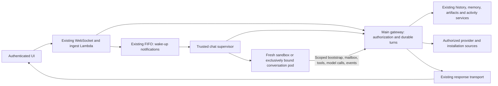

# User-scoped ADP assistant: unified design and evaluation

Design for [epic #6929](https://github.com/aws-e/adp/issues/6929) and its eleven child stories.
Source audit: `0ff2ff15d5b818554684b594a59eb93d1b09517a` (2026-10-03).
Status: reviewed implementation design for #6930; merging PR #6938 records design
acceptance. No code, cloud deployment, live security audit, qualification run or
engine submission is
claimed by this document. The issue amendments and this document are the input to
a subsequent engine plan; they do not authorize live rollout.

## Outcome and scope

An authenticated user can ask what they worked on, what their agents finished,
and, when entitled, what is installed and why an upgrade failed. Answers identify
sources, time windows, timezone, freshness and missing coverage. Personal actions
and agent work remain distinguishable. The assistant acknowledges requests
immediately, exposes real execution state, streams results, recovers conversations,
and offers explicitly selected persistent sessions without sharing used sandboxes.

Keep the existing ingestion Lambda as coordinator and the main gateway as the
identity, authorization, model-policy and data-access boundary. Use the existing
WebSocket transport. Do not add an AWS API Gateway solely for this feature. Do not
create a second activity database, installed-version ledger, or engine node type.
This design does not enable general cloud administration or raw credential tools.

## Current implementation and evidence

The following are source observations at the audited revision, not live claims.

| Area | Evidence | Implication |
|---|---|---|
| Ingress identity and session ownership | [ingest handler](../../modules/agent-factory/gateway/lambdas/ingest/handler.py), `_restore_connection_claims`, `_assert_session_owned_by_caller`, `get_or_create_session`; [webchat adapter](../../modules/agent-factory/gateway/lambdas/ingest/channels/webchat.py) | Reuse verified connection claims and server-issued session IDs. Session IDs remain untrusted lookup arguments, not authority. Recheck expiry and membership for subsequent turns. |
| Classifier and worker history | `load_recent_history` in ingest; [worker](../../modules/agent-factory/agent/src/complex-task-chat/complex-task-chat-agent.ts), `context.assemble`; [Dynamo context store](../../modules/agent-factory/agent/src/complex-task-chat/context/store/dynamo-store.ts) | Ingestion is not the sole history reader. Replace the worker storage ports, preserving summaries, ordering and by-ID access. |
| Execution lifecycle | Worker `main()` receives once and exits; [SQS client](../../modules/agent-factory/agent/src/complex-task-chat/sqs-client.ts) long-polls for 20 seconds; [ScaledJob](../../modules/agent-factory/agent/k8s/chat-scaledjob.yaml) | Raising minimum jobs alone produces churn. FIFO message groups provide ordering, not targeted delivery to a session pod. |
| Model-controlled tools | [run-query](../../modules/agent-factory/agent/src/complex-task-chat/run-query.ts) enables Bash/file tools and defaults to inherited environment; worker optionally injects user credentials | Application ownership checks and environment stripping cannot isolate tools from the containing service. |
| Chat identity split | [chat IAM](../../modules/agent-factory/infra/chat-worker-iam.tf), delivered by [#6928](https://github.com/aws-e/adp/pull/6928) | Dedicated role denies direct Bedrock but retains service-level queue, store and secret policies. This is not per-user data isolation. Verify deployed policy and old credentials separately. |
| Model authority | [chat model decision](../../modules/gateway/src/agentauth/chat_model.py) verifies workload, protected invocation digest and chat root | Preserve registered run identity, model/budget enforcement and workload verification when introducing sandbox identity; do not replace them with a broad internal key. |
| ADP activity | [activity routes](../../modules/gateway/src/activity/routes.py), [service](../../modules/gateway/src/activity/service.py), [Task read-through](../../modules/gateway/src/activity/task_readthrough.py) | Reuse canonical user/tenant authorization, date filters, chains, transcripts and Task records. Empty filtered pages can still have continuation tokens. |
| Connected identities | [identity service](../../modules/gateway/src/admin/identity/identities_service.py), [GitHub connection provider](../../modules/gateway/src/admin/connections/github_app_provider.py), [GitLab service](../../modules/gateway/src/gitlab/service.py) | Reuse provider identity and connection records. Connection administration and an app token's repository visibility do not establish a chatting user's read entitlement. |
| UI | [AgentChat](../../modules/gateway/frontend/src/pages/AgentChat.tsx), [route gates](../../modules/gateway/frontend/src/App.tsx) | Extend existing streaming/reconnect and server-issued sessions. A local conversation record does not prove a live executor or server history. |
| Existing headless harness | [nightly workflow](../../.github/workflows/nightly-cli-regression.yml), [EC2 workflow](../../.github/workflows/eval-cli-uplift.yml), [case registry](../../tests/e2e/cli_uplift/cases.py), [stage runner](../../tests/e2e/cli_uplift/stages.py), [hosted chat diagnostic](../../tests/e2e/cli_uplift/remote/hosted_chat.py), [runbook](../regression-testing/cli-uplift-evaluation.md) | Reuse disposable EC2, fixtures, revision verification, recovery, cleanup and grading. Hosted chat currently tests CLI Task chat; assistant WebSocket and isolation coverage must be added. |
| Existing qualification | [chat E2E suite](../../tests/e2e/chat/README.md), [session owner tests](../../modules/agent-factory/tests/lambda/test_session_ownership.py) | Extend these suites; their present coverage is not a two-tenant isolation or persistent-runtime certificate. |
| Release state | [#6896](https://github.com/aws-e/adp/issues/6896), [design PR #6927](https://github.com/aws-e/adp/pull/6927) | At audit time the PR is open and design-only. Its proposed installed-record contract is an external implementation dependency, not an available API. |
| Merge effects | [chat deploy workflow](../../.github/workflows/chat-agent-deploy.yml) triggers on relevant pushes to main | Engine code-only policy cannot stop GitHub deployment. Audit all touched-path workflows before implementation merge authority is granted. |

The April bodies of #147 and #183 are historical proposals. Their polling affinity,
shared warm process, shared credentials and "no manifest changes" recipes are
superseded where inconsistent with the October epic requirements and this design.

## Architecture decision

Separate trusted coordination from arbitrary model execution in **different pods**.
Choose a durable, gateway-owned session mailbox and a small trusted chat supervisor.
The supervisor is a proposed refactoring of the existing queue consumer and
lifecycle plumbing, not another data-access API or a new engine. It consumes queue
notifications, asks the gateway to claim work, creates/deletes sandbox pods and
reconciles leases. It never runs model tools. The existing ingest Lambda retains
classification, validated ingress and routing coordination.

The supervisor's restricted Kubernetes identity may manage only labelled sandbox
resources in the chat namespace, using a fixed template. Namespace RBAC alone does
not constrain pod specifications: an admission policy must reject service-account
substitution, arbitrary images/commands, privileged mode, host mounts/network,
shared writable volumes and unapproved secret/token mounts. It has no GitHub App
secret or general application-store access. The gateway owns data credentials;
ingestion and the response relay retain only their necessary trusted permissions.

The sandbox has a dedicated service account with no AWS role and no Kubernetes
API permissions. Disable default token mounting. A deliberately projected,
short-lived bootstrap token for a dedicated audience may be mounted; it grants
only exchange for that registered pod's assignment. A model can read its own
scoped capability, so security must not depend on hiding it in an environment
variable. It cannot bootstrap another run or use the token at the Kubernetes API.
No trusted coordinator sidecar, shared process namespace, credential directory,
service-account role, reusable home directory or writable persistent volume is
shared with model execution.

Use non-root, read-only root filesystem where practical, dropped capabilities,
seccomp, no host access and fresh bounded scratch storage. Enforce default-deny
network egress with an installed enforcing network implementation: only gateway,
restricted DNS and explicitly authorized content paths are reachable. Block node
metadata, Kubernetes API, service credentials and internal services. Existing
WebFetch/WebSearch/knowledge/vault tools must use scoped gateway adapters or be
unavailable; allowing arbitrary outbound HTTP would undermine this boundary.
Downloads require gateway authorization, URL/redirect validation, size limits and
SSRF controls. Kernel escape is outside the application isolation claim; if the
installation threat model requires a stronger runtime boundary, qualify that
runtime before enablement. A plain unconfined subprocess is never acceptable.

The first delivery uses fresh one-turn sandboxes. #147 extends the same lifecycle
to exclusive conversation pods. #183 initially warms **node/image capacity** while
still creating a fresh executor per assignment. This intentionally avoids a dirty
process pool and per-session SQS queues. Unused prestarted sandbox pods are a later
option only if measurements justify them and their one-time assignment is tested;
they are not required for this epic's initial warm-capacity implementation.

## Identity and authorization contract

1. Ingest authenticates the existing connection, resolves canonical user and tenant
   from verified identity, checks current membership/session ownership and records
   the turn through a trusted gateway operation. No principal comes from prompt,
   tool arguments, forwarded owner headers or a client-supplied session ID.
2. Gateway registers the turn and run against the existing chat root/model policy.
   Trusted launch records bind run, session, user, tenant, sandbox UID, immutable
   image and lease generation. The supervisor cannot select a broader user scope.
3. Sandbox exchanges its workload proof against that launch record. The gateway
   issues a short-lived, audience-bound capability for exactly that run/session,
   tool allowlist and lease generation. Initial capability TTL is five minutes;
   refresh requires a current lease, live root authority and current entitlements.
4. Every tool/model/mailbox request verifies the capability, current lease and
   revocation state. Repository/team/installation access is checked at the gateway
   on each operation, including by-ID reads, pagination and artifact download.
   Membership revocation invalidates subsequent access even before token expiry.
   Authorization-service failure denies access; it does not reuse stale permission.
5. Session end, lease replacement or root expiry invalidates capabilities. Gateway
   audits principal, run, operation, resource scope and outcome without raw tokens,
   sensitive tool arguments or full private prompts. Late events from old leases
   are rejected. Browser tokens and provider secrets never enter model context.

Extend existing authority verification rather than weakening the current IAM and
workload checks on `/internal/v1/agent/chat/model-decision`. New delegated routes
must explicitly support the credential-free sandbox and still enforce the same
model selection, spending, metering and cancellation controls. Missing usage
receipts cannot be treated as zero spending. Ingestion's direct-response path and
summarizer must also remain authorized, metered and unable to bypass tool scope.
A direct response without source retrieval cannot claim to summarize user work.

Personal conversations are private by default. Team sharing requires an explicit
resource ACL and current membership, not mere tenant equality. Shared content
never transfers another user's credential or persistent process. For this epic,
persistent executors have one owner; collaboration uses authorized durable content
and fresh executions rather than multiple users entering the same live sandbox.

## Gateway data and tool contracts

These are proposed operations, not claims that these routes already exist. Reuse
underlying services and existing port interfaces. Use one shared authorization
helper for browser and delegated callers; do not fake a browser JWT or internally
call a `/me` route with model-selected identity headers.

| Operation | Inputs the model may provide | Server-owned controls / result |
|---|---|---|
| `history.read`, `history.expand` | Authorized session reference, cursor, summary/message IDs | Check every ID and cursor against session scope; ordered messages/summaries with timestamps and next cursor |
| `history.append` | Current turn content and idempotency key | Actor/session from capability; role and final-state transitions from trusted transport; reject model-created system/other-user roles |
| `memory.search`, `memory.write` | Query or proposed memory content and purpose | Scope to owner and explicitly allowed shared collections; provenance, retention and versioned writes; treat recalled text as untrusted data |
| `artifact.create`, `artifact.read` | File metadata/content or authorized artifact ID | Server-derived object key; bounded upload, content type/size/hash, ownership and scan status; gateway-mediated reads reauthorize each time |
| `activity.adp` | `from`, `to`, IANA timezone, filters and cursor | Canonical user/tenant, `/me/agent-invocations` service semantics and Task read-through; lineage, source links and recorded outcomes |
| `activity.external` | Same time window and allowed repository references | Server resolves connected human identities and current repo entitlement; provider pagination/rate-limit status and event provenance |
| `installation.status` | Authorized installation reference | Explicit installation-read entitlement; current observed versions versus desired/last verified release, freshness and partial failure |
| `installation.failure` | Authorized operation/component reference | Bounded redacted failed-stage evidence; no arbitrary AWS request, log query, Terraform state or secret download |
| `session.state`, `session.end` | Authorized session reference | Actual lifecycle, expiry, pod/run state and idempotent end request; owner checks and revocation |

The trusted coordinator additionally needs `turn.accept`, `lease.claim/renew`,
`run.bind` and `run.reconcile`; sandboxes cannot call these administrator operations.
A bound sandbox can long-poll its own `turn.next`, publish ordered events and
complete the current turn through narrower operations. Browser session creation
and mode changes retain authenticated user controls rather than becoming model
commands.

Each read result carries `status` (`ok`, `empty`, `partial`, `denied`,
`unavailable`), `observed_at`, the requested window/timezone, `coverage`,
`next_cursor` and source references. `coverage` records sources queried, covered
intervals and reasons for omissions. An empty page with a continuation cursor is
not complete. Return structured errors: authentication 401, authorization 403 (or
non-enumerating 404 for resource lookup), stale lease/version 409, rate limit 429,
source outage 503. Never translate these to an empty successful answer.

Cursors are opaque and bound to caller scope, filters and ordering. Use UTC
half-open intervals `[from,to)` after timezone conversion, including DST tests.
Preserve original timestamps and precision. Exact source counts must be computed
from retrieved records; do not have a model guess completeness. Source text is
untrusted and cannot alter identity, tools or authorization.

Preserve existing history ordering, compaction, summary expansion, attachments,
TTL/retention and artifact recovery semantics. Add gateway-backed context/memory/
artifact/draft ports and migrate the worker to them before dropping its store
permissions. Session-keyed DynamoDB records may remain behind the gateway; no
client may use a partition key as authorization. Perform an ownership inventory
and idempotent migration with counts and dry-run output. Missing/mismatched legacy
owners are quarantined, not made public or inferred from the requesting user.
Keep the existing ownership-scoped sweeper behavior. Renew active-session retention
consistently so delayed TTL deletion cannot erase a live conversation; TTL is not
a prompt lifecycle timer. Personal-context and credential tools are included in
this audit; no broad-role fallback when a scoped adapter is missing.

## Activity and deployment answers

ADP activity uses existing user-index queries and Task read-through. Preserve
root/child lineage; deduplicate a displayed issue without discarding its runs.
A trigger by the user is different from a descendant agent action. Invocation
success is a recorded run outcome, not proof the issue is now closed or a release
is deployed. Missing transcript, expired retention, inaccessible index or provider
failure appears in coverage, not as fabricated completion.

External human work means authored commits/PRs, submitted reviews and comments
with source event IDs and times. Assignment alone is not work. Resolve aliases
through verified linked identities, not display-name matching. Intersect provider
connection visibility with the user's current repository rights. If those rights
cannot be established, omit that repository with honest coverage. Cache keys
include principal, tenant, repository, window and authorization generation;
revocation invalidates cached results. Start with bounded provider reads using
existing connections; add no new activity store without measured need. Never
accept an arbitrary provider base URL or redirect carrying an installation token.

Deployment tools are read-only projections of existing health/upgrade evidence
and the proposed [#6927 installed contract](https://github.com/aws-e/adp/blob/4671eb1e2797f7f1dd180cef285570a57c1f49da/docs/architecture/component-releases/contracts.md).
That schema is proposed v2, not implemented release state. Consume its desired,
last-fully-verified, component observations and operation failure fields when an
implemented authorized source exists. Show legacy `unknown`, partial application,
stale observation and absent optional modules honestly. A tenant member is not
implicitly an installation administrator. Existing bounded diagnostics can ship
without the ledger; ledger-backed criteria stay blocked until its implementation
and integration tests exist. Do not mark the whole story accepted solely because
mock ledger fixtures pass.

## Session routing and recovery

Persist turns and leases through the gateway using the existing session storage
where transactional access permits. Add explicit turn IDs, per-session sequence,
mode, owner, lease generation, sandbox UID, lease expiry, turn status and last
acknowledged event sequence. Do not create a second session authority. Ingest must
persist an accepted turn and its notification intent atomically; a small outbox
retry/reconciliation path handles failure between storage and SQS publication.
The trusted consumer acknowledges the notification only after durable acceptance
by the runtime manager. Duplicate notifications are harmless. A periodic pending-
turn scan recovers a lost wake-up; FIFO is transport, not the durability ledger.

The supervisor claims a session with a conditional write and incrementing fencing
generation. A fixed-template sandbox is created with that assignment. The sandbox
long-polls the gateway mailbox **for its assigned session**, never the shared SQS
queue. Gateway verifies owner, pod UID, lease generation and current turn on each
poll/result. A persistent pod waits only for its own conversation; competing
supervisors cannot issue two valid leases. Persist run intent before pod creation
and reconcile by assignment label so a crash between creation and recording does
not launch duplicate authorized workers. Gateway unavailable means visible queued
or recovering state, not fallback to a shared IAM role.

Proposed states: `queued → starting → running → completed` per turn, with explicit
`failed`, `cancelled` or `interrupted` outcomes. Session state is independently
`idle`, `active`, `ending`, `ended` or `recovering`. The UI never infers these from
WebSocket connectivity alone. Acknowledgement means durably accepted, not running.

Initial operational defaults are a 90-second renewable lease, 20-second heartbeat
and 20-second mailbox long poll. Detect expired leases within two minutes including
reconciliation delay. These are infrastructure settings exposed in diagnostics,
not hidden model turn budgets. Persistent mode initially offers a displayed
15-minute idle shutdown, administrator-configurable; warn before idle termination.
Do not carry forward the historical arbitrary two-hour conversation ceiling.
Resource, spend, token/context and provider limits remain explicit platform
controls with clear stop reasons. Measure/tune these defaults during qualification.

On disconnect the owned session continues according to its selected mode. Reconnect
reauthorizes and resumes events after the last durable sequence; if retention no
longer covers the gap, return an explicit history refresh requirement. Serialize
concurrent turns by accepted sequence. End-session stops accepting new work,
revokes tool/model authority, cancels or records the active turn's outcome, and
destroys the pod; durable conversation history follows its retention policy.
Ephemeral-to-persistent takes effect at the next turn. Persistent-to-ephemeral
ends the current executor safely; the next turn gets a fresh pod.

On node loss, lease expiry or rollout, fence the old pod before any successor can
commit. Rehydrate from durable history into a fresh sandbox. Do not promise
exactly-once model execution or silently replay side-effecting tools: persist tool
idempotency keys and receipts, and classify uncertain effects for user recovery.
For this epic, external activity/deployment tools are read-only; history, memory
and artifacts need idempotent writes. A missing final reply is visibly interrupted
until reconciliation proves a result or offers a safe retry. In-memory/filesystem
state may be lost; durable authorized artifacts survive. End/idle cleanup is an
active reconciler responsibility, not DynamoDB TTL alone.

## Warm capacity and user experience

#183 pre-pulls the reviewed image and maintains bounded schedulable node capacity
with configuration off by default. Fresh sandbox creation and gateway assignment
remain unchanged. Reuse existing balloon/prepull mechanisms after checking their
namespace, image and scheduling fit; do not mistake webhook readiness for chat
readiness. Measure cold, image-warm and node-warm cases independently. Capacity
shortage falls back to a fresh cold sandbox with truthful starting status, never
to insecure legacy execution. Scale-down must not kill a live conversation without
fencing/recovery. Report idle node cost and scheduling benefit before enabling a
standing warm pool. If this cannot meet the latency criterion, report failure and
propose a reviewed disposable-prestart extension rather than silently recycling
model processes.

#6936 extends the existing chat UI: contextual links from authorized activity and
installation pages, server-backed mode selector, immediate acknowledgement,
queued/starting/running states, actual tool events, streamed output, replay and
clear failure/retry. Show timezone/window and coverage with source-linked answers.
Persistent idle time, running state, end action and ongoing capacity/model cost
implications are visible. Navigation and backend enablement remain separately
gated; direct navigation must not bypass authorization. Keep unavailable tools
visible as unavailable where useful. Keyboard, screen-reader and long-response
behavior are part of acceptance.

## Delivery dependencies and merge boundary

This is a proposed dependency sequence, not a submitted engine graph. Every child
retains its GitHub issue; no design node or engine artifact protocol is required.
The design is delivered through #6930's PR. Subsequent agents read this repository
file and their amended issue. The later plan should pin its reviewed revision.

| Story | Implementation prerequisites | Delivery / activation boundary |
|---|---|---|
| #6930 | None | Design review and merge; source-backed architecture acceptance |
| #6932 | #6930 | Scoped data/delegation foundation; existing execution not enabled by these APIs |
| #6931 | #6932 | One-turn supervisor/sandbox, model routing and isolation; security qualification before exposure |
| #6933 | #6932 | ADP activity tools; can develop alongside #6931 |
| #6934 | #6933 | External activity and merged summaries using verified provider permissions |
| #6935 | #6932 | Existing diagnostics independently; installed-ledger part also requires #6896/#6927 implementation |
| #147 | #6931 | Persistent mailbox/lease lifecycle on the isolated execution foundation |
| #183 | #6931 | Warm nodes/images with fresh execution; independent of persistent implementation, then test together |
| #6936 | #6931, #6933, #6934, #6935, #147, #183 | Full integrated UI acceptance; UI scaffolding may be prepared earlier against reviewed contracts |
| #6939 | #6930 for harness contracts; deployed feature prerequisites for individual live cases | Extend existing nightly EC2 harness early; feature stories supply assistant scenarios; no browser dependency |
| #6937 | All above, including #6939, for final acceptance | Final live qualification, small browser suite, evidence acceptance and separately authorized staged enablement |

Security and scoped-storage code are prerequisites, not a demand to deploy each
story separately. A source merge can pass repository evaluation while its live
acceptance remains pending. #6937 runs the live cases attributed to each originating
story; it must not erase those obligations or convert skipped cases into a pass.
Do not close a story as fully accepted while required live evidence is outstanding.

Before the engine is allowed to merge implementation PRs, audit push-triggered
workflows for every changed component. Introduce/reuse explicit rollout approvals
or an isolated build-only delivery path where merges would otherwise mutate the
target without authorization. Feature flags alone prevent exposure, not deployment.
#6932 owns the initial gateway/data-path rollout-boundary inventory and guard
prerequisite; #6931 extends it to worker, IAM and runtime changes. Their own merges
must obey that boundary. Until guards are effective, hold
such merges or obtain explicit target-specific rollout authority. This design PR
changes only documentation, but verify its actual checks and triggered workflows.
Do not disable deployment workflows globally as an incidental implementation step.

## Evaluation contract for every story

Use the existing repository tests and CI checks. Add missing tests as part of the
owning story. No new evaluation agent is required. The developer provides evidence;
the reviewer independently checks the changed behavior and evidence at the final
PR head, fixes failures, and preserves repository merge requirements.

Each story must publish a criterion-to-evidence table containing: issue and
criterion ID, exact source SHA, test command, fixture definition, expected result,
actual pass/fail/blocked/not-run status, CI run/job and artifact links. Live entries
also record authorized target reference, deployed image/source, observed effective
policy, time, cleanup result and reviewer/acceptance decision. Store sensitive
fixture identities and logs in restricted artifacts; issue summaries are redacted.
A report is ordinary CI evidence, not a newly invented engine completion receipt.
Missing or skipped required cases remain outstanding. Tests must exercise observable
behavior, not merely assert that a configuration string exists.

Common fixtures: users A1 and A2 in tenant A, B1 in tenant B, an explicit shared
resource, private repositories, revoked membership, an installation administrator
and an ordinary member. Use synthetic canary data and credentials. Never use real
customer secrets to test disclosure. Positive owner access must pass alongside
negative cross-user/cross-tenant tests. Tests must distinguish denied, empty,
partial and unavailable sources.

The sections below define story-specific acceptance; they are also the source for
the issue amendments. Suggested test locations are additions to existing suites,
not claims that those tests exist today.

## Story 6930

Deliver this unified design, issue-level implementation/evaluation contracts and
a reviewed dependency sequence. No platform code or cloud changes.

- **D01 — source grounding:** reviewer traces ingress, worker context, IAM, model
  routing, activity, UI and deploy claims to the pinned source. Record differences
  if main advances; no source claim is accepted as live proof.
- **D02 — architecture walkthrough:** trace forged principal, stolen sandbox token,
  concurrent persistent turns, lost wake-up, crash after pod creation, old-lease
  commit, revocation, reconnect and end-session. Each has a specified enforcement
  point, visible outcome and owning implementation story.
- **D03 — completeness:** all eleven children have dependencies, positive and negative
  acceptance, evidence requirements and a live/source boundary. Explicitly resolve
  the #147/#183 contradictions and the unavailable #6927 ledger implementation.
- **D04 — reviewability:** Markdown/local-link/public-doc checks pass; design PR
  review validates scope and merge effects. Acceptance is the reviewed merged
  design and updated issues, not a claimed working assistant.

## Story 6932

Implement delegated identity/data authorization and gateway-backed history, memory,
artifact and draft ports; preserve the existing context interfaces. Own the scoped
bootstrap contract shared with #6931 and the initial deployment-trigger audit/guard
prerequisite before the first implementation merge. Add explicit migration/quarantine reporting.

- **DATA01:** A1 reads/appends own ordered history, expands a summary, retrieves
  memory and uploads/downloads an artifact. Retrying the same write has one effect;
  conflicting versions fail. Verify attachment/compaction/retention behavior.
- **DATA02:** A2 and B1 cannot read/write A1's guessed session/message/summary,
  artifact or memory IDs, cursor or object path. Explicitly shared data succeeds
  only for current ACL members; revoked members and expired/wrong-audience/run
  capabilities fail. Model-supplied user/tenant headers do not widen scope.
- **DATA03:** seed legacy missing-owner, valid-owner and conflicting-owner records;
  dry-run and rerun migration preserve counts, quarantine ambiguity and grant no
  access by inference. Scoped sweeper deletes only eligible owned data.
- **DATA04:** empty, denied, missing source and partial pagination yield different
  responses. Direct object URLs cannot bypass gateway authorization. Gateway-port
  integration tests exercise real storage emulators/test instances, not only mocks.
- **Live evidence:** repeat owner/cross-scope/revocation and download cases using
  issued sandbox credentials in the authorized qualification target. Repository
  tests alone do not prove effective credential isolation.

## Story 6931

Implement the trusted supervisor and fresh one-turn sandbox boundary, fixed-template
admission, delegated model/tool transport, lifecycle fencing and effective access
inventory. Include the deployment-trigger audit/guard prerequisite above. Required
scoped ports land first; remove broad permissions from model execution without
breaking legitimate model, context or response paths. Do not put privileged
coordinator code into an accessible sidecar.

- **SEC01:** run shell probes for environment, `/proc`, projected files, AWS SDK/CLI
  providers, STS, S3/DynamoDB/Secrets, node metadata, Kubernetes API and network
  routes. Own scoped token may be visible; platform/provider/other-user credentials
  and data must be inaccessible. Probe via direct SDK calls, not only model refusal.
- **SEC02:** use a valid sandbox token with forged principal/run/session/generation
  and against admin routes; all broadened access fails. Admission rejects malicious
  pod templates and service-account substitution. Verify actual network enforcement.
- **SEC03:** legitimate owner model calls, summarization, history/artifact operations,
  streaming and cancellation work with expected model accounting. Direct Bedrock
  and broader model-authority bootstrap remain denied; no credential fallback.
- **SEC04:** leave canary files/background processes, end execution, then run A2 and
  B1; no residue or process survives into their sandboxes. Kill a worker before
  result commit: reconcile to visible interrupted/retryable state, reject old lease.
- **SEC05:** enumerate touched-path deployment workflows and demonstrate unauthorized
  rollout cannot occur through merge. Test build/guard behavior without cloud mutation.
- **Live evidence:** effective IAM, mounted identity, admission and network probes
  on deployed image; verify #6928 rollout plus old-pod draining and issued-credential
  expiry/revocation. Source policy review cannot substitute for this evidence.

## Story 6933

Wrap existing activity services with delegated scope and a structured work-summary
result. Do not introduce another activity store or treat run status as issue state.

- **ACT01:** seed a three-day timeline with root/child agents, duplicate issue links,
  mixed legacy/Task records, failures and missing transcripts. Assert exact record
  IDs, chain attribution, deduplicated presentation and retained evidence links.
- **ACT02:** test UTC/DST boundaries and continuation after an empty filtered page;
  all and only authorized records in `[from,to)` are returned. Forged user/tenant
  filters and cross-scope transcript lookup fail.
- **ACT03:** missing index, expired retention and Task/provider failure produce
  partial/unavailable coverage, never "no work". Synthetic natural-language answers
  cite every asserted completion and clearly separate personal triggers/agent work.
- **Live evidence:** a controlled recorded invocation plus Task record is retrievable
  only by the entitled user with correct links/window; validate rendered citations.

## Story 6934

Resolve verified external identities and repository permissions server-side. Merge
bounded provider events with ADP summaries while preserving historical provenance.

- **EXT01:** fixture authored commit/PR, review, comment, assignment-only and bot
  events across aliases/orgs; include the first four as human work, exclude assignment
  as proof, and retain bot/agent attribution without double counting source events.
- **EXT02:** test private repos visible to the app but not the user, revoked repo
  membership, disconnected provider and changed aliases; no unauthorized activity
  or cached data leaks. Same-tenant membership is not enough.
- **EXT03:** exhaust provider pages; simulate 429, outage, missing history and mixed
  provider availability. Coverage is accurate and partial authorized results survive.
  Reject malicious provider URLs/redirects and verify credentials never reach output.
- **Live evidence:** controlled GitHub and GitLab fixtures with known human/bot events
  and a denied repository. An unavailable provider is blocked for its criterion,
  not silently waived because the other provider works.

## Story 6935

Implement bounded installation diagnostics and an adapter to the existing release
state contract when available. Do not implement a competing ledger in this story.

- **DEP01:** ordinary tenant member and cross-installation admin cannot obtain target
  diagnostics; entitled installation reader succeeds. Logs and errors redact seeded
  secrets and internal credential references; arbitrary AWS/state reads are rejected.
- **DEP02:** fixture mixed upgrade with desired new release, old last-verified release,
  one applied-unverified component and failed stage: answer preserves those differences
  with timestamps/evidence. Stale health, unknown legacy version and absent optional
  module are explicit, never guessed from repo main or a successful build.
- **DEP03:** contract tests consume the implemented installed-record provider with
  supported version validation. Until available, show capability unavailable and
  report this criterion blocked; mock v2 examples are only design compatibility tests.
- **Live evidence:** observe an authorized installation's actual status and bounded
  failure evidence; negative access and redaction verified. No deployment or fault
  injection is implied by read-only diagnostics testing.

## Story 147

Implement exclusive persistent sessions using the gateway mailbox and fencing,
not session-selective SQS polling. Persist selected mode server-side; renew authority
without keeping another user's process or silently widening the root grant.

- **SES01:** two sessions with interleaved/concurrent turns execute in per-session
  sequence on their own bound pods; A1 cannot enter A2/B1 sessions. Follow-up retains
  useful same-session context and mode/health survives browser reload.
- **SES02:** duplicate notification/result and supervisor restart do not duplicate
  committed turns. Crash after launch intent/pod creation is reconciled. Old pod
  cannot write after lease replacement; lost notifications are recovered from storage.
- **SES03:** disconnect/reconnect replays ordered events without missing/duplicating
  committed output; replay retention gap is explicit. Node loss preserves durable
  history and reports uncertain effects rather than replaying unsafe operations.
- **SES04:** explicit end, mode switch, idle expiry, authority expiry and revoked
  membership revoke access and destroy the sandbox. Cleanup meets the two-minute
  reconciliation target; failure is surfaced and measured, not hidden by TTL.
- **Live evidence:** run the concurrency/crash/cleanup matrix with real pod loss and
  response transport, plus the follow-up latency protocol below. An in-memory mock
  does not qualify pod affinity, fencing or recovery.

## Story 183

Implement optional node/image warming, preserving fresh sandbox creation. Remove
the historical shared warm-process recipe from implementation consideration. Reuse
existing capacity/prepull machinery only after validating its chat applicability.

- **WARM01:** feature off produces no new warm resources or routing difference;
  compare rendered manifests/isolated Terraform plans. On maintains configured
  bounded capacity and approved image readiness without polling-job churn.
- **WARM02:** consecutive A1/A2/B1 requests receive distinct fresh sandboxes; canary
  files/processes and tokens never transfer. Full/failed capacity uses isolated cold
  execution, preserving authorization and visible starting state.
- **WARM03:** cancellation and scale-down account for assigned work and preserve
  fencing/recovery; no silently lost accepted turns or orphaned warm resources.
- **Live evidence:** measured cold versus image-warm/node-warm p50/p95 latency,
  actual idle capacity/cost and safe scale-down. Failed performance target remains
  a failed criterion even if all manifests applied successfully.

## Story 6936

Integrate the scoped tools and real lifecycle with the existing UI behind gates.
A local toggle never claims an executor is alive. Runtime availability and optional
ledger/provider capabilities come from the backend.

- **UI01:** component/Playwright tests cover authorized contextual entry, denied direct
  navigation and feature off. Persistent selection, idle warning and end action match
  backend state; ordinary users do not see installation-admin data.
- **UI02:** acknowledgement, queued/starting/running, actual tool events, streamed
  answer and final outcome are shown in order. Drop/reconnect transport, crash worker
  and expire session; preserve user input and present one actionable recovery path.
- **UI03:** answers show source links, explicit window/timezone, freshness and coverage.
  Empty, permission denied, source unavailable and partial results are distinguishable.
  Long content, keyboard flow, focus after reconnect and screen-reader announcements pass.
- **Live evidence:** representative personal/agent/installation answers and the latency
  protocol; no UI/navigation enablement before security/data qualification passes.

## Story 6937

Use the existing nightly EC2 harness extended by #6939 and maintain the integrated qualification
runbook; final acceptance waits for all required stories and external ledger capability.
#6939 owns assistant extensions to existing clients/fixtures/reporting; feature stories own their
scenarios. #6936 retains browser navigation, rendering, accessibility and UI controls. Reuse
existing E2E and API tests, with explicit two-user/two-tenant fixtures, independently
recorded expected data and cleanup. Harness creation is code work; dispatch is a
separately authorized live action.

- **QUAL01:** collect every story criterion with repository and live evidence. Fail
  if required criteria are missing, skipped, stale-source, redacted beyond verification
  or inconsistent with deployed artifacts. Design-only D criteria require review,
  not a fabricated runtime test.
- **QUAL02:** adversarial prompts plus direct tool/process probes cover credentials,
  cross-scope reads/writes, stale files/processes, session takeover and revocation.
  Positive authorized paths still pass. Use synthetic secrets/canaries.
- **QUAL03:** duplicate delivery, parallel turns, queue outage, supervisor/worker/node
  loss, interrupted rollout, idle/end cleanup and reconnect yield no silently lost
  accepted turns; unknown side effects are identified. Independently verify cleanup.
- **QUAL04:** execute latency/cost protocol and cite sample data, settings and p50/p95.
  Restore feature/capacity settings and remove only run-owned test resources.
- **QUAL05:** record target-specific authorization, release identity, staged exposure,
  observability and rollback rehearsal. Ordinary users remain gated until security
  and authorized release acceptance. A green build or merge is not this verdict.

## Story 6939

[Assistant headless coverage](https://github.com/aws-e/adp/issues/6939) extends the
existing Nightly CLI Regression / CLI Uplift harness. Do not create another runner,
EC2 provisioner, schedule, fixture ledger or verdict contract. Reuse
`tests/e2e/cli_uplift/` (case/config registry, preflight, stages, runner, remote
bundle/dispatcher, state store, report and cleanup) and `tests/e2e/cli_regression/`
(nightly preparation and combined verdict). Maintain the existing
[regression runbook](../regression-testing/nightly-cli-regression.md).

Add assistant cases and missing HTTP/WebSocket adapters to these extension points.
The existing `remote/hosted_chat.py` diagnostic exercises two-turn CLI Task chat;
it is not evidence of the assistant WebSocket ingress or persistent sandbox path.
Feature stories supply their cases; #6937 owns final qualification. Missing fixtures
are blocked; missing implementation is failed/unimplemented, matching current
harness grading. A successful named suite never proves full-platform acceptance.

Preserve scoped OIDC, deployed-revision checks, run-owned disposable EC2 provisioning,
SSM execution, inventory/recovery, independent cleanup and nightly sequencing/locks.
Ordinary-user clients must not inherit controller AWS/provider permissions. Extend
fixtures and permissions only where required; use synthetic canaries. Reuse existing
preflight/run/resume/cleanup commands and evidence formats. No browser dependency.
Keep the single existing schedule and current nightly selection unchanged initially;
new expensive/faulting cases are opt-in until fixtures, authority and costs are
approved for inclusion. Offline PR guards must not launch live runs.

Cover authenticated assistant streaming, source IDs/citations/coverage, scoped
activity and installation diagnostics, two-user/two-tenant access, persistent and
concurrent sessions, reconnect/replay, duplicates, worker loss, cleanup and latency.
Process isolation requires probes through the actual sandbox tool path and trusted
independent observations, not solely HTTP denial tests. Browser login/PKCE,
navigation, rendering, accessibility and controls remain in #6936. Headless latency
is protocol-client latency, not browser paint time.

Implementation uses `agent-codex-developer` with the existing reviewer and merge
flow. Authorized operators or the existing `operations` persona may dispatch the
existing reusable workflow with the assistant suite once implemented. Creating the
story does not authorize a live run. Existing engine adapters do not automatically
admit this new suite; initial live evidence can feed human acceptance without
inventing another harness or evaluation persona.

- **HEAD01 — reproducible harness:** using the existing harness on a clean supported Linux environment with no browser/Playwright installed, run its offline guards and the new assistant client/fixture tests. Verify existing suites still select, bundle, dispatch and grade correctly. Collection/offline guards make no network calls; existing preflight performs only its allowed read-only discovery and no fixture provisioning, model calls or chat messages. Verify malformed target/configuration and missing permissions produce actionable failures.
- **HEAD02 — meaningful oracles:** intentionally feed out-of-order/missing/duplicate events, an unauthorized record, wrong citation, leaked synthetic secret, incomplete source and a required skipped case. The harness must reject the corresponding result and never emit an overall pass. Include legitimate empty/paginated results and successful authorized paths to catch false failures.
- **HEAD03 — credential separation:** demonstrate that ordinary-user client processes lack privileged AWS/provider credentials and exercise the same authentication/authorization boundary as users. Test expired user credentials, denied fixture access and forbidden fault requests without granting broader access as a workaround.
- **HEAD04 — recovery/evidence:** interrupt a fixture run, resume it, then repeat cleanup. Verify inventory, bounded resource ownership, redacted artifacts and accurate remaining-resource/failure reporting. An incomplete cleanup is visible and prevents a clean qualification verdict.
- **HEAD05 — bounded live proof:** through the existing disposable-EC2 workflow on an explicitly authorized target, run a baseline against currently supported deployed chat behavior with actual authenticated user clients. Record source/image and evidence. Missing features stay blocked. Use the existing run-owned EC2 provisioning and cleanup only when a live run is authorized; do not introduce new provisioning infrastructure, deploy the platform or expose the UI. If target access/spending has not been approved, report this criterion pending rather than fabricating a pass.
- **HEAD06 — feature coverage contract:** prove the existing nightly defaults, locks, cleanup gates and report semantics remain intact, and publish a matrix mapping the scenarios to DATA/SEC/ACT/EXT/DEP/SES/WARM/UI/QUAL criteria from the unified design, identifying headless coverage versus browser/operator-only evidence. Each feature story owns completing its scenario implementation; #6937 cannot accept required placeholder cases.

Provide exact test commands, fixture definitions, expected/actual outputs, final PR SHA, CI/job/artifact links and any live authority/cleanup evidence. Harness code can be reviewed and merged independently of final feature qualification; do not represent that merge as full assistant acceptance.

## Latency and evaluation execution protocol

Capture baseline before changing runtime in an authorized isolated test cohort;
this does not authorize reopening the hidden UI to general users. Use the same
region, client path, model/version, prompt set, output-size class, concurrency and
fixture state for baseline/candidate. Measure at least 30 completed first turns and
30 follow-ups per tested mode, recording all failed/time-out attempts separately
in the denominator. Reuse the same scripted prompts; include deterministic transport
fixtures and representative real-model turns. Report sample count and variability;
30 samples are an initial release check, not a high-confidence long-term SLO claim.

Measure browser send-to-durable-ack, accepted-to-scheduled, image/start/bootstrap,
model first-token, first useful output, completion, reconnect recovery and idle
capacity time. Do not substitute ACK/"thinking" for useful output. Initial release
criteria: p95 durable ACK <= 3 seconds; warm first-useful-output and persistent
follow-up p95 each improve by at least 20% against their matched baseline, with no
more than 10% p50 regression; zero authorization/data-loss failures in the test
matrix. Report real-model latency separately so routing improvements cannot hide a
model regression. Record model spend and node idle cost per measured hour; capacity
must remain within the separately approved target budget. If baseline or comparable
samples are unavailable, latency acceptance is blocked, not assumed. Changes to
these criteria need an explicit issue/design amendment before measuring the verdict.

Repository evaluation can use existing CI checks/artifacts. The engine already
has repository evidence contracts, but its live adapters are bounded: the generic
orchestration harness targets its registered workflow, and workflow evaluation is
currently restricted to CLI knowledge qualification. Neither proves support for
this assistant suite. Initially attach the reviewed chat CI and manually authorized
live evidence to human evaluation acceptance. If automated engine dispatch is wanted
later, verify/extend an existing adapter and receipt contract in an explicit scoped
change; do not claim that adding arbitrary workflow names to a plan makes them run.
The later engine plan must select concrete check names, app identities, immutable
revisions and evaluation criteria after the harness exists. Per-story evidence can
be aggregated by wave; it does not require a new engine node type per test.

## Rollout and rollback

1. Review/merge the design and issue contracts. Resolve deployment-trigger authority
   before authorizing implementation merges. Prepare harness, fixtures and baseline.
2. Deliver scoped gateway operations and migration reports with new behavior disabled.
   Deploy only under explicit target authority; prove ownership/data paths first.
3. Deliver one-turn isolated execution. Verify effective workload/role/network policy,
   model accounting and old-pod/credential drain. Canary only authorized test users.
4. Add scoped sources, persistent sessions and optional warm capacity; qualify each
   against its originating story before integrating user-facing controls.
5. Run full #6937 evidence review. Enable a limited entitled cohort, observe failures,
   coverage, latency and spend, then separately approve wider exposure.

Rollback disables new admissions/navigation, fences sessions, drains or explicitly
interrupts work and preserves durable outcomes. Turn off warming and persistent
mode independently. Roll back to a previously qualified isolated image and compatible
schema; if unavailable, keep chat disabled. Never restore shared credentials or
cross-user execution as a fallback. Ownership migration keeps audit/quarantine data;
no destructive downgrade is a routine rollback. Alert on aged queued/starting turns,
lease expiry, repeated recovery, access-denial anomalies, unreported model usage,
cleanup failures and unexpected deployment triggers. The runbook must identify the
operator recovery action for each visible blocked/failed state.
