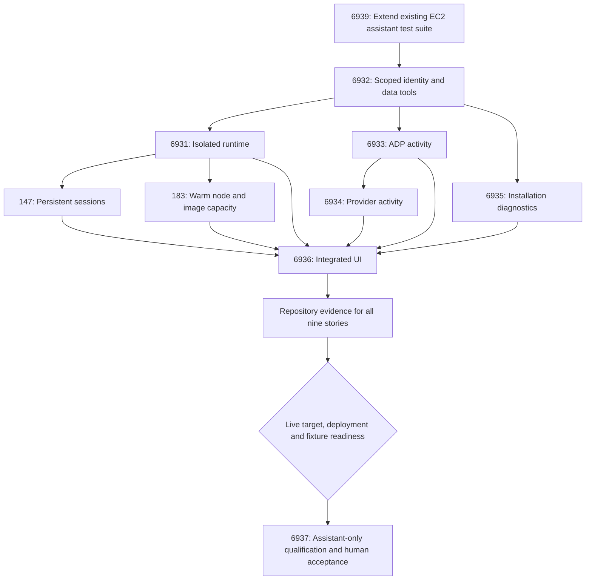

# Execution proposal: user-scoped ADP assistant (#6929)

Status: **historical plan-authoring snapshots, not current execution state**.
The submission and budget sections record observations at their stated revisions;
consult the engine for current plan, authority and progress. Operational identifiers
and receipt hashes in these public copies are illustrative, not usable provenance.

Prepared from the
[unified design](../../architecture/adp-assistant-6929.md) at revision
`6db1df61a63cf7ce36ca4e58d491956d12f474a7` and the current ten non-design children.
Design acceptance is recorded by the merge of PR #6938. Use the merged repository
document for implementation; this bundle preserves the earlier authoring snapshot.

**#6930 is excluded from the graph.** It is only an external design prerequisite;
there is no design node, design gate, duplicate agent assignment or new engine
node type. This bundle proposes the execution sequence after that prerequisite.

The graph has **12 nodes: 9 stories, 2 evaluations and 1 gate**, with 24 edges.
Only existing `story`, `eval` and `gate` kinds are used. The graph passes the current
repository's advisory validator. This proves structure, not server readiness,
accepted authority, evaluation bindings or a working assistant.

Do not submit `proposal.authored.json` alone. Its repository evaluation's machine
specification and execution policy are intentionally unbound, not fabricated.
Without them the engine could interpret missing evaluation configuration as human
and missing policy as legacy behavior. `policy-intent.json` and
`evaluation-plan.json` are authoring inputs, not executable engine contracts.
Resolve the bindings below and preview the complete document before registration.

## Sequence



The JSON also links **every implementation story directly to repository evaluation**;
the diagram abbreviates those nine edges. One delivery wave avoids inventing
routine per-story human gates; the engine requires an evaluation for a wave of
stories. Dependencies control eligibility within that wave. Start with concurrency
one because gateway identity, worker lifecycle and test-registry edits overlap.
The topology permits more concurrency later without promising it at admission.

| Order / branch | Issue | Implementation and completion evidence |
|---|---|---|
| First | #6939 | Extend existing Nightly CLI Regression / CLI Uplift case registry, fixtures, remote adapters, bundling, stage verification, reports and runbooks. Add `assistant` selection; no second harness or cron. Offline guards and negative grading tests pass. Unavailable future features remain explicitly unimplemented/blocked in live results, not certified by fixtures. |
| Foundation | #6932 | Delegated scope and gateway-backed context/memory/artifact/draft ports, migration/quarantine tests and initial merge-triggered deployment audit/guards. |
| Runtime branch | #6931 | Trusted supervisor versus isolated fresh sandbox, scoped model/tool transport, admission/network controls, lifecycle and effective-access test cases. |
| Activity branch | #6933 → #6934 | Existing ADP activity/Task services followed by authorized GitHub/GitLab events, provenance and honest coverage. |
| Diagnostics branch | #6935 | Entitled installation diagnostics and compatible ledger adapter. Existing diagnostics can progress; real ledger acceptance waits for its external implementation. |
| Runtime extensions | #147 and #183 | Exclusive persistent sessions with gateway mailbox/fencing; node/image warming that retains fresh execution. Both depend on #6931. |
| Integration | #6936 | Actual lifecycle UI, streaming/reconnect, contextual sources, feature gating and small browser suite. Full integration waits for all relevant branches. |
| Repository checkpoint | No new issue | Machine evidence intent: reviewed merge receipts and final-head CI evidence for every implementation story. It does not certify deployed isolation or latency. |
| Readiness | No new issue | Explicit live authority, verified installed revisions, usable suite/fixtures, baseline and cleanup readiness. A gate itself neither deploys nor dispatches. |
| Final evaluation | #6937 | Run the selected assistant suite, combine live, repository and browser evidence, record final human qualification. No new developer assignment is implied by this evaluation node. |

All nine implementation nodes select `agent-codex-developer` through the supported
`executor` field. Existing review handling selects `agent-codex-reviewer`: review,
fix, test and merge are owned by the reviewer and its deterministic controller.
The engine verifies and adopts the actual merge. The accepted scope and
current runtime/model admission must be checked; a catalogue entry is not proof of
deployed support. The proposal does not assign an architect or operations persona
as an unsupported graph executor.

#6939 starts first so later feature stories can add executable scenarios against
one registry and fixture contract. It must not wait for the finished assistant or
#6937 to implement that foundation. Each feature PR includes its scenario changes;
a green offline harness test is not a substitute for those feature tests.

## Evaluation and test execution

`evaluation-plan.json` maps **39 criteria** across the ten included issues. The
four #6930 design criteria stay outside this execution graph. Read the linked
story sections for expected outcomes and source-versus-live evidence boundaries.

Each feature PR runs relevant offline tests and independent review. The repository
checkpoint aggregates trusted checks and merge evidence after all code stories.
Before activation, bind exact check names/app IDs and the installed repository
verifier digest in a real `repository-evaluation/v1` specification. Do not bind a
cosmetic check merely because it is already available, or reuse stale checks from
a previous head. If per-criterion artifacts are needed, #6939 and the feature PRs
must produce them before their predicates can be bound.

For live qualification, an authorized operator dispatches **the existing reusable
`.github/workflows/eval-cli-uplift.yml` directly with `suites: assistant`** once
#6939 implements and validates that selector. GitHub Actions executes the cases
on its existing disposable EC2 infrastructure and collects evidence/cleanup.
Do not trigger `nightly-cli-regression.yml` merely to run this subset; do not
change nightly defaults or add a schedule as part of plan creation. Common
preflight, setup and independent cleanup still run for a selected suite.

Bind the real environment, immutable source/workflow revision, deployed component
images, fixture references and runtime budgets at dispatch. Never use a passing
workflow from an older deployment as proof of the latest repair. Test cases must
use ordinary user identities; privileged fixture/fault actions remain separate.
Baseline measurements must be captured before replacing the old runtime, under
separate live-test authority. If a comparable baseline cannot be obtained, latency
acceptance remains blocked rather than being invented after deployment.

Final evaluation is explicitly **human acceptance of recorded evidence**, not an
agent's prose claim or an automatically dispatched workflow. The generic human
specification in the graph lists criterion IDs; it does not install an assistant
runner or make uploaded logs machine-authenticated receipts. Use the supported
human evaluation UI/API with verified workflow/artifact references. #6937 records
release acceptance, the operator runbook and rollout evidence; #6939 updates the
existing execution runbook and each feature contributes recovery documentation.
Any required runbook code/doc changes discovered during qualification become
scoped follow-up work, not an invisible assignment to an evaluation node.

Required evidence includes source citations, authorization negatives and positives,
sandbox probes, lifecycle/recovery outcomes, all required source capabilities,
latency samples, costs, small browser-suite results and independent cleanup.
Headless tests cannot prove browser rendering, accessibility or browser login.
Missing fixture is blocked; absent test implementation is failed/unimplemented;
missing/skipped/not-run required cases cannot pass. A named assistant suite pass
does not mean the entire platform regression matrix passed.

## Existing repair mechanisms and this proposal's limit

Source inspection found `evaluation_corrections.py` and
`evaluation_correction_state.py`: verified machine-evaluation failures can create
bounded correction child stories and request a retest after a new delivery. The
engine is not entirely missing a correction mechanism.

However, this is **not evidence of compatibility with the new assistant suite**.
The current `workflow-evaluation/v1` producer is restricted to the CLI `knowledge`
suite with human acceptance; the E3 correction path requires an active machine
evaluation and verified deployment/evidence lineage. Renaming a suite does not
bridge those contracts. No new agent-controlled infinite loop is proposed.

This plan therefore uses human final acceptance and explicitly authorized external
workflow dispatch. On failure, #6937 records exact criteria, source and evidence;
triage produces bounded repair PRs or a plan amendment using the existing delivery
path, followed by authorized deployment verification and another assistant run.
This handoff is explicit and is not advertised as unattended execution. To automate
it later, first qualify the existing correction machinery with the assistant
producer, machine receipt verifier and deployment lineage in a separately scoped
change. Do not weaken tests or convert missing coverage to a pass to advance a node.

## Deployment, external dependencies and authority

The design and this proposal do not authorize cloud rollout or exposing chat.
Code-only engine policy also does not prevent a GitHub push workflow deploying.
Before affected merges, audit all touched workflow paths, establish build-only or
approved-deployment guards, or obtain explicit target-scoped rollout authority.
#6932 owns the initial guard inventory and #6931 extends it to runtime/IAM. Those
PRs' own merges must obey the same boundary; do not rely on guards that take effect
only after an unauthorized deployment has already started.

Capture baseline and qualify test-user access separately from public UI exposure.
After code delivery, the readiness gate requires an actual compatible deployed
release and current effective IAM/network proof; the operator performs authorized
rollout through the maintained deployment guide. A green merge is not deployment
verification. Staged canary and wider rollout need their stated authority; final
human evaluation does not grant an agent arbitrary cloud control.

#6896 / design PR #6927 remain external. Their proposed ledger schema is not an
implemented installed-state service. #6935 can merge supported diagnostics and an
adapter, while its ledger live criterion remains pending. The final gate/evaluation
cannot pass until that capability exists and is tested, or the owner explicitly
amends the epic scope. No implementation of the ledger is silently added here.
GitHub/GitLab fixtures and cross-tenant identities likewise need real provisioning
and entitlement verification; unavailable sources produce actionable blockers.

`policy-intent.json` proposes three attempts per node and concurrency one. Spend,
duration, expiry, tenant and live-target bindings remain unresolved for acceptance;
no prior $100 budget or expired authority window is reused. Workflow/model and EC2
cost limits must be enforced independently where engine accounting does not cover
them. No policy is active merely because these files exist.

## Bindings before activation

1. Review/merge the external design and this plan; recheck changed issue bodies,
   existing PRs, active work claims and the audited source against current main.
2. Resolve authenticated tenant/repository and deployed developer/reviewer/model
   availability. Set budget, duration, attempts, concurrency and an explicit expiry.
3. Resolve merge-triggered deployment authority before affected source merges.
4. Render a real explicit execution policy and repository machine-evidence spec.
   Validate the complete proposal, including all new test checks and provenance.
5. Use the engine draft preview endpoint and inspect effective edges, policy,
   automatic gate insertion, issue ownership and readiness. Register an inert draft
   only with the intended semantics; obtain acceptance of that exact revision.
6. Execute code delivery. Resolve final suite/target/fixture/deployed-revision
   bindings when those artifacts exist; obtain separate live authorization. A
   missing assistant producer is not permission to dispatch the whole nightly.

The initial authoring was followed by the owner-requested inert submission below.
No acceptance, agent dispatch, workflow execution or cloud action was performed.

## Files and validation

- `proposal.authored.json`: 12-node structural graph; not independently executable.
- `policy-intent.json`: scope, proposed controls and unresolved authority bindings.
- `evaluation-plan.json`: 39 criteria, story attribution and evaluation ownership.
- `source-manifest.json`: inspected issue body hashes, design revision and external
  ledger status; source hashes detect changes without copying sensitive issue text.

Validation uses the repository's actual shared proposal validator:

```sh
python .github/scripts/validate_loop_proposal.py --authored \
  docs/engine-plans/adp-assistant-6929/proposal.authored.json
```

Result: 12 nodes, 24 edges; structural validation passed. Additional authoring
checks verified exact ten-issue coverage, no #6930 node, all nine developer
assignments, criterion uniqueness, all implementation-to-evaluation dependencies,
source links, public-documentation identifiers and whitespace. These checks do
not establish server admission, live runtime compatibility or completed acceptance.

## Engine submission — 2026-10-03

Registered a flow, plan version 1 (identity retained in private operational records).
`proposal.submitted.json` contains a sanitized copy of the submitted body; `submission.json`
records the response and verified state. The engine inserted its standard initial
acceptance gate: the stored graph has 13 nodes and 25 edges, compared with the
authored 12/24. #6930 remains excluded. No extra wave gates were inserted.

The first preview flagged policy-free execution as unbounded if accepted. The
submitted version therefore includes a **proposed**, unstamped code-only policy:
$100 shared agent spend, 24-hour execution ceiling, three attempts per stage,
concurrency one and expiry 2026-10-10T15:01:35.386611Z. This is a new draft proposal,
not reuse of another flow's budget or approval. No deployment target or deploy
action is allowed. Evaluation authority is withheld until a real repository
machine specification is attached; the human final evaluation remains explicit.
The bounded preview passed with `execution_is_unbounded=false`; registration's
plan hash exactly matched the preview.

Read-back confirmed the initial gate is `awaiting_gate` and every other node is
`pending`. Before acceptance, amend the incomplete evaluation binding, resolve
merge-triggered deployment guards and review the proposed limits/design. The
submission makes the plan visible; it does not certify readiness to approve it.
The earlier policy-intent file records the authoring stage's unresolved limits;
the exact submitted proposal records the newer suggested limits.

## Budget revision — version 2

The owner requested a **$1,000** shared agent-spend limit. Saved through the
inert draft revision API and verified in plan version 2. The 24-hour duration,
three attempts per stage, concurrency one and expiry are unchanged. The original
acceptance gate remains unanswered; all 13 nodes are pending or awaiting that gate.
The engine reports execution paused and unauthorized.

`proposal.revised.json` is the new authored revision and `budget-revision.json`
is a sanitized copy of its save receipt. The draft-edit endpoint rejects inline evaluation specs,
including the previous human-only specification. All 39 criteria are preserved in
`evaluation-plan.json` and `evaluation-specification.pending.json`; final acceptance
remains human in the proposed policy. Reattach the appropriate evaluation specs
through the supported evaluation binding path before activation. No test criteria,
nodes or edges were removed. `proposal.submitted.json`/`submission.json` retain the
historical version-1 submission; they are not the current budget.
