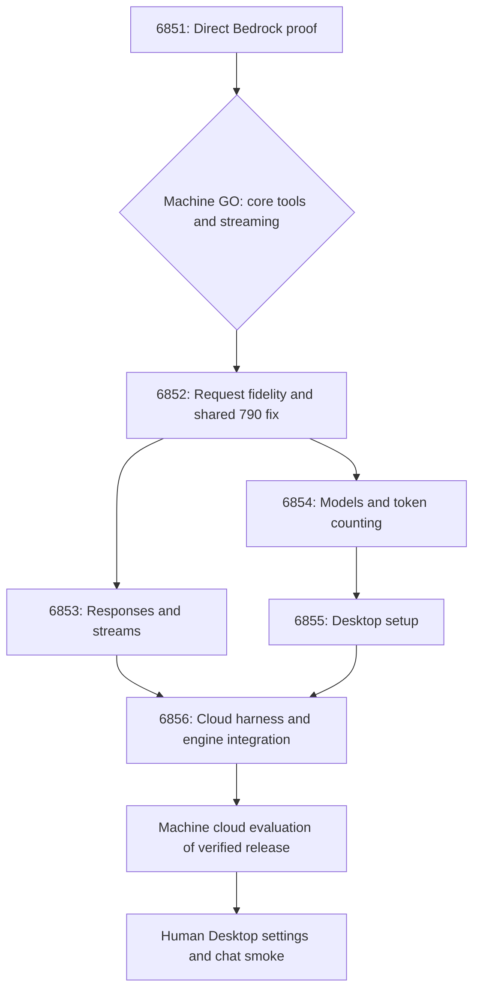

# Engine plan proposal: Claude Desktop via ADP (#6850)

Prepared 2026-09-30 from epic #6850, children #6851–#6856, and shared defect #790. This proposes a delivery flow with machine evaluations, not an evaluation-only run. No issue was assigned, flow registered, authority accepted, or workload started.

**Status: authored proposal; execution bindings incomplete.** The graph passes the repository's advisory proposal validator. That proves graph structure, not execution readiness. Do not submit `proposal.authored.json` on its own: the engine defaults unspecified evaluations to human acceptance and an absent execution policy to legacy behavior. Neither is intended here. Complete the bindings below before registration.

## Proposed flow



The JSON contains all explicit prerequisite edges, including the GO barrier to every implementation story and every implementation story to final evaluation. There are six story nodes, two evaluation nodes and one human gate. Every wave containing stories has its required evaluation node. The final evaluation uses #6850 as its evidence identity; the epic itself gets no implementation assignment. The probe evaluation has no separate issue yet; verify the selected evaluator's claim/issue requirement and create a dedicated evaluation issue only if required.

There are no routine human review, merge, wave or deployment gates proposed. Initial acceptance authorizes the exact bounded plan. A genuine NO-GO, scope change, missing capability or exhausted bound remains visible and actionable. Final Desktop smoke is retained because the epic explicitly requires it. Do not let registration insert additional wave gates without showing them in the effective preview.

## Responsibilities and completion

| Work | Owner and completion evidence |
|---|---|
| #6851 | Probe/evidence work only. Record cloud identity, selected model, sanitized direct calls/events, usage and capability matrix. A reviewed report may merge even when its verdict is NO-GO; the subsequent machine evaluation must still block product implementation. |
| #6852 | Preserve supported schemas/tool fields and explicit unsupported-feature errors. Reconcile #790 and existing PR ownership before coding. A single implementation must cover shared behavior; #790's OpenAI-path requirements must not disappear merely because this epic primarily uses Anthropic Messages. |
| #6853 | Preserve exact tool IDs, reconstructed streamed JSON, ordering, stop reasons, usage and failures. |
| #6854 | Preserve generic discovery while providing permitted Desktop models; CountTokens behavior follows the cloud matrix. Any new IAM permission is a separately scoped reviewed change, not ambient permission expansion. |
| #6855 | Install a deployment-pinned refresh helper, preserve user settings and existing CLI clients; verify served CLI packaging. |
| #6856 | Build the clean cloud suite, failure cases, runbook, and proposed engine dispatch/result integration. |
| Architect | Finalize criterion-to-evidence mapping, target/model capability choices and supported evaluation contracts before admission. |
| Reviewer | Independently review the exact PR head, repair findings, rerun checks, and complete authorized merge through the engine. Changed heads require fresh evidence. |
| Engine | Advance dependencies, preserve execution state and bounds, perform/reconcile merges, verify deployment, collect evidence and show blockers. |

Code stories finish on observed reviewed merge. Product/epic acceptance waits for the verified deployed release, machine cloud evaluation and actual Desktop smoke. Cloud protocol tests do not prove the desktop GUI/settings experience.

## Evaluation design

`evaluation-plan.json` defines six mandatory proof criteria and eleven final cloud criteria. It is a design document, not an invented engine contract. Render those criteria into supported accepted specifications after the real producers, check identities and artifacts exist.

For the first checkpoint, core direct tool round trip and streaming must pass. CountTokens and optional betas may have explicit unsupported dispositions, with downstream behavior narrowed accordingly. Missing permission is distinguishable from an unsupported model. No product changes or implementation dispatch occur before core GO.

For final evaluation, require all child merges, #790 evidence, actual gateway/CLI provenance, clean scoped login, both tool-loop modes, model authorization, counting behavior, refresh, usage attribution, regressions and cleanup. A successful workflow with missing mandatory cases cannot pass. Bind evidence to the actual source, workflow definition, model, target, run and attempt.

The existing repository-security-scan producer is not a Desktop/Bedrock probe runner. The current `workflow-evaluation/v1` implementation is restricted to the knowledge CLI suite. Reuse the engine's ledger, evidence validation and acceptance machinery, but establish a supported Desktop/probe execution adapter. Do not relabel Desktop tests as knowledge or repository scans.

## Proposed bounds

`policy-intent.json` proposes $100 shared agent spend, 24 hours from first dispatch, four attempts per node and concurrency one. These are proposed values, not existing authorization. Serial execution also avoids overlapping gateway translator/schema edits. Set an explicit UTC expiry when preparing final acceptance; never renew it silently.

Direct proof: at most two models, 24 inference requests and eight CountTokens requests, 256 output tokens per inference request, 30-minute duration. Final cloud run: at most 24 inference requests and eight CountTokens requests, 256 output tokens per inference request, 60-minute duration. Retries consume the same ceilings. Probes must enforce limits before calls, not infer a bound from a short prompt. Optional cases that cannot fit require a reviewed narrower matrix or amended bounds.

The agent budget does not by itself cap direct Bedrock, workflow or infrastructure charges. Verify target pricing and bind the corresponding spend/resource controls before a run. Use private fixture references, never credential contents. Only dev is proposed; production remains outside this plan.

## Required preparation before engine acceptance

1. Resolve the authenticated tenant and existing-flow visibility. The current API session returned an empty flow list; that does not prove historical flows were deleted or that the deployment is correctly selected.
2. Recheck all seven issue/PR ownership records against current main; preserve original acceptance criteria. Snapshot bodies are in `source-issues.json`.
3. Resolve the actual dev environment connection, account, cloud role, region and entitlement-allowed model IDs. Do not reuse the prior E32 target authority as permission for this epic's Bedrock calls.
4. Bind a supported probe producer and machine GO specification. If this requires engine integration code outside the children, give it an explicit prerequisite owner before activation; a prose obligation cannot execute itself.
5. Include the #6856 engine integration addition in the accepted scope. Its current issue describes manual dispatch, a workflow with both PR and dispatch triggers, and no engine receipt contract. Preserve PR-only offline validation while making live dispatch/collection compatible with the selected adapter. Do not weaken event authentication.
6. Prepare exact deployment bindings and release verification for gateway/CLI changes, including packaging-only changes that do not automatically deploy. Final tests must wait for an observed compatible running release.
7. Render `policy-intent.json` into the actual policy schema and attach both machine evaluation specifications. Bind actual workflow/check identities and artifact schemas without inventing future run IDs, merge SHAs or receipts. If final immutable bindings can only exist after #6856, use the supported revision-bound binding process and show that dependency explicitly; do not advertise unattended completion until that path is supported.
8. Preview the complete document with `/orchestration/flows/drafts/preview`; inspect effective graph, inserted gates, policy and technical blockers. Register an inert draft only once its machine intent is represented correctly. Owner acceptance is separate from proposal creation and execution.

## Files and validation

- `proposal.authored.json`: schema-shaped graph; tenant intentionally unresolved; **not a standalone execution document**.
- `policy-intent.json`: proposed roles, actions, limits and unresolved target bindings.
- `evaluation-plan.json`: mandatory criteria and evidence requirements for both machine checkpoints.
- `source-issues.json`: inspected child/defect bodies and discussion for traceability.

Validation performed:

```text
/tmp/adp-6196-test-venv/bin/python .github/scripts/validate_loop_proposal.py --authored docs/engine-plans/claude-desktop-6850/proposal.authored.json
OK — 9 nodes, 19 edges; all proposal structural rules passed.
```

This is local advisory validation against the workspace validator. Server readiness, cloud capability and evaluation adapter compatibility have not passed and are not claimed.

## Executor assignment update — 2026-10-01

All six story nodes now propose an agent executor with role `develop` and persona `agent-codex-developer`. This requires the engine executor-assignment change; it is not supported by the old deployed schema. Reviewer selection remains the existing `agent-codex-reviewer` controller. Model and tenant bindings remain unresolved; no flow has been activated. See `docs/design-notes/engine-executor-assignment.md` in the implementation worktree.
