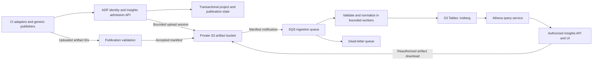

# Engineering Insights — shared ADP capability

Status: proposed capability architecture, reviewed 2026-10-07. This document is
an implementation proposal, not evidence of an available API or a deployed
service. The ADP regression catalog and selector exist on the regression
coordinator branch; Insights onboarding, publishing, storage, ingestion and
query APIs do not exist as a result of this document. Existing artifact uploads
have not been switched.

Engineering Insights is an ADP capability that other projects can use to retain
engineering evidence, analyze outcomes and understand coverage. A consuming
project brings its own CI system, test frameworks and execution environments.
It does not need to run on ADP, use ADP agents, host its repository on GitHub, or
adopt ADP's module IDs. ADP's own regression stack is the first consumer and uses
the same published interfaces and isolation rules as an external project.

The initial product scope is test/run evidence, artifacts, coverage and associated
measurements. Builds, deployments, security findings and AI evaluations are
extension domains. Do not claim delivery metrics such as deployment frequency
or change-failure rate until the relevant source events and their semantics are
implemented. The service does not execute tests or replace CI scheduling in v1.

## Module location and integration

The implementation home is [`modules/engineering-insights/`](../../modules/engineering-insights/README.md),
a new ADP platform module. Detailed design and review material stays in
`docs/engineering-insights/`. The module directory currently contains its README;
its documented service, contract, adapter, client, infrastructure and test
directories will be added with implementation.

Engineering Insights owns its capability logic and data contracts. Reuse existing
ADP identity and tenant authority, with gateway routing/authentication and UI
integration in the existing gateway/frontend. Platform deployment wiring remains
in the platform's existing integration points. This module boundary does not
require a separate tenant directory or a new runtime/framework. ADP regression
uses a consumer adapter rather than becoming part of the shared service core.

## Review findings and design changes

The previous revision described a regression artifact pipeline. The following
findings are requirements for offering it as a shared capability. Their design
changes are recorded here; implementation and validation remain outstanding.

| Finding | Priority | Required design change |
|---|---|---|
| EI-R01: project fields alone did not establish an ownership boundary | Release blocker | Reuse ADP tenant authority; authorize every operation against an Insights project and bind storage, queries, caches and exports to that scope |
| EI-R02: no external-project onboarding or publishing contract | Release blocker | Define project registration, source connections, publisher grants, artifact sessions and versioned ingestion APIs |
| EI-R03: repository and ADP test IDs were assumed | High | Support projects with multiple/no repositories, native test identities, optional coverage catalogs and unknown coverage denominators |
| EI-R04: publishers appeared to choose S3 destinations and write completion manifests directly | Release blocker | Issue bounded upload sessions; let the service validate and finalize the authoritative manifest |
| EI-R05: operational state was deferred despite admission and revocation requirements | High | Keep project configuration, grants, run admission, idempotency and publication state in the transactional control plane; S3 Tables serves analytics |
| EI-R06: source adapters and coverage verdicts were mixed with the common pipeline | High | Keep provider metadata and parser-specific behavior in adapters; version acceptance policies separately from reported test outcomes |
| EI-R07: resource isolation and consumer-facing service behavior were unspecified | High | Add quotas, query budgets, retention/deletion, freshness states, compatibility policy and audited support access |
| EI-R08: acceptance only described ADP's migration | Release blocker | Require two independent projects, a non-GitHub publisher, colliding native IDs, hostile inputs and cross-tenant/project isolation tests |

## Product boundary and ownership

```text
ADP deployment / regional Insights service
  ADP tenant (existing authorized organization)
    Insights project (new capability resource)
      source connections and publisher/read grants
      optional repositories, components and environments
      versioned coverage definitions and test mappings
      runs -> attempts -> suites/jobs -> test instances -> retries
      immutable artifact publications and analytical projections
```

A tenant is the existing ADP organization boundary, as described in
[tenant selection](../adp-cli/tenant.md). It is not a GitHub organization, AWS
account or compute workspace. Reuse authoritative ADP identity, membership and
revocation checks; do not create an Insights tenant directory. Tenant membership
alone does not automatically grant access to every project's evidence.

An Insights project is an independently administered evidence scope within that
tenant. This is a proposed resource, not a claim that ADP already has a generic
project model suitable for this purpose. Confirm reuse opportunities during
implementation before adding a scoped project record to the Insights control
plane integrated with ADP. A project may aggregate multiple repositories and CI connections. A
repository may publish to different projects only through explicit authorized
bindings. Forks, renamed repositories and transferred repositories must be
resolved using provider identity plus current connection authorization, not a
mutable repository name.

Tenant and project authority comes from the authenticated identity and current
grants. A requested project ID is a resource selector checked by the service;
a tenant ID, project ID, bucket key or role name in an uploaded report cannot
confer access. Server-issued run IDs are opaque and do not grant access either.
Project moves between tenants are excluded from v1; use a reviewed export/import
procedure that creates new ownership and provenance if later required.

## Storage responsibilities

| Information | Authoritative location |
|---|---|
| Project-owned strategies, test code, catalogs and policy definitions | Consumer's versioned source/configuration system; GitHub for ADP's own consumer |
| Tenant identity, membership and revocation | Existing ADP authority |
| Insights project settings, source bindings, grants, upload sessions, idempotency and run/publication state | Transactional ADP control plane; never inferred from analytical rows |
| Logs, JUnit/JSON reports, screenshots, traces and coverage files | Private S3 general purpose artifact bucket |
| Immutable accepted manifests, catalog snapshots and normalized input envelopes | Same artifact store, under service-controlled object keys |
| Historical runs, test attempts, mappings, artifact references and measurements | S3 Tables table buckets, using Apache Iceberg |
| Queries, authorized artifact delivery and stable result links | Insights API and UI; Athena executes historical queries |
| Test scheduling, execution and required CI checks | Consumer's CI/execution system |

S3 Tables is a separate bucket type from the general purpose artifact bucket.
Copying JSON/Parquet objects into a prefix does not commit rows to an Iceberg
table; normalization must use an Iceberg-compatible writer/query engine. The
transactional store handles admission and current state while analytical writes
are delayed. It is not a second source of historical test facts.

GitHub Actions continues to produce its native console logs when a consumer uses
it. S3 becomes the retained evidence store; moving uploads does not disable the
provider's native log storage. CI summaries and required check conclusions remain
with the provider, with stable links to Insights instead of expiring download
URLs. Provider retention is a consumer setting, separate from Insights policy.

## Consumer onboarding and permissions

An external project follows the same process as ADP:

1. A tenant administrator enables the capability and creates an Insights project
   with owners, data Region, retention classes and initial resource limits.
2. A project administrator registers an authenticated source connection, such as
   a GitHub repository/workflow binding or a generic machine publisher. Registration
   stores immutable provider identities where available; a label is not evidence
   of repository ownership.
3. Grant the publisher only run submission and upload permissions for that project.
   Grant people or services read/download/manage permissions separately.
4. Configure the provider adapter or generic HTTPS client. Test execution stays in
   the project's existing CI, EC2, Kubernetes, workstation or other environment.
5. Optionally publish a versioned test/coverage catalog and acceptance policy.
   Standard reports can be ingested without either; unmapped tests are visible and
   scenario coverage is reported as unknown until definitions are supplied.
6. Run a synthetic publish/read/download check, verify restricted access, and link
   the project's CI summaries to its Insights view before migrating retention.

| Capability role | Proposed responsibility |
|---|---|
| Tenant administrator | Enable Insights, establish projects and tenant-level policy/budgets |
| Project administrator | Manage source bindings, publisher/read grants and project settings within tenant limits |
| Publisher service principal | Register runs, upload assigned artifacts and publish results for its connection/project; no implicit read or project-management permission |
| Project viewer | Read authorized results and ordinary artifacts; sensitive-artifact access may require a separate grant |
| Support/operator | Operate the service; inspect tenant content only through explicit, time-bounded, audited access |

These are capability permissions to map onto ADP's existing role/policy system,
not new global platform-admin roles. Configuration changes and grants require
current authority. Revocation must block new admissions, publication and reads;
short-lived already-issued S3 URLs may remain usable until expiry. Use short
lifetimes and an authenticated download proxy when immediate revocation is needed.

For v1 machine publishing, use ADP's registered service-principal authentication
and authorize Insights-specific scopes. The [Task API identity design](../task-api/README.md#7-authentication-tenant-validation-and-execution-authority)
is a reuse reference, not permission to reuse Task scopes or assume its proposed
contracts are automatically available to Insights. Human requests use existing
ADP login and tenant context. Validate the actual shared implementation before
exposing Insights routes.

A GitHub OIDC adapter can exchange a verified provider token for a short-lived,
project-bound publisher session once implemented. Validate issuer, audience,
signature, expiry, subject and configured repository/workflow/ref restrictions.
Use provider-verified metadata for additional claims; workflow inputs and report
fields are not authentication evidence. Keep OIDC federation a distinct adapter
milestone, not a requirement that every consumer obtain AWS credentials. Before
that adapter exists, a trusted workflow may use a registered machine identity
through its protected secret store. Untrusted fork jobs do not receive it.

## Proposed public contract

The following routes describe the capability boundary. They are not existing
endpoints, committed SDK commands or an approved final OpenAPI specification.
Version the contracts and publish schemas before implementing integrations.

| Proposed operation | Contract |
|---|---|
| `POST /engineering-insights/v1/projects` | Authorized project creation under the resolved ADP tenant |
| `POST /engineering-insights/v1/projects/{project_id}/connections` | Register a source binding; manage grants through authorized control-plane operations |
| `POST /engineering-insights/v1/projects/{project_id}/catalogs` | Validate and snapshot a versioned catalog; project-local IDs and typed parent links |
| `POST /engineering-insights/v1/projects/{project_id}/runs` | Admit a run with an idempotency key; return a server run ID and stable result locator |
| `POST /engineering-insights/v1/runs/{run_id}/artifacts` | Allocate bounded uploads tied to this publisher, run and attempt; return exact upload instructions |
| `POST /engineering-insights/v1/runs/{run_id}/publications` | Validate artifact IDs/checksums and reported completion; return durable publication receipt and ingestion state |
| `GET /engineering-insights/v1/runs/{run_id}` | Return current reported execution, evidence and ingestion states to authorized readers |
| `GET /engineering-insights/v1/projects/{project_id}/results` | Bounded, paginated analytical views with authorized filters |
| `GET /engineering-insights/v1/artifacts/{artifact_id}/download` | Reauthorize and return a short-lived download or authenticated stream |

A project-bound idempotency key is additionally scoped by connection and operation.
The same key and semantic payload returns the existing resource; a different
payload conflicts. A CI rerun or test retry has a new attempt identity, not a
replacement of the old result. Return publication receipt before analytics are
ready; the status endpoint exposes pending/failed normalization explicitly.
Rate/size limit responses include actionable retry or limit information.

Illustrative native run metadata, inside a versioned admission envelope:

```json
{
  "schema_version": "1.0",
  "connection_id": "conn-example",
  "source": {
    "provider": "generic",
    "native_run_id": "build-42",
    "native_attempt_id": "attempt-1"
  },
  "kind": "test",
  "execution": {
    "mechanism": "api",
    "executor": "container"
  },
  "definition_snapshot": null,
  "extensions": {}
}
```

The example has no required GitHub repository, ADP module ID, EC2 instance or
Playwright dependency. The connection is authorized, not trusted just because
its ID appears in the body. Source/deployment revisions, environment and report
formats are supplied when known, with provenance and verification status. Keep
observed and publisher-asserted values distinguishable. Environment identities
are project-scoped; two projects' `dev` environments are not the same target.

Catalog identities are qualified by `(tenant_id, project_id, catalog_version,
local_id)`. ADP's `MOD-001` and another project's `MOD-001` are different definitions.
Other projects can retain their own IDs and hierarchy; v1 defines optional
module/feature/scenario types without requiring that naming pattern. Native test
selectors remain queryable even when no catalog mapping exists. A test instance
adds canonical parameter/fixture identity and test retry to a stable definition;
do not put secret fixture values into an identity string.

The service derives tenant/project scope, server IDs, storage references and
admission timestamps. The producer supplies reported execution facts and artifact
metadata. Known optional fields can evolve compatibly; incompatible changes use
a new schema major. Reject unsupported versions without losing the upload's
failure receipt. Bound and namespace extensions, retain unknown supported
metadata as opaque data, and version parsers independently. Never infer a missing
scope or acceptance policy from an ADP-specific default.

## Shared data flow and publication boundary



Publishers get upload instructions for service-generated object keys. Grant only
the assigned object/session operations, with short expiry, allowed sizes/formats
and checksum constraints. They never receive general bucket listing, table
administration or an arbitrary S3 destination parameter. Validate actual stored
size/type/checksum and session ownership before finalization; declarations alone
are insufficient. A finalized manifest pins exact immutable object versions so
a still-valid upload URL cannot change the bytes already accepted.

Only the service publishes the authoritative completed manifest. Normalize only
accepted, service-controlled manifest objects. An event under the raw-upload
prefix cannot bypass admission. The manifest means evidence was durably accepted,
not that its assertions passed or are independently verified. Coordinate the
transactional publication record and manifest notification with an outbox or
reconciliation protocol: a crash between stores must be recoverable. Consumers
must not assume an atomic transaction spans the control store, S3 and Iceberg.

Start with micro-batched writes through a supported Iceberg writer. Athena DML
is a candidate after catalog integration; verify the required operations and
concurrency behavior in the chosen Region/workgroup. Do not issue a SQL write
per log line. S3 Tables manages table maintenance, not application deduplication.

Register runs before tests begin when the producer supports it. A provider
completion collector or heartbeat/timeout reconciler records cancelled/abandoned
runs and missing publications. A generic publisher can send heartbeats and
explicit completion without a provider adapter. Batch import of older results is
supported as historical import with observation timestamps; it cannot prove
there were no other missing runs. Retry interrupted uploads and never manufacture
passing results to fill missing evidence.

## Generic artifacts and provenance

Example service-owned layout, with real bucket targets kept in private configuration:

```text
tenants/<tenant-id>/projects/<project-id>/runs/<run-id>/attempts/<attempt-id>/
  definitions/<snapshot-id>.json
  selection/<selection-id>.json
  suites/<suite-id>/jobs/<job-instance-id>/
    artifacts/<artifact-id>/<object-id>
    publications/<publication-id>/manifest.json
  completion/<publication-id>.json
```

A matrix job has its own identity. Repository/provider/native-run names are
metadata rather than authority or raw path components. Generated object IDs,
checksums and version references prevent retries from overwriting accepted
history. The service records project-qualified locators in analytical tables;
the client cannot fetch another project's object by supplying its S3 key.

Every accepted manifest contains the schema/parser provenance, resolved scope,
source connection, source-native and server run/attempt IDs, observed/reported
timestamps, artifact IDs and immutable locators, checksums, sizes, media types,
classification, retention policy version, publication status and omitted-artifact
reasons. When supplied, include catalog/selection snapshots, source revisions,
independently observed deployment/component revisions and cleanup result.
Cleanup is `not_applicable` only where declared by the harness contract; absence
is `unknown`, not success. Unknown revision fields remain unknown.

Store raw supported reports and normalized input envelopes so results can be
reprocessed when parsers change. Keep parser corrections and original outcomes
auditable. API-generated download URLs are transient; the CI link points to a
stable authenticated Insights run page. Escape source titles and error messages;
serve HTML reports and trace viewers with download or isolated-origin policies
so uploaded content cannot execute with the Insights application's session.

## Analytical model and trustworthy metrics

All analytical table/column names use lowercase. Every fact and definition is
scoped by tenant and project; joins, deduplication keys, caches and exports carry
that scope, even when physical storage is already isolated.

| Table | Row grain and purpose |
|---|---|
| `runs` | One source run attempt with source connection, reported/verified provenance, trigger, source/deployed revisions, timing and execution verdict |
| `suite_runs` | One suite/job attempt with mechanism, executor, cleanup, evidence and ingestion state |
| `test_definitions` | One versioned stable test definition with native selector, source location when supplied, framework and mapping status |
| `test_results` | One parameterized/fixture-qualified test instance attempt and retry, with raw/normalized outcomes, duration and failure category |
| `coverage_definitions` | One versioned project-local module/feature/scenario definition and its typed parent relationship |
| `test_scenario_map` | One versioned test-to-scenario relationship; shared definitions do not duplicate executed tests |
| `selection_items` | One intended test/scenario selection with required/optional status, prerequisites and gap reasons |
| `artifacts` | One immutable accepted object reference, checksum, media type, classification, retention and availability state |
| `measurements` | One typed measurement with value, unit, source, observation interval and aggregation semantics |
| `policy_evaluations` | One versioned acceptance-policy evaluation against pinned evidence, evaluator version and result; separate from producer-reported outcome |

Deterministic logical keys include tenant, project, connection, source-native run,
source attempt, suite/job instance, test instance and retry. The same native IDs
in two connections or projects must not collide. Deduplication is a writer
responsibility; S3 Tables does not enforce application primary keys. Choose
partitioning using volume/time/query patterns, not high-cardinality test/run IDs.
Document and benchmark table/namespace growth before broad tenant rollout.

| Insight | Definition and limits |
|---|---|
| Test pass rate | Show first-attempt and eventual outcomes separately with skipped/blocked/not-run counts; state the selected denominator |
| Scenario coverage | Derive from a versioned catalog and mappings; without a catalog, show unknown, not zero or 100% |
| Execution completeness | Compare expected selection with observed instances; no plan means completeness is unknown |
| Flakiness | Preserve initial failures and retries; distinguish test instability from environment failures using explicit classification |
| Performance | Compare compatible mechanisms, environments and measurement definitions; retain units and aggregation method |
| Cost | Label estimated versus measured cost, currency, period, source and attribution completeness |
| Cross-project rollups | Require access to each project and comparable metric definitions; expose unknown/unequal coverage instead of combining incompatible percentages |

Test outcome, evidence state, ingestion state and acceptance are independent.
An uploaded JUnit file is a producer assertion. Passing a mapped test is evidence
for a scenario, not proof of all its acceptance criteria. Qualification policies
must state expected tests, trusted publishers, required revisions, cleanup and
other proof, and run under a separately authorized evaluator. A publisher cannot
self-assign qualified status. Module-run selection and ADP-specific gates remain
consumer policies outside the shared ingestion service.

## Isolation, resource controls and data lifecycle

For the first ADP-hosted deployment, use one regional private artifact store with
service-enforced tenant/project prefixes and exact-object upload grants. Start
with tenant-separated S3 Tables namespaces/table resources governed by backend
IAM/catalog permissions. Namespace names or SQL predicates alone are not an
authorization boundary. Within a tenant, project rows may share tables, but only
the authorized query service can execute access-controlled views. Consumers get
no direct bucket-list or arbitrary Athena/SQL credentials in v1. Dedicated
buckets, accounts, customer-managed storage and direct BI access are later
isolation tiers requiring their own policy and operational design.

The query service resolves current project grants, uses approved parameterized
query templates, enforces tenant/project filters and binds query IDs/results to
the same scope. Pagination tokens, saved searches, caches, exports and downloads
must be scoped too. Restrict Athena query-result storage; knowing a query ID or
result key never grants access. Auth checks apply again when polling a query or
retrieving an export. A project reader must not infer other projects' existence,
names, aggregates or artifact metadata through errors or cached responses.

Admission limits include bytes/artifact, artifacts/run, decompressed report size,
runs/time, active sessions and retention storage. Query/ingestion budgets include
per-project concurrency, bytes scanned, timeouts and bounded retries. Use queue
fairness so one project cannot starve others. Define configured quotas and a
billing/usage attribution policy before enabling a project; no unlimited default
for a new connection. Show stale analytical views and pending evidence explicitly.
Numeric freshness/availability objectives require measurements before launch.

Parsers handle untrusted content: bound XML/JSON/archive size and nesting, disable
external XML entity resolution, reject path traversal and archive bombs, and never
execute uploaded scripts. Ingestion workers need no customer credentials or
network access to producer-supplied URLs. Provider log collectors fetch only via
configured providers, validate webhook signatures/replay where applicable, and
use narrowly scoped credentials. Treat arbitrary source links as display data,
not destinations the backend should fetch.

Classify and minimize logs before upload. Protect traces, screenshots and reports
that may contain user/deployment data; encryption and retention do not remove
secrets. Use explicit output allowlists and keep credential-bearing private run
or cleanup state out of Insights. The ADP CLI adapter must preserve its existing
separation between publishable reports and private state.

Retention is policy-versioned by artifact class and bounded by tenant settings.
Choose object version lifecycle, Iceberg snapshot expiry, normalized fact
retention and backup handling together. Deletion/offboarding first revokes
publish/read grants, then purges or expires artifacts, query results, caches,
analytical rows and historical snapshots according to policy. Do not describe a
row tombstone as complete erasure while old snapshots or object versions remain.
Retain an authorized deletion audit without sensitive payloads; expose expired
or deleted artifact availability correctly. Legal-hold support and cross-Region
replication are separate requirements to resolve before promising either.

## Reliability and compatibility

Queue deliveries can repeat or arrive out of order. Deduplicate by scoped
publication identity/checksum, coordinate conflicting writes, retry Iceberg commit
conflicts, quarantine malformed input and replay from accepted manifests. Preserve
source event time, service receipt time and ingestion time. Corrections and
reprocessing reference previous publications; repeated delivery does not count
as another test attempt.

Publication failure must not prevent the caller's cleanup. If normalization is
down, acknowledged raw evidence remains durable and status is pending/failed,
not accepted as qualified. Show last-ingested time and source coverage in the UI.
Backpressure must be visible with bounded retry guidance. Reconciliation restores
missing notifications and reports partial manifests or abandoned runs.

Publish a compatibility policy for API/schema majors, adapter versions, parsers
and catalog imports before external consumers depend on it. Test new parsers on
retained fixtures before reprocessing history. Version metric definitions and
keep snapshots/rebuild provenance; a parser upgrade must not silently redefine
historical pass rates. Maintain export of accepted evidence and normalized data
so a project can leave the service.

## Initial adapters and ADP as a consumer

| Adapter/domain | Initial responsibility | Status |
|---|---|---|
| Generic HTTPS publisher | Run admission, bounded artifact upload, publication receipts and status | Proposed v1 foundation |
| JUnit XML adapter | Normalize supported pytest/JUnit results and preserve native selectors/properties | Proposed v1 parser; dialect differences require fixtures |
| GitHub Actions publisher/collector | Bind verified workflow metadata, publish supported outputs and link checks to Insights | Proposed first provider adapter; OIDC exchange is a distinct milestone |
| ADP regression adapter | Import the ADP catalog/selection plan, normalize CLI and shell reports, preserve module tags and cleanup/revision evidence | First consumer; existing harnesses are inputs, not shared-service internals |
| Playwright, coverage and trace formats | Store opaque artifacts initially; add typed result/coverage parsers where explicitly supported | Format/version-specific rollout |
| Other CI providers | Use generic publishing first; add provider-specific collectors only as needed | No native adapter claimed |

ADP registers a normal project and source connections. The same generic client,
quotas and grants apply; do not hardcode `aws-e/adp`, `MOD-nnn`, a deployment name,
EC2, Cognito fixtures or a particular nightly schedule into the service contract.
The Insights service does not load ADP's test registry as a global source of truth.
Each consumer submits its own optional catalog snapshot. A parser's missing mapping
is visible rather than a reason to reject otherwise valid native test evidence.

For ADP's migration, replace artifact publishers and readers together. In
particular, `eval-cli-uplift.yml` currently publishes engine deployment context
and qualification results through GitHub artifacts. Migrate those consumers and
retain their policy checks before removing uploads. Validate S3 alongside existing
consumers during cutover, then remove migrated GitHub artifacts while preserving
short check summaries and stable Insights links.

## Delivery sequence and release acceptance

| Phase | Deliverable and exit evidence |
|---|---|
| 1. Contracts | Versioned API/envelope/catalog schemas, role mapping, source trust rules, limits and error/status semantics; fixtures from two unrelated projects |
| 2. Shared service foundation | Project onboarding, identity/grants, transactional admission, artifact sessions, immutable manifests, audit and revocation; cross-project/tenant isolation demonstrated |
| 3. Analytics | Queue/replay, parsers, S3 Tables integration, authorized query views, deletion/retention and resource limits; duplicate and crash recovery validated |
| 4. External pilot plus ADP | One independent generic/non-GitHub consumer and ADP regression use the same service; qualification consumers migrated without weakening their checks |
| 5. Product access | Project/run/module views, artifact downloads, completeness/freshness indicators, exports and operator monitoring; measured service objectives and supported adapter matrix |

Architecture review is not AWS deployment approval. Prepare infrastructure-as-code
and select the actual account/Region/storage permissions before following the
repository's [deployment procedure](../adp-platform-deployment/deploy-with-agent.md).
No resources or identities are created by this document.

The capability's own test strategy must cover these release criteria:

| Acceptance area | Required proof |
|---|---|
| Generic adoption | A project with no ADP agent, GitHub repository or module catalog can publish a supported report, see native results and retrieve authorized evidence |
| Identity collisions | Two tenants and two projects in one tenant reuse native run/test/module IDs without overwriting, joining or exposing each other's data |
| Authorization and revocation | A forged tenant/project field, wrong connection, guessed run/artifact/query ID, stale grant or replayed upload is refused; support access is explicitly audited |
| Catalog optionality | Missing catalog/selection gives unknown coverage/completeness; importing a catalog later creates a versioned mapping without rewriting original evidence |
| Input safety | Oversized/malformed XML, archive traversal, active HTML, object mutation and cross-project manifest references cannot bypass validation or execute with platform authority |
| Delivery correctness | Duplicate/out-of-order messages, retry collisions, partial uploads, expired sessions, lost runners and a crash between every persistence step remain replayable or explicitly incomplete |
| Verdict correctness | Failed/skipped/blocked/not-run tests, missing evidence, failed cleanup and deployment drift cannot become qualified through successful upload or delayed analytics |
| Query isolation and fairness | Cross-scope pagination/cache/export/query-result access fails; one project's upload/query flood stays within quotas and does not exhaust all other capacity |
| Lifecycle and compatibility | Retention/offboarding includes versions, snapshots and caches; parser/schema upgrades preserve provenance; exports and old compatible clients work as declared |
| ADP coexistence | Existing required checks, cleanup and release qualification remain enforced before GitHub artifact consumers are retired |

These are planned acceptance criteria, not completed tests. Implementation should
assign capability-owned test/scenario IDs without reusing another module's audit
IDs or presenting this strategy as executed coverage.

## Related material and references

- [ADP tenant selection and authorization](../adp-cli/tenant.md)
- [Existing organization authority](../../modules/gateway/src/admin/identity/organizations_service.py)
- [Gateway authentication dependencies](../../modules/gateway/src/auth/dependencies.py)
- [Task API identity design reuse reference](../task-api/README.md#7-authentication-tenant-validation-and-execution-authority)
- [ADP regression entry point](../regression-testing/README.md)
- [ADP master coverage register](../regression-testing/master-test-coverage.md)
- [ADP module selection and tags](../regression-testing/module-selection.md)
- [ADP consumer's test registry](../../tests/regression/catalog.json)
- [AWS: S3 Tables and table buckets](https://docs.aws.amazon.com/AmazonS3/latest/userguide/s3-tables.html)
- [AWS: querying S3 Tables with Athena](https://docs.aws.amazon.com/AmazonS3/latest/userguide/s3-tables-integrating-athena.html)

AWS references were checked on 2026-10-07 during the initial storage design. They
document managed Iceberg storage, maintenance and Athena integration. Account/Region
availability, policy behavior, scale, latency, quotas and pricing require verification
for the selected deployment; this review does not claim those have been measured.
