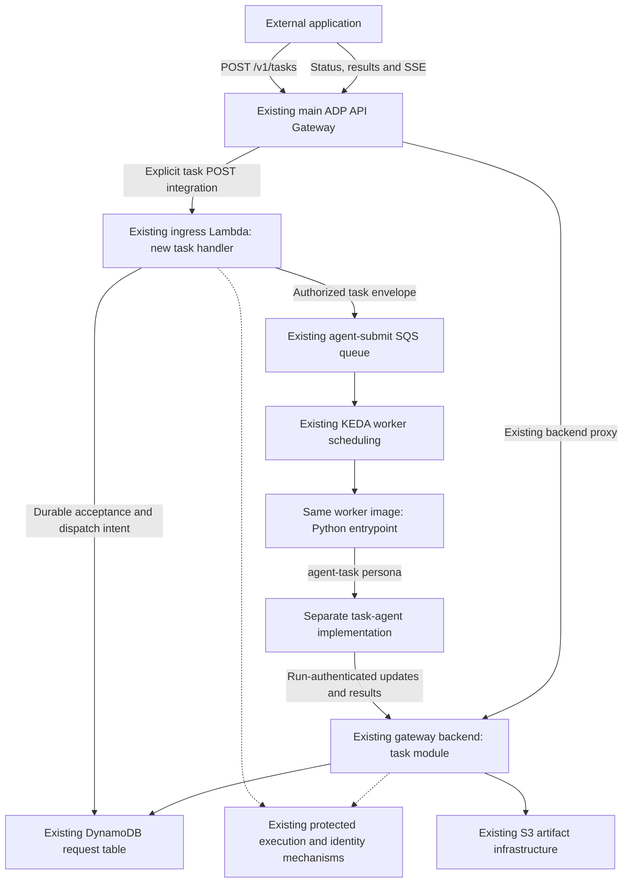

# ADP Task API: agreed architecture and implementation design

**Decision date:** 2026-09-23

**Status:** Architecture agreed with the project owner; implementation has not started.

**Source baseline:** [`aws-e/adp` main at `3cb303b`](https://github.com/aws-e/adp/commit/3cb303b00ac50cf98586092c7e5d0119b8b822ce).

**Validation plan:** [validation.md](validation.md).

This document records the design agreed in the Task API discussion. Section 2
contains the decisions of record. The detailed API, record layouts, module names
and delivery slices below are implementation proposals that make those decisions
concrete; they are not claims that every field or technology choice was separately
approved. Section 13 identifies the remaining decisions before implementation.

The document is the starting point for a new epic, GitHub-native child stories
and separate validation stories. Creating that backlog does not start agent
execution, deploy infrastructure, enable task traffic or retire existing paths.

## 1. Outcome

An external application submits work to ADP, receives a stable task handle,
observes progress while the work happens, supplies additional input when needed,
and retrieves the result. No GitHub issue, App installation, token, comment,
Check Run or pull request is required anywhere in this task execution flow.

The work runs as a new `agent-task-<persona>` implementation packaged in the
**existing worker image/container**. The existing Python entrypoint selects a
separate task flow. The existing Claude Agent SDK TypeScript agents and the
GitHub-integrated Codex reviewer retain their current implementations.

Example acceptance scenario: a third-party service submits an investigation,
sees two substantive progress updates before execution finishes, disconnects and
reconnects without losing retained events, answers a clarification, and retrieves
a final report. The task succeeds in a tenant with no GitHub integration.

### Relationship to earlier roadmap work

- [#2212](https://github.com/aws-e/adp/issues/2212) groups external invocation and
  response streaming. Its project status is not implementation evidence.
- [#2033](https://github.com/aws-e/adp/issues/2033) established multiple ingress
  transports and shared queue execution.
- [#2115](https://github.com/aws-e/adp/issues/2115) designed a shared progress
  stream. The [June external-integration design](../design-notes/2212-external-integration-cross-service-design.md)
  still requires a repository and issue number; this task design does not.
- The [EventBridge spike](../design-notes/4559-ci-eventbridge-dispatch.md) is useful
  evidence about machine identity and existing dispatch constraints. Its
  GitHub-dependent envelope is not the new task contract.
- [#4989](https://github.com/aws-e/adp/issues/4989) concerns streaming explanations
  from the existing hosted agents to the ADP dashboard. This design does not
  change that runtime or depend on completing that story.

For the new task path, the decisions here supersede the earlier suggestions to
relay GitHub comments, disguise tasks as issues, extend existing persona prompts,
or deploy a completely separate worker image. Existing paths keep their own
contracts. Their eventual retirement is a later migration.

## 2. Decisions of record

| ID | Agreed decision | Implementation consequence |
|---|---|---|
| D01 | Provide a proper external invocation and progress capability. | Build an ADP-owned task lifecycle and result contract, not a GitHub bridge. |
| D02 | Task agents have no GitHub integration. | No mandatory repository/issue fields, GitHub bootstrap, status comments, checks or PR finalization. |
| D03 | Use new agents named `agent-task-<persona>`. | Separate executable implementations; these are not prompt variants inside the existing Claude worker. |
| D04 | Keep the same worker image/container. | Package the new code alongside existing runtimes and select it from the shared Python entrypoint. |
| D05 | Preserve the existing agent implementations. | Do not modify the Claude Agent SDK agent code or Codex reviewer to implement task execution. |
| D06 | Follow the separate-code precedent of `agent-codex-reviewer`. | Independently built code and dependencies, an allowlisted command, and a dedicated result path. The new agents' SDK/language is not yet selected. |
| D07 | Host the Task API on the existing main ADP API Gateway. | Add task routes on the current public API surface; no new API Gateway is required. |
| D08 | Reuse the Lambda behind webhook ingress. | The main API Gateway can invoke the same function through a new task route and scoped invoke permission. |
| D09 | Put task requests on SQS. | API Gateway/Lambda does not directly launch or wait for an agent. Reuse SQS/KEDA and the worker assignment mechanism. |
| D10 | Use a separate task handler/method inside the Lambda. | Add a small routing branch and lazily load task code. Existing GitHub, EventBridge and agent-trigger handlers retain their behavior. |
| D11 | Minimize changes to working shared code; duplication is acceptable initially. | Prefer new task modules or narrow copies over refactoring existing handlers/helpers. Consolidation follows maturity. |
| D12 | Reuse authoritative tenancy and platform policy. | Authenticate the source, resolve the existing registered identity, then apply tenant, persona, credential, model and budget policy. Do not create a parallel tenant directory. |
| D13 | Reuse the existing request/run DynamoDB table. | Store task request/run metadata in `adp-<env>-webhook-events`, with additive attributes and distinct record types/keys where needed. Do not replace the table. |
| D14 | Progress is available while work executes, with status and result retrieval. | Use the existing gateway backend for authenticated SSE and read APIs. Persist progress for reconnect/replay. |
| D15 | Keep task persistence and completion logic separate. | Task acceptance must be durable; existing best-effort webhook logging and GitHub completion semantics are not silently changed. |
| D16 | Protect existing behavior during rollout. | Default task admission off, deploy worker support before publishing task messages, prove coexistence and rollback. |
| D17 | Retire the older path only after the new path matures. | No automatic migration, consolidation, deletion or cutover in this delivery. |
| D18 | Prepare a clear epic with independently owned child work and validation. | Freeze shared contracts first, then permit parallel implementation with explicit dependencies and acceptance evidence. |

## 3. Existing implementation and the extension points

The following observations were checked against the GitHub source, not the
original local working copy. They are source evidence, not a live deployment test.

| Existing component | Verified behavior | Task-path implication |
|---|---|---|
| [Worker Dockerfile](../../modules/agent-factory/agent-worker-image/Dockerfile) | Builds the Claude runtime and a separate Codex package into one image. | Add another isolated build/package; preserve existing dependency versions. |
| [Python entrypoint](../../modules/agent-factory/agent-worker-image/entrypoint.py) | `persona_runtime()`/`worker_command()` select the Codex reviewer command. `parse_envelope()` requires installation/repo/issue before execution. | Task routing and validation must branch before GitHub-only validation, bootstrap and completion. A command switch alone is insufficient. |
| [Codex reviewer](../../modules/agent-factory/codex-reviewer/README.md) | Receives an envelope on stdin using `--embedded`; the host prepares GitHub context and consumes a structured final result. | Reuse the packaging/dispatch pattern, not its GitHub preparation or review contracts. |
| [Lambda handler](../../modules/agent-factory/webhook-ingress/lambda/github/handler.py) | Routes EventBridge and `/agent/trigger` before GitHub HMAC processing. | Add an explicit authenticated task route, lazily importing a separate module. |
| [Service identity resolver](../../modules/agent-factory/webhook-ingress/lambda/common/service_identity.py) | Resolves a registered service alias to tenant/org and optional persona restrictions. | Useful lookup foundation; it does not authenticate an external credential or by itself establish current authorization. |
| [Spawn helper](../../modules/agent-factory/webhook-ingress/lambda/common/spawn_persona.py) | Requires a GitHub installation and builds GitHub-shaped context. | Do not call it unchanged with dummy GitHub fields. Add task-specific admission/dispatch. |
| [SQS publisher](../../modules/agent-factory/webhook-ingress/lambda/common/sqs_publisher.py) | Uses repo/issue FIFO grouping on the older path and returns the SQS transport message ID. | Use task-based grouping/deduplication and return ADP task/run IDs, never confuse them with SQS IDs. |
| [Main API Gateway](../../modules/gateway/infra/modules/api-gateway/main.tf) | Has a greedy ALB/backend proxy with `responseTransferMode=STREAM`; the timeout variable defaults to 15 minutes. | Add an explicit POST integration to the existing Lambda; task reads/SSE use the backend proxy. Verify behavior in the deployed environment. |
| [Request table and indexes](../../modules/agent-factory/webhook-ingress/infra/dynamodb.tf) | `event_id` + `arrived_at`; tenant/user/correlation/root-human indexes; TTL uses `expires_at`. | Preserve keys/index definitions and existing rows; new attributes are additive. |
| [Event logger](../../modules/agent-factory/webhook-ingress/lambda/common/webhook_events.py) | GitHub fields are optional; writes are best-effort; the writer normally sets 30-day retention. | The table is reusable, but the new task writer must implement durable acceptance and task retention explicitly. |
| [Activity readers](../../modules/gateway/src/activity/service.py) | Map indexed rows to invocations; detail selects the latest row in an invocation partition. | Keep progress/control records out of these indexes and out of invocation lookup partitions. A `record_type` field alone does not exclude them. |
| [Worker table permissions](../../modules/agent-factory/webhook-ingress/infra/scaledjob-iam.tf) | Older worker mode has broad request-table updates; protected mode uses gateway-mediated status writes. | Reusing a table does not establish trustworthy task ownership, inputs or events; preserve protected authority and prove task key/write isolation. |

The Lambda's current [deployment definition](../../modules/agent-factory/webhook-ingress/infra/lambdas.tf)
can take VPC settings from configuration. Older notes saying it never has VPC
attachment are not sufficient evidence about a selected environment. This task
design does not introduce direct access to the gateway's PostgreSQL database or
human orchestration approvals from the Lambda.

## 4. End-to-end architecture



SQS buffers accepted work. KEDA schedules pods according to backlog; the worker
obtains an assignment through the platform's applicable queue/authority path.
There is no client-to-SQS access and no API-Gateway-to-pod launch operation.

The Lambda handles short task admission requests. It is not held open for the
duration of agent execution or an SSE subscription. The gateway backend serves
reads and streaming from the same task/event data. The same integration identity
must resolve consistently at both services.

The existing webhook API Gateway and the main ADP API Gateway remain distinct
AWS resources. Reusing their Lambda does not require moving or replacing the
existing `/github` or `/agent/trigger` endpoints. Existing EventBridge triggers
continue to use their current adapter; a future EventBridge-to-task adapter can
be additive after the HTTP task contract is established.

## 5. Code ownership and isolation

Proposed locations, to be frozen by the contract-owning story:

| Area | New code | Small shared changes allowed |
|---|---|---|
| Task ingress | `webhook-ingress/lambda/task_api/` | Explicit route dispatch and packaging; task-specific permissions/configuration. |
| Task host flow | `agent-worker-image/lib/task_flow.py` and task contract modules | Early branch in `entrypoint.py`; retain existing validation for old envelopes. |
| Agent implementations | `modules/agent-factory/task-agents/` | Additional Dockerfile build/copy steps with isolated dependencies. |
| Task read/report APIs | `modules/gateway/src/tasks/` | Router registration and narrow task-scoped authority integration. |
| Documentation and contracts | `docs/task-api/` plus versioned machine-readable fixtures | Contract changes reviewed before dependent stories merge. |

The task path must branch after safe common parsing/authenticated assignment but
before GitHub field access, installation poison guards, credential minting,
checkout, branch setup, persona staging tied to a repository, or comments/checks.
It needs a separate finalization branch as well. Do not remove those checks from
the legacy flow to accommodate task envelopes.

Only registered `agent-task-*` commands may execute. The prefix selects the
family; it is not permission to construct an arbitrary executable path. An
unknown task persona must not fall through to Claude. External callers cannot
select existing GitHub personas through the Task API.

The new agents may use a different SDK or language. Nothing in this decision
requires modifying existing TypeScript agent sources or using Claude Agent SDK.
Do not confuse `agent-codex-reviewer` with the older `codex` supervisor persona.

Copying narrow helper implementations is acceptable where sharing would require
refactoring working code. Record the source and behavior being copied and test
the applicable policy. Share authoritative identity/policy data; do not create a
second policy source. Do not change existing dependency versions merely to
satisfy the task package. Task-only imports and initialization are lazy.

Shared infrastructure still shares capacity, deployments and some permissions.
Separate methods are not a hard isolation boundary. Coexistence validation must
cover Lambda errors/concurrency, queue contention, worker rollout skew, table
traffic and dependency packaging; see [validation.md](validation.md).

## 6. Task, run and external API contracts

### 6.1 Identity and lifecycle

- **Task ID:** stable identity of the caller's requested work.
- **Invocation/run ID:** one agent execution assigned to that task.
- **Attempt/generation:** the currently authorized execution attempt, used to
  reject stale reports and commands.
- **External reference:** caller correlation metadata; never authority or a
  substitute for an idempotency key.
- **Correlation ID:** relates task runs/descendants where supported. A task can
  eventually include multiple runs; clients should not have to change handles.

The first delivery needs one complete task persona and one run per task. The
identity model must not preclude retries or later multi-agent work. A new task
workflow engine, automatic use of existing GitHub personas, and migration of
AI-DLC flows are not required for the first release.

Proposed task states are `accepted`, `queued`, `running`, `waiting_for_input`,
`cancel_requested`, `completed`, `failed` and `cancelled`. `accepted` means
durably owned with recoverable dispatch, not that a pod started. `completed`
requires persisted completion evidence and result references. Cancellation is a
request until execution exit is confirmed. Loss of heartbeat is unknown/stale
execution, not completion. Keep task states separate from legacy status enums;
define an explicit mapping if task runs are projected into Activity.

### 6.2 Public routes (proposed v1 surface)

| Route | Behavior | Owner |
|---|---|---|
| `POST /v1/tasks` | Authenticated, idempotent task acceptance; `202` with handles. | New task handler in existing Lambda. |
| `GET /v1/tasks/{task_id}` | Task snapshot, active run/attempt, latest event cursor and result references. | Gateway task module. |
| `GET /v1/tasks/{task_id}/events` | Authenticated SSE with bounded replay. | Gateway task module. |
| `POST /v1/tasks/{task_id}/messages` | Persist follow-up input and acknowledge its identity; report when consumed. | Gateway task module. |
| `POST /v1/tasks/{task_id}/cancel` | Idempotent cancellation request; report eventual outcome. | Gateway task module. |

Example request; field names and numeric limits are part of the contract review:

```http
POST /v1/tasks
Authorization: Bearer <registered-service-token>
Idempotency-Key: incident-483-investigation
Content-Type: application/json
```

```json
{
  "schema_version": "1.0",
  "persona": "agent-task-investigator",
  "external_reference": "incident-483",
  "instructions": "Investigate the supplied service-error evidence and report likely causes.",
  "inputs": {"service": "payments-api", "environment": "staging"},
  "artifact_ids": ["artifact_owned_by_this_tenant"],
  "acceptance_criteria": ["Cite evidence", "Provide a remediation recommendation"]
}
```

`agent-task-investigator` is an illustrative persona, not a selected SDK or an
already available agent. A tenant/workspace selector, if needed, is checked
against authenticated membership; it never establishes identity from the body.

```json
{
  "task_id": "tsk_example",
  "invocation_id": "11111111-1111-4111-8111-111111111111",
  "status": "accepted",
  "status_url": "/v1/tasks/tsk_example",
  "events_url": "/v1/tasks/tsk_example/events"
}
```

Use one error shape containing `code`, safe `message` and `request_id`. Distinguish
invalid input (`400`), unauthenticated (`401`), disallowed capability (`403`),
absent/not-visible task (`404`), conflicting idempotent request or transition
(`409`), rate limit (`429`), and unavailable dependencies (`503`). Define retry
behavior in the client contract. Never return `202` for an unrecorded request.

Follow-up messages do not silently modify an immutable original request or grant
new credentials. A privileged approval requires a separately authorized decision
contract. Whether that decision endpoint is needed for the first persona is an
open scope detail. Messages/cancellation use a durable command channel that the
task worker consumes; exposing routes without a working delivery path is not
completion of those capabilities.

### 6.3 Worker assignment

The task envelope contains a schema discriminator/version, task ID, invocation
ID, persona, correlation, input reference/digest and protected assignment
reference. Authoritative tenant, owner, limits and attempt binding come from
trusted admission and worker bootstrap, not arbitrary message fields.

Do not add dummy `installation_id`, `repo` or `issue` fields. Do not reuse the
existing repo/issue FIFO grouping with empty strings: unrelated tasks would
collapse into one group. Use a tenant-and-task group and a dispatch ID stable
across publication retries. SQS deduplication is bounded transport behavior,
not application idempotency or a promise of exactly-once external effects.

## 7. Authentication, tenant validation and execution authority

Authenticate first, resolve the registered service principal/tenant second, then
authorize the specific operation. Reuse ADP's authoritative identity and
revocation mechanisms. The DDB service alias lookup is useful existing code;
neither a body-supplied service name nor a successful lookup proves the caller
owns that identity. Reconcile it with the canonical service-principal model in
[the existing identity design](../persona-model-mapping-approved-design.md).

Short-lived service tokens through the existing identity system are the proposed
default. The exact issuer/client-registration/scopes and Lambda validation or
authorizer mechanism remain to be finalized. IAM/SigV4 can be an optional
transport for AWS callers; external integrations must not require an agent pod's
credentials. Do not invent a static API-key registry merely because an older
design proposed one. No auth-NONE route implies anonymous task access.

Task permissions cover submit, read/events, input, cancellation and any privileged
decisions separately. Resolve the same caller consistently in Lambda and gateway.
Tenant membership alone does not automatically expose every integration's tasks;
task ownership/delegation and explicit administrative access determine visibility.
Enforce the same scope on artifacts and reconnects, and close streams when access
expires or is revoked. Never put credentials in stream URLs.

Reuse model access, budget and credential policy through their existing
enforcement services. Current admission helpers and service grants can be
GitHub-rule/repository-bound; add narrowly scoped task adapters rather than
fabricating those inputs or disabling checks. A machine-rooted task does not
inherit a human's vault credentials. Any privileged resource use must follow an
explicit grant to the task's service identity and run.

Keep task owner, input digest, active attempt and grants in protected authority
mechanisms. Request-table projections and worker-authored text cannot confer
authority. Worker reports are authenticated to an assigned run/attempt; the
gateway derives the writable task and permitted fields. Existing internal routes
must not be widened into arbitrary task or approval writes.

## 8. Reusing DynamoDB without changing legacy semantics

### 8.1 Request and run records

Use the existing `webhook-events` table for task request/run metadata. Preserve
the physical primary key names `event_id` and `arrived_at`; DynamoDB permits new
non-key attributes without replacing the table. Add `record_type`,
`schema_version`, `task_id`, canonical owner references, task state/version,
input references/digest and result references as needed. Use `channel="api"`
and the `agent-task-*` persona for any compatible run projection. GitHub fields
are absent.

The table contains request/run metadata, not an unlimited durable transcript.
Use S3 for large inputs, outputs and artifacts, with authenticated references,
integrity/version binding and coordinated retention. Observe DynamoDB's 400 KB
item limit and all stricter gateway/queue payload limits.

### 8.2 Record separation (proposed layout)

| Record | Key/access pattern | Legacy exposure |
|---|---|---|
| Task metadata | Dedicated `TASK#<task_id>` partition and fixed metadata item; Task API knows its full key. | Kept out of invocation indexes initially. |
| Run summary | Existing invocation lookup pattern; task ID links back to metadata. | Optional compatible Activity projection, after reader/authorization validation. |
| Progress events | Separate `TASK_EVENTS#<task_id>` partition, ordered fixed-width sequence keys. | Omit legacy GSI key attributes so progress does not appear as new runs. |
| Input/cancel commands | Dedicated task-command partition and stable command keys. | Not invocation/engine-command rows. |
| Idempotency/dispatch intent | Dedicated namespaced records, conditionally written. | Not invocation rows. Recovery uses a defined bounded access pattern. |

These are proposed logical keys; the storage story must freeze the concrete
layout, including how the string sort-key field `arrived_at` is populated for
non-invocation records. Real timestamps remain explicit event fields. Do not put
progress under the invocation's `event_id`: the current detail lookup selects
the newest item in that partition. Do not set `engine_command_status` on task
records. A discriminator does not protect old consumers that ignore it.

For records excluded from legacy GSIs, keep tenant/owner metadata in a separate
attribute or nested scope, and authorize from the protected task binding before
querying their partition. Do not set top-level `tenant_id`, `user_id`,
`correlation_id` or `root_human_id` simply by copying the old logger if that would
place internal task records into run indexes. Any required new sparse index
needs an additive Terraform change and plan; an unbounded full-table recovery
scan is not acceptable.

### 8.3 Trust and retention

Older workers can have table-wide `UpdateItem`. A separate Python writer or
`record_type` does not stop them modifying new task items. The storage/authority
stories must establish task-key write isolation, or verify task records against
protected authority/integrity records before serving or executing them. Prove
that a legacy worker cannot change task instructions, forge progress/completion,
redirect result references or claim another task. An additive deny scoped to new
task key namespaces is one candidate; it must not revoke existing run access or
require turning a global legacy-worker flag on. This is a required design closure
before task admission is enabled, not a claim that current permissions suffice.

TTL is configured on `expires_at`; the old writer normally sets 30 days. Task
retention is a per-record decision, not a table-wide TTL change. Active tasks,
pending dispatch/commands and referenced artifacts must not expire prematurely.
Define expiry after terminal state, replay/idempotency retention and tombstone
behavior. DynamoDB TTL removal is asynchronous, not an exact deletion deadline.

## 9. Durable acceptance, dispatch and recovery

The new task writer must not inherit best-effort logging semantics. Proposed
acceptance protocol:

1. Authenticate, validate references/persona/limits and resolve protected scope.
2. Bind the normalized request digest to an idempotency key scoped to the
   authenticated tenant and principal. Same key/body returns the original task;
   same key/different body returns a conflict.
3. Establish the required task/run authority, task metadata, initial event and
   durable dispatch intent. Commit atomically where possible; otherwise use
   explicit prepared/committed states so no incomplete assignment can execute.
4. Publish the authorized envelope and record dispatch delivery. Return `202`
   once acceptance is durable and publication is recoverable. Report `accepted`
   while pending and `queued` only after confirmed publication.
5. Automatically reconcile pending or ambiguous publication using the stable
   dispatch ID and conditional leases. Recovery must not depend on the caller
   making another request. Queue delivery alone cannot claim execution started.

The implementation story must specify and deploy the recovery wake-up mechanism.
It may reuse the same Lambda on a restricted scheduled recovery invocation; no
separate Lambda function is assumed. It must validate internal invocations
independently of public request content. No untrusted request can select an
internal recovery/authority operation through a body discriminator.

Worker retries acquire or renew a protected assignment. Old attempts cannot
publish new state after replacement. Persist terminal evidence/results before
acknowledging completion; a timeout with uncertain external effects is reconciled,
not automatically rerun as fresh work. Report exhausted delivery/recovery to the
task instead of leaving it permanently queued/running. Shared SQS is reused;
its current envelopes and message-group behavior remain unchanged for old paths.

## 10. Progress, results and conversation

Use one versioned event contract for live delivery and replay. Proposed fields:
`event_id`, `schema_version`, `task_id`, `invocation_id`, `attempt`, `sequence`,
`type`, `timestamp` and an allowlisted `data` payload. Proposed event kinds:

```text
task.accepted       run.started          progress.updated
artifact.created    input.required       input.accepted
cancel.requested    run.completed        run.failed
task.completed      task.failed          task.cancelled
```

Progress contains authored explanations of actions and evidence, selected tool
activity and artifact references. Do not publish private model reasoning,
credentials or unrestricted raw tool/terminal output. Heartbeats only show
connectivity; they are not substantive progress or an invented percentage.

The task process can report through an authenticated gateway client, or through
a host that incrementally reads structured process events. Finalize this choice
in the runtime contract. Copying the Codex host's `capture_output=True` and reading
stdout only at exit does not provide live updates.

Persist accepted events before fan-out, assign task-level ordering, deduplicate
retries and reject stale attempts. Commit task state transitions and their events
consistently. Do not make a slow external subscriber block the agent. Bound the
agent/reporting buffers; if nonterminal events cannot be retained, explicitly
report a gap or partial history. Terminal evidence cannot be silently dropped.

SSE uses an authenticated client and `Last-Event-ID`/cursor replay. The contract
must handle connect-before-start, already-completed tasks, duplicate frames,
disconnects, expired cursors, authorization expiry, worker replacement and backend
restart. Close a completed stream only after its terminal event can be replayed.
Return an explicit history gap and a current snapshot when full replay is no
longer possible. Snapshot/event cursors must make the catch-up-to-live handoff
race-free.

The current API Gateway streaming configuration has finite connection windows
(the source config allows 15 minutes). Tasks outlive those connections. Verify
end-to-end flush behavior, heartbeat interval and reconnect through the actual
public path; HTTP 200 alone is not proof of streaming. A Redis live relay may be
used if justified, but it cannot replace durable events. Reusing DynamoDB does
not automatically provide an SSE endpoint or require enabling DynamoDB Streams.

Polling returns the same task snapshot and result references. Signed outbound
webhooks were discussed as an optional later delivery channel; they are not a
requirement to add another notification system in the first release. The same
events should support them if later selected.

## 11. Deployment, coexistence and eventual retirement

Proposed task-specific controls are admission enablement, worker readiness and
read/stream capability. Exact configuration names are to be frozen. They must
not depend on globally enabling legacy agent controls or changing the execution
mode of existing personas.

Deployment order:

1. Land the contracts, task storage/authority/reporting support and inactive
   routes. Preserve old reads and writes.
2. Build the existing worker image with the new task implementation. Deploy it
   and verify the real image digest/entrypoint capability before publishing tasks.
3. Enable authenticated task submission for a bounded tenant/service/persona
   allowlist after validation. Bound shared Lambda concurrency, queue load,
   workers, stream subscriptions and spend using task-specific limits.
4. Expand only after the live validation and regression evidence passes.

Same-queue rollout must handle old pods that could receive a new task envelope.
Drain or otherwise exclude incompatible consumers before admission; a mixed
image rollout by itself is not proof. Do not enable admission while an older
entrypoint can reject/delete a task as a malformed GitHub message.

Rollback stops new task admission first. Keep a task-capable consumer and read
path for accepted work until it is completed, explicitly cancelled or durably
quarantined for recovery. Do not roll all workers back to a task-incompatible
image with task messages still in the shared queue. Preserve records and
artifacts; no table recreation, legacy queue purge or destructive down-migration.

This document changes no runtime flags and authorizes no AWS operations. Live
work follows [AGENTS.md](../../AGENTS.md) and the
[agent deployment guide](../adp-platform-deployment/deploy-with-agent.md), with
the target and operational scope confirmed for that run. Documentation merge,
code merge and deployed/live acceptance are separate evidence states.

Retirement is a later explicit migration: establish capability parity, migrate
callers and retained work, verify rollback and obtain cutover authorization.
Nothing in this epic automatically retires GitHub, EventBridge, Claude or Codex
paths. No immediate rewrite into one universal dispatcher is required.

## 12. Delivery slices and parallel ownership

These are proposed story boundaries for the requested epic, not issued tasks or
dispatches. Each implementation story must name its tests, owned files, deployment
effects and required later validation. The contract owner resolves shared-file
changes so parallel agents do not redefine the same interface.

| Slice | Scope / ownership | Dependencies |
|---|---|---|
| T0 | Freeze v1 schema, auth/identity binding, record layout, event/command semantics and open decisions in section 13. Own shared fixtures. | This design. |
| T1 | Task persistence, protected ownership/input binding, idempotency and recoverable dispatch records in existing DynamoDB infrastructure. | T0. |
| T2 | New task handler, external authentication/authorization integration and main API Gateway POST integration to existing Lambda. | T0; integrate with T1 and T3. |
| T3 | Task-specific admission, SQS publisher/reconciler and execution-authority adapter. | T0; integrate with T1. |
| T4 | Early Python task flow, task assignment/credentials, process/event contract and isolated completion. Own shared entrypoint changes. | T0; integrate with T3. |
| T5 | First independent task-agent implementation and isolated build/package in the same image. | T0; integrate with T4. |
| T6 | Gateway task snapshot/results/artifacts APIs, run-bound event ingestion, ordered persistence and SSE/replay. | T0; integrate with T1/T4. |
| T7 | Durable clarification/input and cancellation delivery, receipts and lifecycle integration. | T0; integrate with T1/T4/T5/T6. |
| T8 | SDK-free external client example, configuration/deployment/rollback documentation and end-to-end qualification fixtures. | Contract T0; integrate with T2-T7. |

After T0, T1/T2/T3/T4/T5/T6 can progress in parallel against fixtures. Integration
dependencies still gate acceptance; mocks do not demonstrate the combined path.
T4 owns `entrypoint.py`, T5 owns task-package Dockerfile additions, T2 owns API
Gateway/Lambda routing, T1 owns table/index changes, and T3 coordinates narrowly
required IAM/authority changes. Split overlapping edits into a prerequisite
commit or serialize them explicitly. Native child relationships and dependency
links will be added when the epic is filed.

Separate validation stories V1-V5 are specified in [validation.md](validation.md).
Do not close the epic merely because its implementation PRs merge.

## 13. Remaining decisions and implementation-review gates

The architecture above is agreed. The following were not separately selected in
the conversation and must not be represented as already deployed or approved
product choices. T0 records concrete answers before dependent implementation.

| ID | Decision to finalize | Required outcome |
|---|---|---|
| O1 | First task persona, language, SDK and model compatibility. | A useful bounded external use case, independently implemented and validated through existing model policy. No requirement to alter Claude or Codex agents. |
| O2 | External credential issuance/registration and shared principal resolution. | Exact short-lived token or IAM contract, scopes, canonical service mapping, revocation and Lambda/gateway parity. No new tenant directory. |
| O3 | Table keys, authoritative task state and isolation from legacy writers. | Concrete records/index access, protected owner/input/event integrity, old-reader safety and IAM proof. Separate handler code alone is insufficient. |
| O4 | Durable publication and recovery scheduling. | Atomic/prepared-state protocol, bounded automatic recovery, stable deduplication and a tested failure matrix. |
| O5 | Run assignment/model/credential authority without GitHub fields. | Task-specific supported adapters and readiness requirements; no fake installation, human root or permissive fallback. |
| O6 | Event transport, command consumption and reconnect contract. | Agent-to-host/API reporting choice, ordered replay/cursor semantics, input and cancellation receipts, loss/gap behavior. |
| O7 | Numeric limits and retention. | Payload/event/buffer/subscription limits, task duration/spend, idempotency/replay horizons, active-task TTL and artifact retention. |
| O8 | Shared-worker rollout and regression environment. | Task-capable consumer proof, old-message/new-message compatibility, bounded traffic, rollback and evidence targets. |

An inability to prove one of these within the reuse/isolation decisions must be
raised as a design amendment. It must not silently become a new worker image,
parallel tenant system, replacement table, GitHub fallback or broad legacy
refactor. No implementation code, deployment or live acceptance is claimed by
this document.
