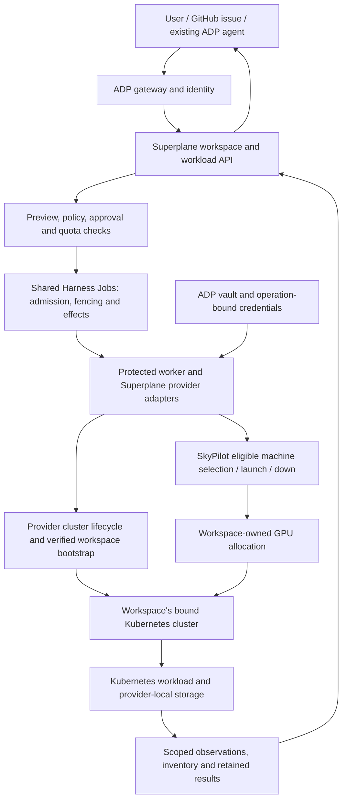
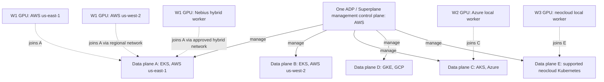
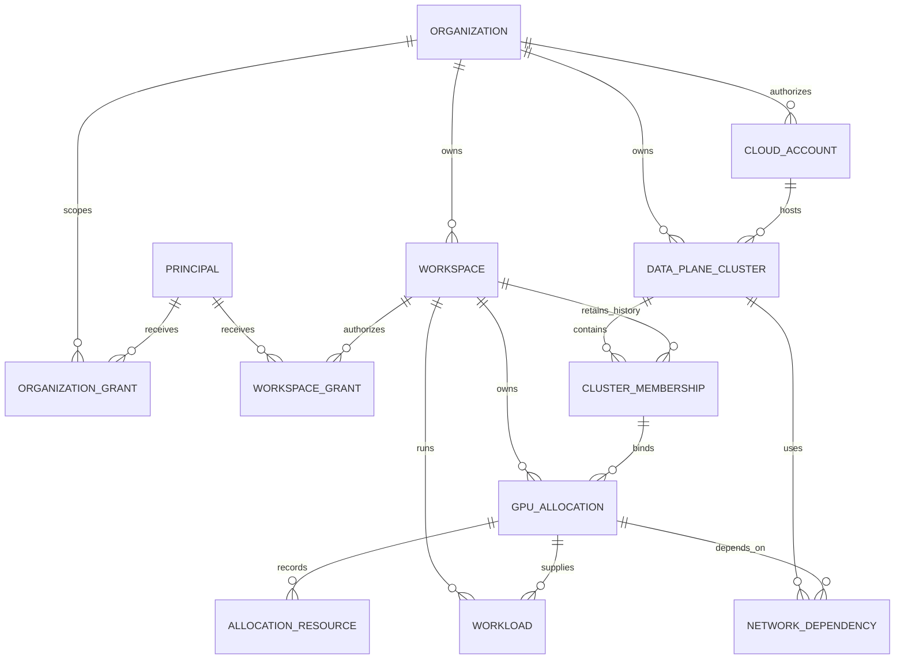
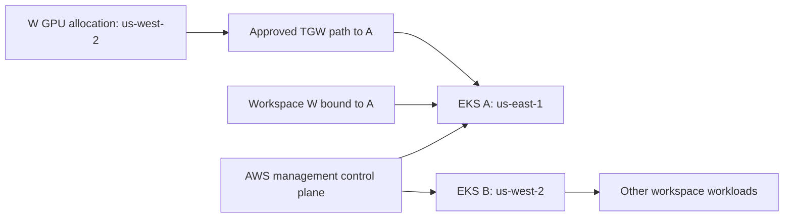

# Superplane authoritative design

**Status:** authoritative product and architecture specification; implementation is partial.
**Updated:** 25 September 2026. **Parent epic:** [#4910](https://github.com/aws-e/adp/issues/4910).
**Maintained code:** `aws-e/adp`, under `modules/domain-apps/superplane/`.

This is the single entry point and source of truth for Superplane's logical,
database, API, CLI and network design. It consolidates the accepted workspace,
GPU ownership, regional and multi-cloud requirements. A requirement in this file
is not a claim that its implementation or live acceptance is complete.

Product/architecture changes must update this file in the same reviewed change.
Supporting documents may elaborate implementation and preserve historical evidence;
they must not override this design. This file supersedes conflicting topology and
ownership assumptions in the original integration notes, AWS milestone design,
shared-cluster amendment and historical upstream documents. It does not alter an
already admitted operation or authorize a deployment. User-approved requirements
remain controlling; incompatible code must be tracked as a gap, not described as
already compliant.

## Contents

1. [Scope and implementation status](#1-scope-and-implementation-status)
2. [Logical design](#2-logical-design)
3. [Database design](#3-database-design)
4. [API design](#4-api-design)
5. [CLI commands](#5-cli-commands)
6. [Network design](#6-network-design)
7. [Lifecycle, security and recovery](#7-lifecycle-security-and-recovery)
8. [Delivery and acceptance](#8-delivery-and-acceptance)
9. [Supporting specifications and source map](#9-supporting-specifications-and-source-map)

## 1. Scope and implementation status

Superplane lets an authorized user or existing ADP agent create a workspace,
request CPU/GPU capacity, execute Kubernetes workloads, obtain results and retire
owned resources. ADP/Superplane management stays on AWS and can manage many data
planes. The user's cloud/region/cluster choices are bounded by installed capability,
organization policy, provider compatibility, available capacity and approved budgets.

| Capability | Position at this design revision |
| --- | --- |
| ADP identity/gateway, workspace preview/approval, AWS managed/adopted workspace lifecycle, protected worker and provider inventory | Implemented source paths exist; a particular installation must prove configured readiness. |
| AWS regional SkyPilot allocation, pre-create binding checks, durable regional resource identity | #5925 merged in [PR #5968](https://github.com/aws-e/adp/pull/5968), with code-only CI evidence. |
| Complete AWS cross-region connectivity, GPU join, recovery, issue workflow and exact live demonstration | #5926–#5930 remain delivery/acceptance work; existing pieces do not establish end-to-end completion. |
| Explicit same-organization shared-cluster creation and lifecycle | Accepted requirement, implementation pending in #6048. Existing schema fields alone do not implement it. |
| Concurrent regional data-plane clusters composed with cross-region GPU workers | Required in #6054; existing per-workspace infrastructure is a starting point, not sufficient composed acceptance. |
| Non-AWS GPU workers joining AWS EKS | Required hybrid topology; historical Nebius-to-EKS evidence exists, but maintained governed execution and live acceptance remain pending. |
| Complete Azure, GCP and neocloud data planes with AWS management | Required in #6051; provider adapters and provider-specific live evidence remain pending. |

The shared-placement reservation adapter now participates in the API workspace
transaction, and the worker validates immutable membership before any credential
delivery or provider effects. Creation preview remains unavailable: namespace
admission, cluster-owned bootstrap delegation and renewable Kubernetes credential
issuance/projection are not yet composed. The static bootstrap credential reference
is registration metadata, not evidence of credential delivery. Dedicated retirement
refuses clusters open for sharing or holding live peers; membership reservation
also refuses clusters whose original owner has entered retirement. Completing
member-only retirement requires its own scoped ownership inventory.

No live end-to-end capability is established by this document. The phrase “done
in a day” has not been resolved into a provisioning-time objective or implementation
deadline and is not an accepted SLA. Establish prerequisites, timing boundaries and
provider-specific evidence before adding such a target.

## 2. Logical design

### 2.1 Terminology and ownership invariants

| Term | Meaning |
| --- | --- |
| Management control plane | ADP identity, gateway, agent facilities, Superplane management APIs and orchestration on AWS. |
| Data-plane cluster | A selected Kubernetes cluster and its execution resources. Its Kubernetes control plane is distinct from the Superplane management control plane. |
| Organization | The authenticated ADP tenant. Sharing an AWS account or AWS Organizations organization does not make two ADP tenants the same organization. |
| Workspace | An organization-owned execution boundary with a namespace, permissions, quotas and exactly one active data-plane cluster membership once provisioned. |
| GPU allocation | Capacity owned by one workspace, tied to its operation, selected cluster and membership generation. |
| Compute region | Where an allocated machine runs. It may differ from its bound cluster's home region when supported connectivity and node bootstrap are available. |

The fundamental relation is:

**GPU allocation → owning workspace → that workspace's one data-plane cluster.**

- An organization can own many workspaces and many eligible data-plane clusters.
- Multiple workspaces may share a cluster only within the same ADP organization.
- A pending workspace may have a reserved membership; it cannot execute until its
  one target and readiness are established. Historical memberships may be retained.
- Cluster sharing does not share GPU reservations between workspaces. Scheduling,
  quotas and accounting must enforce the owning workspace's allocation.
- Cluster identity is resolved before compute selection. No proximity, regional
  affinity or process-global default can substitute another cluster.
- If workspace W is bound to EKS A in us-east-1 and SkyPilot allocates W a GPU in
  us-west-2, it must join A, even when EKS B exists in us-west-2. Failure to connect
  to A is a failure/uncertainty to handle, not permission to join B.
- Workspace reassignment or cluster migration is a separate explicit operation,
  requiring drain and ownership checks. Retry and regional fallback cannot do it.

### 2.2 Tenant, user and principal alignment

ADP remains the identity and tenant-membership authority. Superplane does not
create a competing tenant directory, user login or role hierarchy. Infrastructure
membership (workspace → cluster) and user authorization (principal → workspace)
are different relations; neither implies the other.

| Identity concept | Authoritative source and Superplane interpretation |
| --- | --- |
| ADP organization / tenant | The verified, currently selected ADP organization. Resolve it through the server-held `organizations.adp_org_id` mapping to the domain `organizations.id`; do not equate UUIDs, names, emails or cloud accounts. |
| Human login | An authenticated immutable subject with ADP-proven identity links. One person may have organization-local accounts/memberships in multiple tenants. Only the selected organization applies to a request; never union permissions from those memberships. |
| ADP organization-local user | Resolved by ADP's membership/identity services. The Superplane `users` row is a domain projection, not proof of membership or permission. Matching email addresses or a connection to the same GitHub installation do not link authority. |
| Team and department | Organization-local ADP context. Do not invent Superplane hierarchy or infer a workspace grant from a team/department name. Any group-based delegation must use an explicitly supported ADP policy path with current membership checks. |
| Human vs service principal | Preserve the verified principal type with the subject and tenant. Service/agent authentication does not inherit the initiating human's permissions. A service must have its own effective grant and original operation/run authority. |
| ADP workspace selector | In ADP identity flows this selects organization context; it is not the Superplane execution workspace UUID. Do not substitute a CLI-selected ADP tenant or token context for the requested domain workspace. |
| Superplane workspace | Organization-owned execution scope. Its cluster membership chooses where work runs; a server-held workspace grant decides who may read, spend, provision, administer or renew credentials there. |

The current organization-binding code retains a bounded legacy UUID path for
unbound installations. That is compatibility behavior, not an onboarding strategy.
New installations and shared/multi-cloud extensions require explicit reviewed ADP
organization mappings. Never guess or relink a legacy tenant by name.

The domain user model currently has one `org_id` and a globally unique nullable
`cognito_sub`. It must not be assumed to mirror every ADP multi-organization user
account. Keep authorization on the verified subject, mapped organization and live
grants; any projection/schema changes needed for multi-organization users require
an explicit migration and tests, not duplicate-user creation or automatic merging.

Authorization rules:

- **Same organization is necessary, not sufficient.** Users U and V may belong
  to the same organization while U can access only workspace A and V only B.
  Sharing a cluster must not grant either user access to the other's workloads,
  secrets, GPU allocations, results, credentials or administration.
- Current workspace grant records bind workspace, organization, principal subject,
  principal type, explicit permissions and revocation. Check every dimension and
  reread authority at operation admission/execution. Revocation is a refusal, not
  an absent row that enables a broader fallback.
- Organization grants (`organization:read`, `organization:administer`) authorize
  organization-scoped endpoints. They do not automatically authorize spending,
  kubeconfig access or credential rotation in every existing workspace.
- First-workspace creation may use the existing narrowly bounded organization
  administration fallback when the workspace does not yet exist and provisioning
  is requested. It must not bypass a revoked grant or apply to existing workspaces.
  Creation records the creator's explicit workspace grant through the governed path.
- Domain display roles (`developer`, `workspace-admin`, `org-admin`) are not ADP
  role names. Use the existing explicit permission mapping; unknown roles or stored
  permissions grant nothing. Neither a display role nor an email supplies authority.
- Agent delegation preserves requester provenance and a separately authorized
  service/run identity. An approval for one requester, workspace or plan cannot be
  replayed by another. Human approval and execution permission remain separate checks.
- Cluster use, cluster administration and cluster-wide telemetry require distinct
  scoped authority in the shared-cluster extension. A workspace owner is not a
  cluster administrator, and a cluster observer is not a workload executor.
- Tenant switching, revoked membership, disabled principals and expired credentials
  must not leave usable authority in client caches or ongoing mutation paths. Use
  current identity/grant/fence verification; retain uncertain provider ownership.

### 2.3 Components and responsibilities



| Component | Owns | Boundary |
| --- | --- | --- |
| ADP | User/agent identity, tenant context, gateway, vault, Agent Factory and existing ingress | No second login, agent runtime or secret store. |
| Shared Harness Jobs | Admission, approvals consumed by execution, operation/attempt identity, fencing, effects, cancellation and accounting authority | Domain projections and agent messages cannot authorize provider mutation. |
| Superplane API/UI/CLI | Workspace, cluster and allocation views; canonical previews; scoped lifecycle and workload requests | All clients use the same server-side authorization and request binding. |
| Superplane adapters/worker | Provider lifecycle, bootstrap, network reconciliation, inventory and evidence | Use existing shared contracts; no second execution engine. |
| SkyPilot | Supported GPU machine selection, alternatives, launch and down | No independent machine ranking/fallback loop in Superplane. |
| Provider Kubernetes service / approved cluster adapter | Supported cluster lifecycle and provider-native capabilities | Do not assume arbitrary external GPU nodes can join AKS/GKE or any managed Kubernetes service. |
| Kubernetes | Scheduling and workload execution within the selected cluster | Workspace-scoped credentials and allocation-scoped placement; no cluster switching. |

The app remains optional and default-off. Installation, failure and removal must
preserve ADP. Readiness separates management API availability, workspace readiness,
provider access and workload readiness; one green health endpoint proves none of
the other layers. Reuse the original AISuperPlane source where compatible, but
maintain adaptations only in this repository's Superplane folder.

### 2.4 Supported target arrangements

**One logical ADP/Superplane management control plane on AWS manages many
independent data-plane clusters. A data-plane cluster can also have supported
GPU workers hosted in another cloud. Both forms of multi-cloud deployment must
coexist.** One logical management control plane may have multiple replicas.
Each data-plane cluster has its own Kubernetes control plane.

This diagram shows the required target architecture, **not current live status**.
Solid arrows represent management; dotted arrows represent GPU node membership.



W1 is bound only to A. Its AWS and Nebius allocations all join A, even though B
is closer to one AWS allocation and E also runs in a neocloud. W2 is bound only
to C; W3 only to E. E is an independent neocloud cluster. N3 is a worker of A
and does not create another data-plane cluster. B and D serve other authorized
workspaces. Remote-worker support must be validated per provider/cluster pair;
this diagram does not imply arbitrary external nodes can join AKS or GKE.

| Placement dimension | Decision |
| --- | --- |
| Management location | AWS, managing the fleet through existing ADP authorization and execution facilities. |
| Workspace cluster | Exactly one cluster identity, including Kubernetes provider, provider account/project/subscription and home region, selected at creation/adoption or explicit migration. |
| GPU compute location | Each allocation's provider and region, which may differ from the bound cluster when its supported join mode, networking, credentials and approved plan permit it. |

The fleet may span organizations, but each tenant data-plane cluster belongs to
one ADP organization. Same-organization workspaces may explicitly share an eligible
cluster with separate namespaces, grants and GPU ownership. Fleet management does
not grant users access across tenants or workspaces.

| Arrangement | Required behavior |
| --- | --- |
| Dedicated AWS workspace | One workspace uses its dedicated EKS cluster. Preserve existing behavior. |
| Shared AWS data plane | Two or more same-organization workspaces use distinct namespaces on one eligible EKS. |
| Management EKS also used as data plane | Explicit platform authorization and same-organization tenant placement, separate platform/tenant namespaces, permissions and scheduling. Not inferred from cluster name or account. |
| Regional fleet | One management control plane operates independent data-plane clusters across AWS regions. Each has its own Kubernetes control plane and lifecycle. |
| Cross-region workers | A selected EKS has GPU workers in approved regions outside its home region. Its Kubernetes control plane remains in its home region. |
| Cross-cloud workers on EKS | AWS EKS has GPU nodes in a supported other cloud, such as Nebius, through an approved hybrid join/network path. Its Kubernetes control plane stays on AWS; GPU resources retain their actual provider identity. |
| Composed regional fleet | Several regional clusters coexist, and any compatible one can have cross-region workers. GPU ownership still determines the destination. |
| Other-cloud data plane | AWS management controls a complete AKS, GKE or supported neocloud Kubernetes data plane, including its Kubernetes control plane, nodes, execution components, network and workload storage. No workspace EKS dependency. |

Cross-organization workload sharing of a tenant data-plane cluster is excluded.
Platform services on a management EKS do not grant a workspace ownership of that
physical cluster. Platform policy must explicitly reserve/authorize any tenant
placement there. Automatic regional failover, transparent migration, one workspace
spanning several clusters and automatic inter-cluster workload federation are not
part of this design.

### 2.5 End-to-end sequence

1. Resolve the ADP organization and caller's permissions. Discover only eligible
   provider accounts/connections and clusters for that organization.
2. Preview workspace creation: acquisition mode, dedicated/shared placement,
   exact cluster identity or creation intent, namespace/membership, costs and limits.
3. Approve the immutable revision and admit through the existing operation system.
   Reserve membership before bootstrap side effects; revalidate at execution.
4. Provision/adopt the cluster or attach to an eligible existing shared cluster.
   Bootstrap isolated namespace/credentials and reuse one compatible controller.
5. Request a workload against the workspace and an installed capacity profile.
   Resolve its cluster membership before presenting eligible machines to SkyPilot.
6. Persist effect intent, deliver scoped credentials, launch and record provider
   handles. Establish connectivity and verify node identity, join and GPU readiness.
7. Schedule only against the workspace allocation. Retain Kubernetes UID, results,
   resource observations and cost evidence under the original operation.
8. Cancel/drain and clean up owned resources. Unknown inventory retains ownership
   and exposure. Workspace removal and shared-cluster retirement are separate actions.

## 3. Database design

### 3.1 Storage boundaries and current schema

Superplane owns its PostgreSQL domain schema and Alembic migrations. Shared Harness
operation/inventory tables are accessed through their existing contracts and scoped
connections; their schema and truth must not be duplicated in the app. Store opaque
ADP credential references, not secret values or long-lived provider tokens.

| Existing domain tables / records | Role and relevant limitation |
| --- | --- |
| `organizations`, `workspace_grants`, organization grants | Explicit ADP-to-domain tenant mapping and independently scoped, revocable principal permissions. Organization membership alone is not workspace authority. |
| `users` | Organization-local domain profile/display-role projection; its current unique `cognito_sub` is not a complete ADP multi-organization membership model and must not replace ADP identity resolution. |
| `cloud_accounts`, `provider_connections`, `provider_connection_bindings` | Organization-owned provider identities, opaque credential references and workspace authorization bindings. New workspace bootstrap needs organization-authorized onboarding credentials, not a borrowed workspace's connection. |
| `workspaces` | Name, isolation mode, status, operation identity, quotas; currently has both `cluster_id` and `shared_cluster_id`. The latter is not a complete shared lifecycle. |
| `clusters` | Provider cluster identity/endpoint and health, organization, and legacy `workspace_id`. Canonical bootstrap currently binds one workspace and one `workspace_bootstrap` metadata object. |
| `deployments`, node pools and nodes | Workload and observed capacity projections; these are not authorization to mutate cloud resources. |
| Provider operations/allocation resources | Durable domain provider handles and reconciliation evidence. Keep original operation and tenant scope. |
| Controller execution/capacity/request/accounting records | Worker metadata, capacity projections, SkyPilot request journal and accounting observations. v4 inventory uses account-qualified regional resource identities. |
| Bootstrap reservations and authority records | Fenced bootstrap identity, namespace/credential evidence, ownership and cleanup progress. |
| Operation budget reservations | Domain budget projections bound to approved operations; shared settlement remains authoritative. |

Current registration refuses a second workspace on an already bound cluster.
Current fleet-observation authorization expects one workspace owner. Both are
intentional fail-closed boundaries that must be replaced with explicit membership
and cluster authority, not removed.

### 3.2 Target logical schema — proposed, not an applied migration

Use the existing `clusters` and `workspaces` entities; extend them and introduce
membership records rather than creating competing cluster catalogs. `PRINCIPAL`
in the diagram is the authenticated ADP subject/type, not a new domain login table.
Organization/workspace grants remain the maintained grant entities. Names below
are the target logical schema; exact migration DDL is reviewed with implementation.



| Entity | Required target fields and constraints |
| --- | --- |
| `clusters` | `id`, `org_id`, provider, provider scope (AWS account / Azure subscription / GCP project / neocloud tenant), canonical provider cluster ID, home region, endpoint/CA identity, generation, lifecycle ownership, sharing eligibility, platform eligibility where relevant, lifecycle state and infrastructure-state reference. Provider identity is unique in its provider scope; registration cannot bind it to another ADP organization. |
| `workspace_cluster_memberships` (new) | `id`, `org_id`, `workspace_id`, `cluster_id`, membership generation, namespace, namespace UID, state, original operation, per-workspace bootstrap/credential references, creation/removal timestamps. Use composite foreign keys to enforce organization agreement. |
| `workspaces` | Existing identity/quota fields plus explicit placement selection. `cluster_id` becomes a compatibility projection of canonical membership; it must not remain an independent routing authority. Deprecate `shared_cluster_id` as an alternate lookup path after migration. |
| GPU allocation binding (extend maintained capacity/allocation records) | Allocation ID, organization/workspace, cluster/membership ID and generation, original operation, approved profile/plan digest, compute candidates, selected provider/region, SkyPilot cluster/request handles, physical GPU limit, runtime/spend bounds and lifecycle state. No allocation exists as an unassigned shared-cluster GPU pool. |
| Allocation resources | Canonical provider-qualified reference, kind, region/provider scope, originating effect key, ownership, observed state/time and unresolved exposure. Resources remain linked after detachment or response loss. |
| Shared network/controller dependencies | Canonical resource identity and owner, immutable desired binding, generation, active/pending/unresolved dependent memberships or allocations, and lifecycle state. Reference membership is durable, not an in-memory counter. |
| Workspace workload/result records | Workspace/cluster/membership/allocation/operation bindings, namespace, Kubernetes UID, status, retained result or provider-local artifact pointer, timestamps and accounting reference. |
| Cluster observation authority | Organization and cluster identity, trusted service principal, permission scope and generation. Workspace credentials never gain this authority merely by membership. |

Required integrity rules:

- At most one non-retired/reserved membership per workspace, with exactly one
  active membership for an execution-ready workspace. Enforce with a partial
  unique index; pending and unresolved membership must also block a second target.
- Unique non-retired `(cluster_id, namespace)` binding. Namespace UID identifies
  the actual object; name reuse cannot adopt a replacement namespace.
- Unique `(org_id, operation_id)` request identity and a stable request fingerprint.
  Same identity/different payload is a conflict; same identity/same payload resumes.
- Composite tenant keys protect membership, allocation, workload and grant references.
  The grant's organization must agree with the target workspace and mapped caller;
  principal type must agree with the authenticated account type. The same subject
  in two organizations does not carry grants across the boundary.
  Cluster name alone is never unique across providers, accounts or regions.
- Serialize membership admission/removal and cluster retirement with a lock on
  canonical cluster identity, then check generation and live execution fence.
  Retirement is refused while any active, pending or unresolved dependent exists.
- Bind physical GPU/resource limits and accounting to the allocation, not to a
  mutable workspace display name or untrusted node label.
- Retain tombstones, original handles and incomplete cleanup evidence. Removing a
  row is not evidence that a provider resource disappeared.

Cluster provider/home region and allocation compute provider/region are separate
persisted identities. W1's cluster identifies AWS EKS A, while its Nebius resources
identify the Nebius tenant, region and native resource handles. Credentials,
inventory, billing and cleanup follow each resource's actual provider, never an
inference from its destination cluster's provider.

### 3.3 Migration and backward compatibility

1. Add new fields/tables and tenant constraints without changing existing reads.
2. Audit existing cluster registrations. Backfill one membership per verified
   workspace binding from canonical bootstrap records; quarantine ambiguity.
3. Move bootstrap metadata/credentials into per-membership records. Update recovery,
   result anchors, observations and retirement to read that membership evidence.
4. Preserve original admitted plan versions and provider handles. Version new
   request shapes; do not recalculate old approval digests with added defaults.
5. Compare new and legacy projections before switching read authority. Block shared
   admission until the complete lifecycle and authorization tests pass.
6. An existing dedicated cluster becomes shareable only through explicit lifecycle
   ownership transfer. Preserve/back up its Terraform state, invalidate stale
   workspace destroy plans and verify the new owner before admitting another member.
   No automatic state move, import, retagging or destroy/recreate migration.

Cluster infrastructure state must eventually be keyed to the cluster's lifecycle
owner rather than its first member. The current per-workspace AWS Terraform state
continues to govern existing dedicated installations until a reviewed migration.
Database rollback must preserve registrations and provider ownership; it must not
silently discard memberships or relabel live shared infrastructure as dedicated.

## 4. API design

### 4.1 Common contract

The existing gateway base is `/api/superplane/v1`; paths below are relative to it.
The domain API internally uses its native paths. Public exposure requires an
explicit gateway allowlist entry; an internal router is not a public API.

Organization and principal come from verified ADP identity, not request fields.
Use workspace grants for namespace/workload actions and separately authorized
cluster principals for cluster-wide actions. Validate permission, provider
connection, target/membership generation and current policy before mutation.

All provisioning/workload mutations use preview → approval → admission. The
preview revision covers exact inputs, policy, target, membership, profile and
limits. Keep operation/idempotency identity through retries. A create response
means accepted/provisioning, not Ready; poll the operation and workspace readiness.
Expose unsupported capability, stale revision, forbidden target and unresolved
provider execution distinctly. Never manufacture success from a timeout.

#### Authorization matrix

These permissions are the existing Superplane vocabulary. Route-specific policy
and current server-held grants govern access; the table does not create new grants.

| Action | Required authority and boundary |
| --- | --- |
| Workspace read, nodes, scoped usage | `workspace:read` on that workspace; organization collection routes use their separately defined organization authority. |
| Budget-consuming workload operations | `workspace:spend` on the target workspace plus its exact operation approval, provider policy and budget checks. |
| Workspace capacity provisioning/teardown and kubeconfig | `workspace:provision` on the target workspace; only new-workspace creation has the bounded organization-admin fallback described above. Kubeconfig remains namespace-scoped, never a shared-cluster admin credential. |
| Provider-credential binding/rotation/deletion | `workspace:renew_credential` for the selected workspace, plus organization-owned provider identity and connection checks. |
| Workspace authorization management | `workspace:administer` on that workspace, with permitted principal types and target-tenant consistency. |
| Organization management | Explicit `organization:administer`; organization reads can use `organization:read`. Neither is a general bypass of workspace authorization. |
| Approval decision | Current authorized human approver and exact request/plan binding, using the existing approval contract. An agent token or `--yes` is not an approval. |
| Shared-cluster discovery/use/admin/observation | Proposed separate cluster-scoped authority under #6048; require the owning organization and explicit use eligibility. Administrative and telemetry grants cannot be inferred from workspace membership. |

The current implication rules are deliberate: `workspace:spend` and
`workspace:provision` each imply read but do not imply each other;
`workspace:renew_credential` implies read; `workspace:administer` implies all four.
The explicit ADP-role mapping is `workspace_viewer` → read,
`workspace_operator` → spend, `workspace_provisioner` → provision and credential
renewal, and `workspace_owner` → administer. This mapping is not permission to
trust a client-supplied role string; live target-bound grants still apply.

Identity-bearing client headers, body fields and selected CLI defaults must not
supply organization, principal type or delegation authority. Credential delivery,
background work, recovery and observations must enforce the same bindings as the
public API. Database unavailability is reported as unavailable, not as an absent
grant, and never grants fallback access.

### 4.2 Existing public API surface

These routes are present in source; deployment capability/configuration still gates
execution. This table is a functional index, not a replacement for generated schemas.

| Purpose | Methods and paths |
| --- | --- |
| Capabilities | `GET /capabilities` |
| Workspace preview/create/adopt | `POST /workspaces/preview`, `POST /workspaces`, `POST /workspaces/adopt` |
| Workspace reads/access | `GET /workspaces`, `GET /workspaces/{workspace_id}`, `POST /workspaces/{workspace_id}/kubeconfig` |
| Workspace retirement | `POST /workspaces/{workspace_id}/retirement/preview`, `POST /workspaces/{workspace_id}/retirement`; the existing `DELETE /workspaces/{workspace_id}` path must preserve governed teardown semantics |
| Lifecycle phases | `GET /workspaces/{workspace_id}/lifecycle-proposals`, `POST /workspaces/{workspace_id}/lifecycle-proposals/{artifact_id}/preview`, `POST /workspaces/{workspace_id}/lifecycle-proposals/{artifact_id}/continue` |
| Approvals and progress | `POST /operation-approvals`, `GET /operation-approvals/{approval_id}`, `POST /operation-approvals/{approval_id}/decision`, `GET /operations/{operation_id}`, `GET /operations/by-idempotency/{idempotency_key}` |
| Provider access | `GET/POST /accounts`; workspace provider-connection bind/read/validation/rotation/delete routes under `/workspaces/{workspace_id}/provider-connections` |
| Serving | `GET /workspaces/{workspace_id}/deployment-profiles`, `POST /workspaces/{workspace_id}/deployments/preview`, `GET/POST /workspaces/{workspace_id}/deployments` |
| Batch workloads | `GET /workspaces/{workspace_id}/batch-profiles`, `POST /workspaces/{workspace_id}/batch-jobs/preview`, `GET/POST /workspaces/{workspace_id}/batch-jobs` |
| Workload lifecycle/results | Deployment/batch `teardown-preview`, `DELETE`, `cancellation`, `observation` and `accounting` routes; batch `GET .../batch-jobs/{job_id}/result` |
| Usage | Workspace `nodes`, `quota`, `cost`, `budget`; organization cost/quota and scoped audit events |

Current workspace requests include `operation_id`, `mode`, `region`,
`cluster_reference`, `plan_revision`, `approval_id`, `name`, `isolation_mode`,
`account` and budget fields. Infrastructure acquisition modes are `managed`,
`adopt`, and `new-account-managed` in the schema; runtime capability may support
only a subset. `isolation_mode=namespace` and `mode=adopt` do not by themselves
implement shared-cluster membership.

### 4.3 Required API extensions — not currently available

Workspace placement selects the destination cluster. Capacity preview must show
that binding separately from candidate compute providers/regions and the supported
join/network mode. Approval binds both; execution cannot select a closer cluster.
Existing AWS-only plans do not authorize multi-provider execution: versioned
contracts and provider-specific credentials, inventory and recovery are required.

| Extension | Target contract |
| --- | --- |
| Eligible cluster discovery | `GET /workspaces?view=eligible-clusters`, scoped to the caller's organization and permissions. Return identity, provider/home region, sharing readiness and generation; no other-tenant inventory. |
| Cluster details | Proposed `GET /clusters/{cluster_id}` with separately scoped cluster health and membership summaries. Ordinary members do not receive peer secrets or administrative credentials. |
| Workspace placement | Add `cluster_placement: dedicated|shared` (default dedicated) and `shared_cluster_id` for shared placement. Resolve account/region/ARN/CA on the server; reject conflicting inputs and require namespace isolation. |
| Provider-local workspace | Versioned provider and organization-authorized provider account/connection selection for AWS/Azure/GCP/neocloud. Reject unsupported providers before resource creation. |
| Cluster sharing eligibility | Separately authorized preview/approve/update operation; no plain flag toggle that bypasses lifecycle ownership transfer or platform authorization. |
| Shared-cluster retirement | Separately authorized preview/approve/retire operation, refused with any active/pending/unresolved dependencies. Workspace deletion cannot implicitly perform it. |

Illustrative **future** shared-workspace request, not executable against today's schema:

```json
{
  "operation_id": "<stable-request-uuid>",
  "name": "research-b",
  "mode": "adopt",
  "isolation_mode": "namespace",
  "cluster_placement": "shared",
  "shared_cluster_id": "<eligible-cluster-uuid>",
  "budget_max_gpus": 2,
  "budget_max_daily_usd": 25
}
```

The server previews the resolved cluster/membership and returns a revision; creation
uses the same request identity and reviewed inputs plus `plan_revision` and the
required approval reference. `adopt` here describes reuse by the new workspace,
not transfer of infrastructure ownership. The existing cluster must already be
eligible; creating a new cloud cluster or account is incompatible with selecting
`shared_cluster_id`.

Provider selection for a new dedicated data plane is distinct from compute-region
selection for an existing workspace. Workload APIs must not accept a cluster-affinity
hint that overrides membership. A same-region cluster is irrelevant to GPU join
unless it is the workspace's bound cluster.

Internal controller/recovery/bootstrap APIs remain service-authenticated and scoped
to their operation/claim. Do not expose them as shortcuts to public workspace creation.
Existing allowlists and shared CLI dispatchers are reused. Keep implementation
within the Superplane app; if an existing shared interface cannot express a
required capability, record the concrete gap rather than changing shared code
or bypassing that interface in these stories.

## 5. CLI commands

### 5.1 Existing commands

These command forms were checked against the maintained CLI parser. They describe
source interfaces, not proof that every installed deployment has them configured.
Angle-bracket values are placeholders; examples are not instructions to spend.

```bash
adp login
adp superplane workspace list --json
adp superplane workspace use <workspace-name>
adp superplane workspace describe --workspace <workspace-id> --json
adp superplane onboarding readiness --workspace <workspace-id> --json

adp superplane onboarding plan --name research-a --account <registered-account> \
  --region us-east-1 --isolation dedicated --budget-gpus 2 --budget-daily 25 --json
adp superplane onboarding approval request --name research-a \
  --account <registered-account> --region us-east-1 --isolation dedicated \
  --budget-gpus 2 --budget-daily 25 --plan-revision <reviewed-revision> --json
adp superplane onboarding approval show --approval-id <approval-id> --json
adp superplane onboarding create --name research-a --account <registered-account> \
  --region us-east-1 --isolation dedicated --budget-gpus 2 --budget-daily 25 \
  --plan-revision <reviewed-revision> --approval-id <approved-id> --json

adp superplane onboarding operation show --operation-id <operation-id> --json
adp superplane onboarding lifecycle list --workspace <workspace-id> --json
adp superplane node --workspace <workspace-id> --json
adp superplane deploy list --workspace <workspace-id> --json
adp superplane quota show --workspace <workspace-id> --json
adp superplane cost --workspace <workspace-id> --json
```

An approval request is not approval granted; the authorized decision precedes
creation. Onboarding can require additional saved lifecycle phase previews and
approvals. The CLI retains request/operation receipts; a lost response must be
recovered under the same identity rather than retried as a new creation.

Existing-cluster onboarding uses `onboarding plan --cluster <cluster-reference>`
and `onboarding adopt` with the matching account/region/revision/approval. This is
existing adoption, not the new shared-cluster option. The simpler
`workspace create` command exists but lacks the full reviewed onboarding arguments;
it is not the documented shortcut around server approval requirements.

Serving commands use `deploy preview` and `deploy create`, with a workspace,
installed `--profile-id`, stable `--operation-id`, model/name, and then the exact
`--plan-revision` and `--approval-id`. Profiles, not CLI-provided arbitrary provider
commands, determine authorized capacity and images. Do not advertise a batch CLI
subcommand merely because batch APIs exist.

### 5.2 Proposed additions — design only

```bash
# Proposed cluster discovery and explicit placement options; not implemented.
adp superplane cluster list --eligible-for workspace-sharing --json
adp superplane onboarding plan --name research-b --isolation namespace \
  --cluster-placement shared --shared-cluster-id <eligible-cluster-id> --json

# Proposed provider-local dedicated workspace selection; not implemented.
adp superplane onboarding plan --name research-gcp --provider gcp \
  --provider-account-id <authorized-project-reference> --region <supported-region> \
  --cluster-placement dedicated --json
```

The reviewed `create`/`adopt` submission must carry the same placement/provider
inputs and receipt. Existing ADP login supplies tenant context. No additional
provider-specific login flow is required for each workspace; credentials are
registered and delivered through ADP's existing connection/vault facilities.
Unsupported commands/flags must fail explicitly until the API and runtime support
them. `--yes` suppresses a local prompt; it cannot grant missing server authority.

## 6. Network design

### 6.1 Traffic classes

| Traffic | Intended path and checks |
| --- | --- |
| User/agent to management | Authenticated HTTPS to ADP gateway; tenant/workspace authorization, rate limits and approved public route allowlist. |
| AWS management to data-plane Kubernetes API | Verified private or explicitly approved secure management connectivity, exact endpoint/CA and short-lived scoped credentials. |
| GPU node to bound cluster API | Approved private routing/DNS to that cluster only; verify node identity and membership before workload scheduling. |
| Kubernetes control plane to kubelet | Explicit return route and scoped access, typically TCP 10250 for kubelet operations; validate independently of node-to-API success. |
| Pod-to-pod and Service traffic | Correct CNI/node/pod routing and encapsulation/MTU as applicable, service datapath and DNS. Service CIDRs are virtual datapath ranges and must not be blindly added to TGW routes as ordinary VPC CIDRs. |
| Workload ingress | Explicit authenticated service exposure/load balancer policy. Management reachability or `kubectl logs` does not prove serving ingress. |
| Storage, image and model reads | Provider-local storage/registry access where required, approved egress and workload identity; preserve data locality for provider-local data planes. |
| Telemetry/results to management | Authenticated scoped observations, metadata and authorized summaries/pointers; bulk workload traffic need not transit AWS management. |

### 6.2 AWS regional arrangements



The GPU in the diagram joins A. B's regional proximity gives it no claim on W's
allocation. Distinct clusters need management connectivity, but do not need a
workload-routing mesh between them by default.

- **Same VPC/native path:** use the selected cluster's existing private API and
  supported node networking. Avoid adding TGW merely because a workspace is shared.
- **AWS cross-region worker path:** reuse the original hub/spoke Transit Gateway
  topology through maintained adapters. Establish/reuse regional VPC attachments,
  TGW peering and acceptance, route-table associations and routes in both directions.
- Verify bounded, non-overlapping VPC/node/pod CIDRs and preserve provider-local
  routes. Select subnets and security groups by approved IDs and verify ownership.
- Private EKS endpoint DNS must resolve to reachable addresses in the remote node
  environment. Record the selected DNS mechanism and verify it, rather than assuming
  cross-region peering provides DNS resolution.
- EKS remote node/pod configuration describes remote ranges; it does not itself
  establish TGW connectivity or make a node bootstrap mode supported.
- Reject unrestricted route/ingress substitutions and identity/network mismatches.
  IAM/EKS access entries, node bootstrap image and supported join mode must match
  the selected cluster. Never blanket-approve node certificates.
- Reserve and inventory network charges and dependencies. Delayed peering is
  observed/resumed against the original handle. Shared attachments/routes survive
  until all dependent memberships and allocations are conclusively retired.

#5926 proves API, kubelet, pod/Service and DNS paths independently. #5927 proves
provider/node identity, membership, Node Ready, allocatable GPUs, image pulls and
actual scheduling. Neither “TGW available” nor “node listed” completes both stories.

### 6.3 Shared cluster isolation

Each workspace gets a distinct namespace and namespace UID, scoped service accounts,
RBAC, NetworkPolicies, quotas and Pod Security constraints. Enforce GPU allocation
placement with trusted admission/scheduling configuration (selectors/taints or the
supported equivalent), not caller-editable labels alone. A workspace must not gain
access through privileged pods, host networking, broad kubeconfigs or another
workspace's workload identity.

Management-cluster placement additionally isolates ADP namespaces and credentials,
reserves platform resource capacity and keeps platform roles outside tenant grants.
A single compatible cluster-wide controller is reused under cluster authority;
workspaces retain independent registrations and execution scopes.

### 6.4 Azure, GCP and neocloud data planes

AWS remains the management location. AKS, GKE or a named supported neocloud hosts
the full workspace Kubernetes cluster, nodes, local execution components, network,
persistent volumes and workload artifact storage. A target-cloud Kubernetes control
plane is part of that data plane for this product topology; it is not ADP management.

Each provider adapter must publish and validate a concrete management connectivity
recipe: supported private routing/VPN or an authenticated connector with TLS,
identity, rotation, DNS and disconnect behavior. AWS TGW is not a universal
cross-cloud adapter. Existing WireGuard-to-EKS source is reference material for
hybrid nodes, not proof of a complete provider-local data plane.

Use provider-native workload identity and storage. An AWS-hosted coordinator does
not justify AWS EKS bootstrap or EC2 metadata dependencies inside non-AWS workloads.
SkyPilot integration must match the provider's actual node lifecycle; unsupported
AKS/GKE external-node joins are refused, not approximated as successful provisioning.

Existing jobs remain in their provider-local cluster on management disconnection;
continued execution is bounded by their admitted lease/runtime and cleanup policy.
New mutations need valid authority. Report observations as stale/unknown, retain
ownership, and reconcile original handles on reconnect. Do not promise failover or
continued execution beyond those bounds. Separate management-transfer costs from
provider compute, storage, cluster and network costs.

### 6.5 Non-AWS GPU workers joining AWS EKS

Here the Kubernetes control plane remains EKS on AWS while GPU machines run in
another provider. Each remote node joins its owning workspace's bound EKS cluster.
This differs from section 6.4, where the complete cluster lives in another cloud.

Use a supported, approved private hybrid path such as the upstream WireGuard
pattern, with explicit endpoint ownership, key delivery/rotation, routes, DNS,
CIDR/MTU compatibility and return paths. Verify node-to-private-API,
control-plane-to-kubelet, pod/Service, DNS and storage/registry connectivity
individually. A working tunnel is insufficient. AWS regional TGW routing alone
does not establish this cross-cloud connectivity.

Validate supported EKS node identity/bootstrap (including Hybrid Nodes prerequisites
where applicable), scoped provider credentials, CNI compatibility, GPU runtime and
allocation-specific scheduling. Reject unsupported provider/cluster combinations
before creation. Inventory remote machines, disks and network dependencies under
their actual providers and original operation. Preserve uncertain ownership and
shared paths still needed by other allocations during recovery and cleanup.

[Historical hybrid evidence](executor/HYBRID-CAPACITY.md) records Nebius GPUs
joining EKS and running workloads. Maintained governed execution remains pending.
Acceptance must repeat join, GPU workloads/results, disconnect recovery and
provider-verified cleanup through the approved execution path. The complete
provider-local data-plane story #6051 does not by itself deliver hybrid workers.

## 7. Lifecycle, security and recovery

Workspace lifecycle is logically `pending → provisioning → active → retiring →
retired`, with failed/unresolved states and durable recovery evidence. These are
design states; preserve existing API wire/status values until explicitly versioned.
An operation acceptance, a Kubernetes object creation and workload readiness are
separate observations.

Membership is reserved before mutation and becomes active only after verified
bootstrap. Pending/unresolved membership prevents retirement races. Cluster sharing
eligibility cannot be changed concurrently to bypass a live dependency. Workspaces
never implicitly transfer cluster infrastructure ownership.

A GPU operation resolves `(org, workspace, cluster, membership generation,
allocation, plan, attempt/fence)` at every effect boundary. v4 AWS plans carry
approved regional candidates and require the installed regional RunInstances guard.
Launch/recovery receipts and inventory use the same regional resource identity.
A lost launch reply is not permission to allocate again.

Cleanup order follows actual dependencies: stop new work, cancel/drain workloads,
verify original Kubernetes UIDs, retire owned capacity through its allocator,
observe provider absence, release exclusive networking/credentials/membership and
settle through shared authority. Exact order is plan-specific; do not detach a
shared route while a surviving node depends on it. Cluster retirement is a separate
approved operation, even after the final shared member leaves. Preserve adopted
infrastructure and separately tracked platform resources.

Unknown observation, denied inventory and partial cleanup retain ownership and
cost exposure. Cancellation requested is not cancellation complete. Deleting a
record, receiving a successful API response or seeing an empty failed listing does
not establish resource absence. Recovery uses durable handles and original grants,
not worker memory or reconstructed names.

Fleet observations use cluster-scoped authority bound to the owning organization.
Workspace submissions cover only their authorized scope. Expose common cluster
health and workspace usage separately; never authorize all cluster writes to “any
member workspace.” Audit approvals, membership changes, provider effects and
cleanup outcomes without logging credentials.

### 7.1 Shared membership credential composition

This is the approved source implementation contract for #6048; installation and
live readiness remain separate acceptance gates. One explicitly installed,
cluster-owned issuer principal holds the stable EKS access entry. Its authority
and admission-policy ownership are cluster dependencies, never member cleanup
objects. Membership bootstrap uses that verified authority to create only its own
namespace delegation. The existing bootstrap engine handles the namespace gate,
component journal, observation and recovery; it must not reinstall cluster CRDs,
patch system workloads or change every node's bootstrap taint for a new member.

Each membership has distinct reader and mutator ServiceAccounts for each integer
credential revision. Kubernetes TokenRequest issues bounded, API-audience tokens.
The delegation journal retains the ServiceAccount UID before issuance so an
interrupted response still has an exact revocation object. Token bytes never enter
the domain database, operation parameters or audit output. The
`membership_credentials` table retains revision, scope, namespace/ServiceAccount
UIDs, expiry, projection identity, acknowledgement and revocation state. Rotation
reserves a monotonic revision under the membership lock. Revoked revisions and
namespace identities cannot be revived.

A separately authorized projector updates only the exact workspace key in the
installed reader or mutator Secret, using resourceVersion comparisons and pinned
Secret/namespace UIDs. Peer keys must survive retries, rotation and retirement.
Kubeconfigs carry public membership identity in the
`superplane.aws-e/membership` extension; consumers compare it with fresh trusted
registry state, rather than treating the extension as authority. The comparison
includes organization, workspace, bound cluster, generation, namespace UID,
ServiceAccount UID, revision, expiry and scope. Reader and mutator credentials
cannot substitute for one another. Management-EKS access additionally requires
current platform eligibility for that exact registered placement.

Both consumers acknowledge actual scoped access before bootstrap activates the
membership. A rotation activates only its acknowledged projection and retains the
previous revision as revocation work. Removing a projected key does not revoke an
issued token: cleanup deletes the generation/revision-specific ServiceAccount
with a UID precondition and confirms absence. Fence renewal before membership
retirement; retain cluster issuer authority and every surviving member's objects.

Renewal requires fresh admitted service authority or an explicitly installed
cluster-owned credential controller, with current membership and issuer checks
before each effect. A completed bootstrap lease cannot authorize indefinite
renewal. The privileged issuer/projector runs separately from the observer and
executor: neither tenant credential gains Secret-writing, token-minting, RBAC
administration or fleet-wide NodePool access. Until recurring renewal, consumer
acknowledgement and scoped retirement are composed, shared creation stays
unavailable even when its individual adapters pass source tests.

The installed shared-bootstrap dependency contract is versioned separately from
renewal authority: v1 authorities remain valid for renewal, while shared bootstrap
requires a v2 authority with explicit CRD, management controller and supported
private-network identities. The read-only proof contract and remaining delivery /
recovery requirements are specified in
[shared-runtime-wiring.md](workspace_provisioning/shared-runtime-wiring.md#version-2-pinned-dependency-descriptor).
Runtime must refuse missing or incompatible pins; it must not substitute a callback
that asserts readiness or hash current provider state to manufacture an expectation.

## 8. Delivery and acceptance

| Story | Required outcome |
| --- | --- |
| #5925 | Merged regional allocation/guard/resource identity implementation; preserve compatibility. |
| #6048 | Explicit same-organization shared placement, membership schema, bootstrap/controller/observation authority and safe deletion. |
| #5926 / #5927 | Private connectivity and verified GPU join for the workspace's bound cluster; consume membership invariants. |
| #5928 / #5929 | Complete recovery/cleanup and issue-to-workload/results through existing agent/execution paths. |
| #5930 | Exact two-region GPU demonstration on one EKS, with replay/recovery, surviving allocation and cleanup evidence. |
| #6054 | Multiple regional data planes plus composed fleet/cross-region-worker tests. |
| #6051 | Azure, GCP and selected neocloud provider-local data planes; separate acceptance for each provider. |
| Hybrid-worker follow-up under #4910 (story assignment pending) | Non-AWS GPU workers joining the bound AWS EKS through governed multi-provider plans, private networking, supported bootstrap, workloads/results and recovery/cleanup. Historical evidence alone does not close this requirement. |

Identity/isolation acceptance additionally requires:

- One human with ADP memberships in two organizations switches context without
  carrying workspace grants, selected clusters, provider credentials or approvals
  across tenants. Same email/cloud account/GitHub connection does not authorize access.
- Two users in one organization, granted different workspaces on the same cluster,
  cannot read each other's secrets/results or use each other's GPUs/kubeconfig.
- An organization administrator without an existing-workspace grant cannot spend
  there; the new-workspace creation fallback remains bounded and revoked grants
  cannot be revived through it.
- Viewer/spender/provisioner/credential-renewer/administer permissions obey their
  exact implications. Unknown/display roles, forged headers and stale grants fail.
- Service/human type mismatches, lost human delegation, wrong-run credentials and
  another requester's approval are refused. Cluster observation grants cannot launch
  workloads; workspace grants cannot publish cluster-wide fleet state.
- Revoke authority after preview/admission and before a delayed effect or recovery.
  No new unauthorized mutation occurs, and uncertain resources remain accounted for.

Mandatory acceptance includes two same-organization workspaces on one cluster plus
a workspace on another regional cluster; wrong-cluster/foreign-tenant/stale-generation
refusals; namespace and allocation isolation; creation/deletion races; and deleting
one member while surviving workloads, credentials and networking continue working.
Test the presence of a nearer in-region cluster explicitly to prove it never
retargets workspace GPU placement.

#5930 retains its precise live criterion: two GPU nodes in distinct AWS regions,
at least one outside EKS's home region, Ready simultaneously on that EKS; a CUDA
Job per node returning checksum **33,554,432**; replay without duplicate allocation
or Job; removal of one without breaking the other; provider-verified cleanup and
separate cost evidence. #6054 requires additional distinct-cluster and composed
scenarios. One does not substitute for the other.

Use real parser, API, registered worker and database integration with declared
provider fixtures for code acceptance. Require provider-specific live evidence
before advertising live availability. Keep source completion, installed readiness
and observed capability separate. The current one-replica serving contract does
not establish multi-replica or mixed-provider serving; those need their own evidence.

No infrastructure deployment, live migration, image promotion or GPU spend follows
from writing or merging this design. Live runs use existing operational gates with
concrete account/provider/region/cluster, credentials, pinned release/images, runtime,
deadline, total budget including networking and a cleanup owner.

## 9. Supporting specifications and source map

All relative links are within the maintained Superplane app unless noted. This
file owns the cross-cutting architecture; the linked documents own implementation
detail and evidence under it.

| Reference | Purpose |
| --- | --- |
| [AWS milestone](executor/AWS-MILESTONE-ARCHITECTURE.md) | Regional allocation/network/join contracts and exact AWS evidence. |
| [Shared-cluster detail](executor/ORG-SHARED-CLUSTERS.md) | Membership, placement, migration and acceptance detail for #6048. |
| [Executor contract](executor/README.md) | Protected worker, fencing, profiles and provider execution. |
| [Workspace lifecycle](workspace_provisioning/README.md) | Provision/adopt/retire adapters and phase ownership. |
| [Bootstrap](workspace_bootstrap/README.md) | Verified cluster access, namespace/controller registration and cleanup. |
| [Workspace Terraform](infra/workspaces/README.md) | Current dedicated AWS infrastructure and ownership boundaries. |
| [Installation](installation/README.md) | Supported domain installation, readiness and release inputs. |
| [UI](ui/README.md) | Existing onboarding and capability-driven user flows. |
| [Historical upstream audit](executor/HYBRID-CAPACITY.md) | Reusable original behavior and evidence limits; not deployment authority. |

Identity and authorization source checks:

- [Organization binding](src/superplane-api/app/organization_binding.py): explicit
  ADP organization mapping and bounded legacy compatibility.
- [Workspace grants](src/superplane-api/app/models/workspace_grant.py) and
  [organization grants](src/superplane-api/app/models/organization_grant.py):
  independent principal/type/permission/revocation records.
- [Permission policy](auth/superplane_auth/policy.py): permission implications,
  explicit ADP role mapping and stripped identity headers.
- [Operation authority](src/superplane-api/app/adapters/operation_authority_source.py):
  current-grant resolution, bounded creation fallback and approval checks.
- ADP's existing `modules/gateway/src/shared/identity/workspaces.py`
  (repository-relative): selected organization-local identity/membership resolution
  without email-based authority merging. Reuse this interface; do not duplicate it.

Current schema: `src/superplane-api/app/models/` and its owned `alembic/versions/`.
Current API: `src/superplane-api/app/routers/` and `app/schemas/`.
Current canonical workspace binding: `workspace_bootstrap/superplane_bootstrap/canonical.py`.
Current observation ownership: `src/superplane-api/app/services/observations.py`.
Current GPU plan/provider/inventory: `executor/superplane_executor/`.
Existing shared gateway route list: `modules/gateway/src/domain_proxy/superplane_routes.json`
(repository-relative; read/reuse interface, not a second domain implementation).
Existing CLI parsers: `modules/gateway/cli/adp-superplane.py` and
`modules/gateway/cli/adp-superplane-onboarding.py` (repository-relative). All changes
in this design PR and its app implementation scope stay under the Superplane
folder; report any missing shared interface explicitly rather than bypassing it.

Baseline inspected: ADP main `c6f20b354` plus #6049 design amendments and merged
#5925 source. Status is evidence at this revision, not a continually updated runtime
health report. Update this document when a tracked capability is implemented,
when its public contract changes, or when evidence changes its advertised status.
