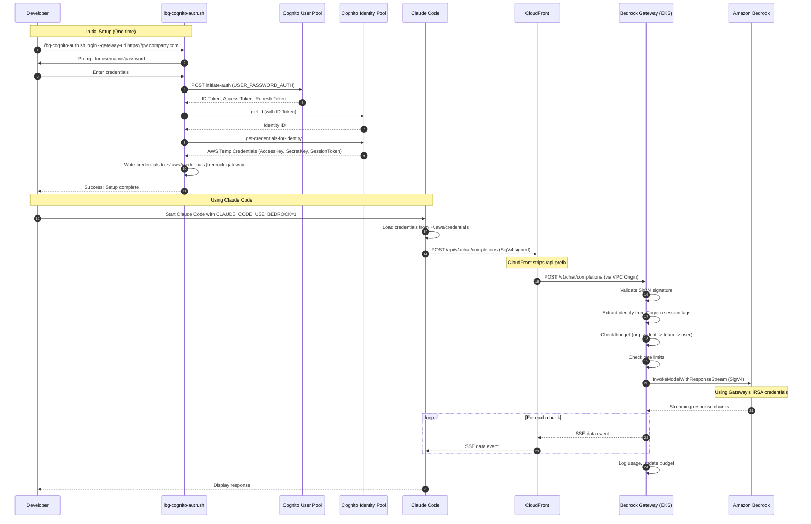
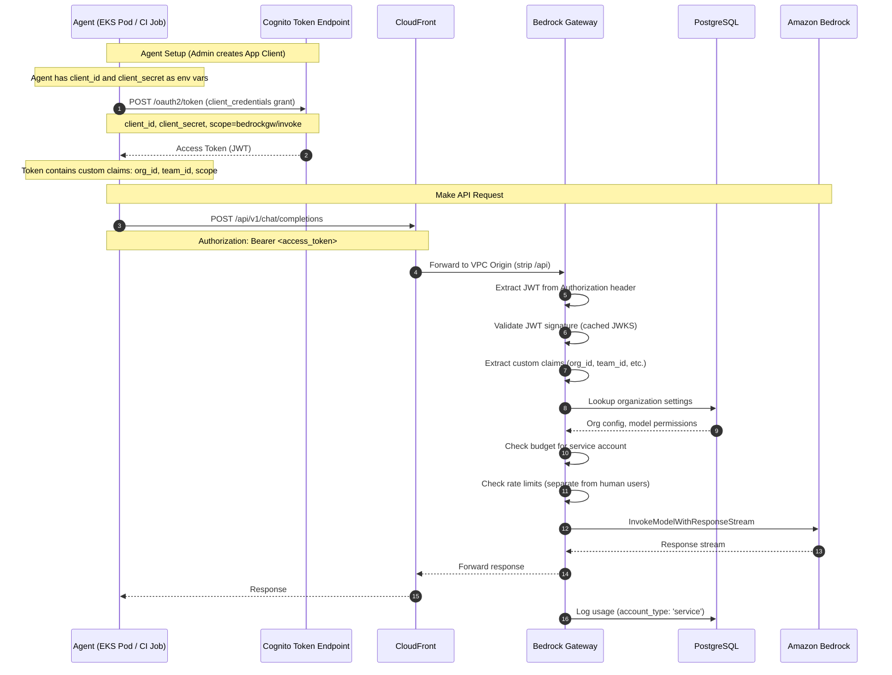
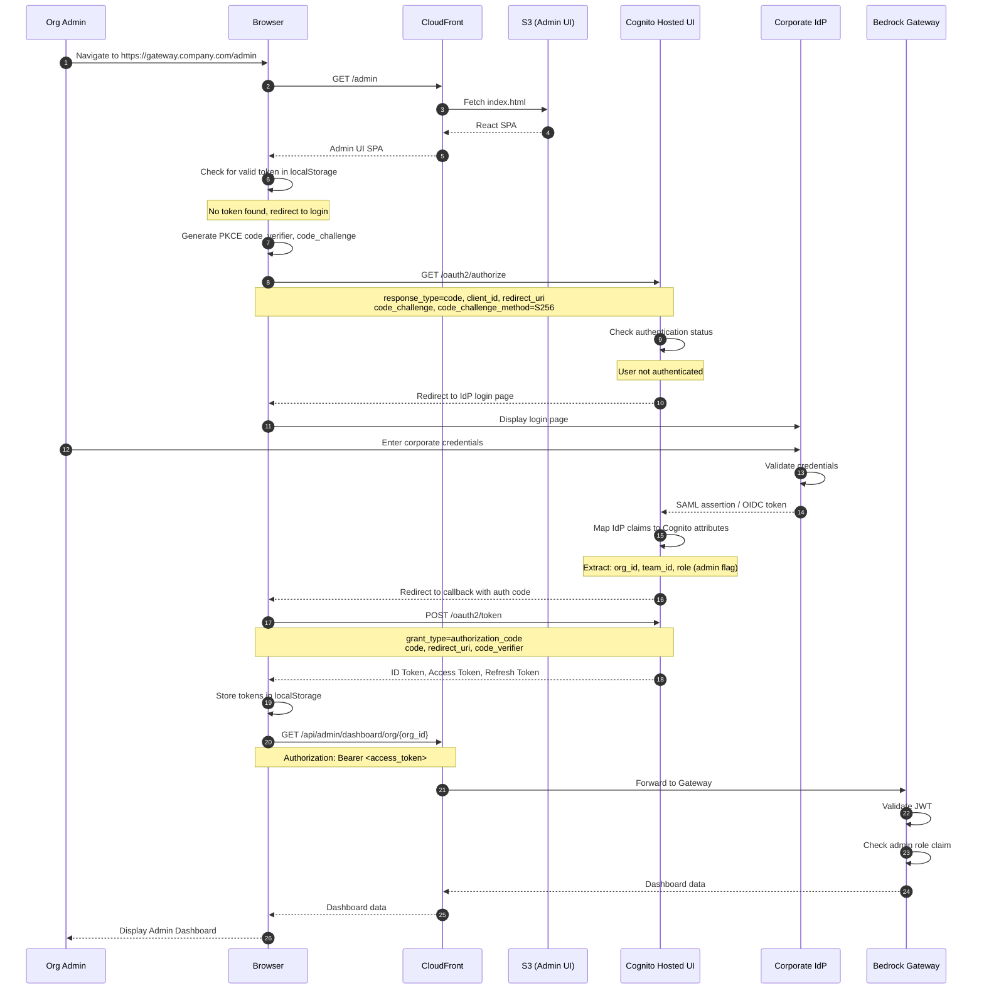
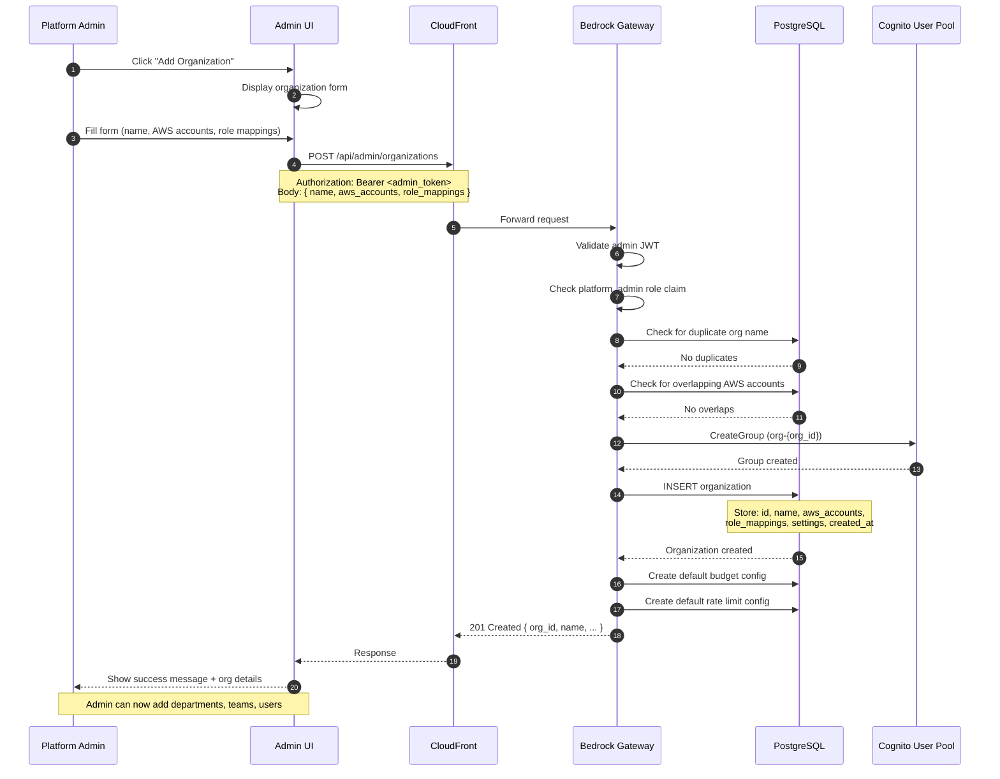
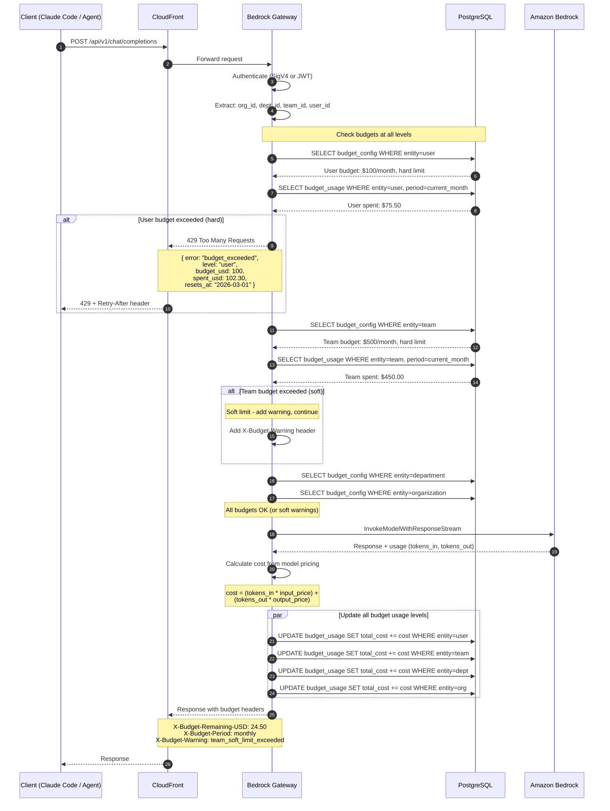
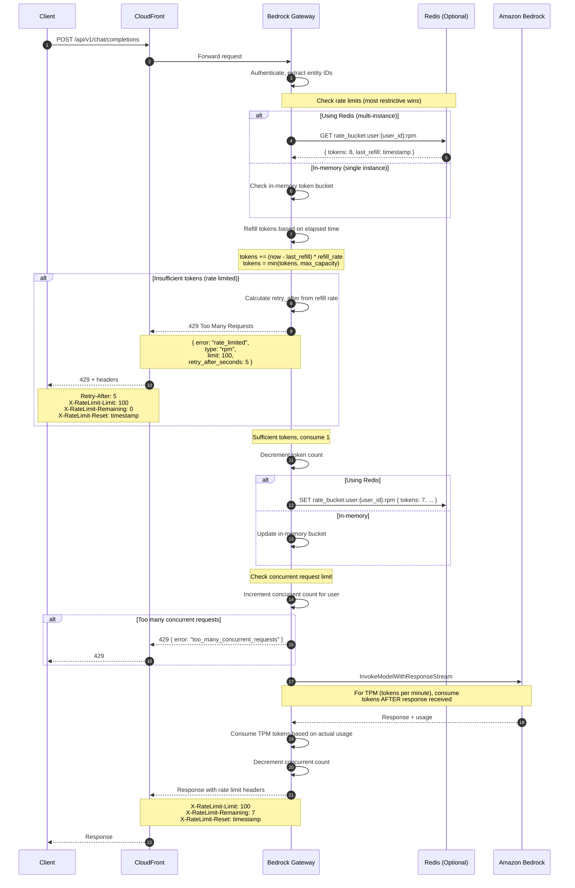

# Bedrock Gateway Sequence Diagrams

This document contains Mermaid sequence diagrams for key user flows in Bedrock Gateway.

## Table of Contents

1. [Human Developer Using Claude Code](#1-human-developer-using-claude-code)
2. [Agent M2M Authentication](#2-agent-m2m-authentication)
3. [Admin UI Login](#3-admin-ui-login)
4. [Create Organization](#4-create-organization)
5. [Budget Enforcement](#5-budget-enforcement)
6. [Rate Limiting](#6-rate-limiting)

---

## 1. Human Developer Using Claude Code

This flow shows how a developer authenticates via Cognito and uses Claude Code with the Bedrock Gateway.



### Key Points

- **CLI handles all token management**: Developers don't manually copy tokens
- **Credentials stored in AWS profile**: `~/.aws/credentials` under `[bedrock-gateway]`
- **CloudFront VPC Origin**: ALB is internal, CloudFront is the only ingress
- **SigV4 authentication**: Gateway validates AWS credentials via STS
- **Streaming support**: SSE works through CloudFront with extended timeouts

---

## 2. Agent M2M Authentication

This flow shows how automated agents (CI/CD pipelines, EKS containers) authenticate using Cognito's `client_credentials` flow.



### Key Points

- **Client credentials flow**: No user interaction required
- **App Client per agent**: Admin creates in Cognito or via `/admin/agents` API
- **JWT validation via JWKS**: No STS calls, faster validation
- **Separate quotas**: Service accounts have independent budgets/rate limits
- **Usage tracking**: Logged with `account_type: service` for reporting

---

## 3. Admin UI Login

This flow shows the Admin UI authentication using Cognito Hosted UI with PKCE.



### Key Points

- **PKCE flow**: Secure OAuth 2.0 for single-page applications
- **Cognito Hosted UI**: Handles IdP federation (Okta, Azure AD, Auth0)
- **Token storage**: Access token stored in localStorage
- **Admin role**: Extracted from JWT `custom:role` claim
- **Silent refresh**: Browser refreshes tokens before expiry

---

## 4. Create Organization

This flow shows how a platform admin onboards a new organization.



### Key Points

- **Platform admin only**: Requires `custom:role = platform_admin` claim
- **Validation**: Checks for duplicate names and overlapping AWS accounts
- **Cognito group**: Created for org-level IAM role mapping
- **Default configs**: Org gets default budget and rate limit settings
- **Audit logging**: All admin actions logged with actor and timestamp

---

## 5. Budget Enforcement

This flow shows how budget limits are enforced at all hierarchy levels.



### Key Points

- **Cascading check**: User -> Team -> Department -> Organization
- **Hard vs soft limits**: Hard blocks, soft warns in headers
- **Pre-check**: Budget checked BEFORE calling Bedrock
- **Post-update**: Usage updated AFTER successful response
- **Headers**: Client receives budget status in response headers

---

## 6. Rate Limiting

This flow shows the token bucket rate limiting algorithm.



### Key Points

- **Token bucket algorithm**: Smooth rate limiting with burst capacity
- **Multiple limit types**: RPM, TPM, and concurrent requests
- **Hierarchy check**: User -> Team -> Department -> Org limits
- **Redis optional**: In-memory for single instance, Redis for distributed
- **TPM consumption**: Tokens consumed AFTER response (based on actual usage)
- **Standard headers**: `X-RateLimit-*` headers for client visibility

---

## 7. Request Timing Instrumentation (Issue #144)

This flow shows where timing is measured at each stage of a proxy request.

```mermaid
sequenceDiagram
    autonumber
    participant Client as Client
    participant CF as CloudFront
    participant LM as LoggingMiddleware
    participant Auth as Auth Dependency
    participant Budget as BudgetMiddleware
    participant RL as RateLimitMiddleware
    participant Route as Proxy Route Handler
    participant Bedrock as Amazon Bedrock

    Client->>CF: POST /api/model/{id}/invoke
    CF->>LM: Forward request

    Note over LM: ⏱ Start: total timer<br/>Initialize request.state.timings = {}

    LM->>Budget: dispatch(request, call_next)

    Note over Budget: ⏱ Start: budget_check
    Budget->>Budget: Parse body, check hierarchy
    Note over Budget: ⏱ End: budget_check

    Budget->>RL: call_next(request)

    Note over RL: ⏱ Start: ratelimit_check
    RL->>RL: Check token bucket
    Note over RL: ⏱ End: ratelimit_check

    RL->>Route: call_next(request)

    Note over Auth: ⏱ Start: auth
    Route->>Auth: get_token_context (Cognito JWT)
    Auth-->>Route: TokenContext
    Note over Auth: ⏱ End: auth

    Note over Route: ⏱ Start: bedrock
    Route->>Bedrock: invoke_model
    Bedrock-->>Route: Response
    Note over Route: ⏱ End: bedrock

    Note over Route: ⏱ Start: serialize
    Route->>Route: json.dumps(response)
    Note over Route: ⏱ End: serialize

    Route-->>RL: Response
    RL-->>Budget: Response
    Budget-->>LM: Response

    Note over LM: ⏱ End: total timer
    LM->>LM: Add X-Gateway-Timing header
    Note over LM: auth=5ms;budget_check=12ms;<br/>ratelimit_check=3ms;bedrock=1847ms;<br/>serialize=2ms;total=1870ms

    LM-->>CF: Response with timing header
    CF-->>Client: Response
```

### Key Points

- **Timing initialization**: LoggingMiddleware initializes `request.state.timings = {}` at request start
- **Per-segment timing**: Each middleware/handler records its own segment using `get_timings(request).time_segment(name)`
- **Total timing**: LoggingMiddleware records `total` after all processing completes
- **Header format**: `X-Gateway-Timing: auth=5ms;budget_check=12ms;bedrock=1847ms;total=1870ms`
- **Structured logging**: Timing dict included in JSON log entry for each request
- **Streaming**: For streaming responses, `bedrock_ttfb` (time to first byte) is used instead of `bedrock`

---

## Summary

| Flow | Authentication | Key Service |
|------|---------------|-------------|
| Human Developer | Cognito + SigV4 | bg-cognito-auth.sh CLI |
| Agent M2M | Cognito client_credentials | JWT Bearer |
| Admin UI | Cognito PKCE | Hosted UI + React SPA |
| Create Org | Admin JWT | Admin API |
| Budget Enforcement | Any | BudgetService |
| Rate Limiting | Any | RateLimitService |
| Request Timing | N/A | LoggingMiddleware + get_timings() |
